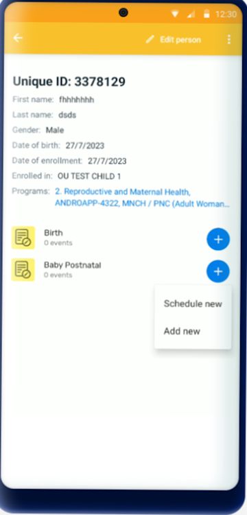
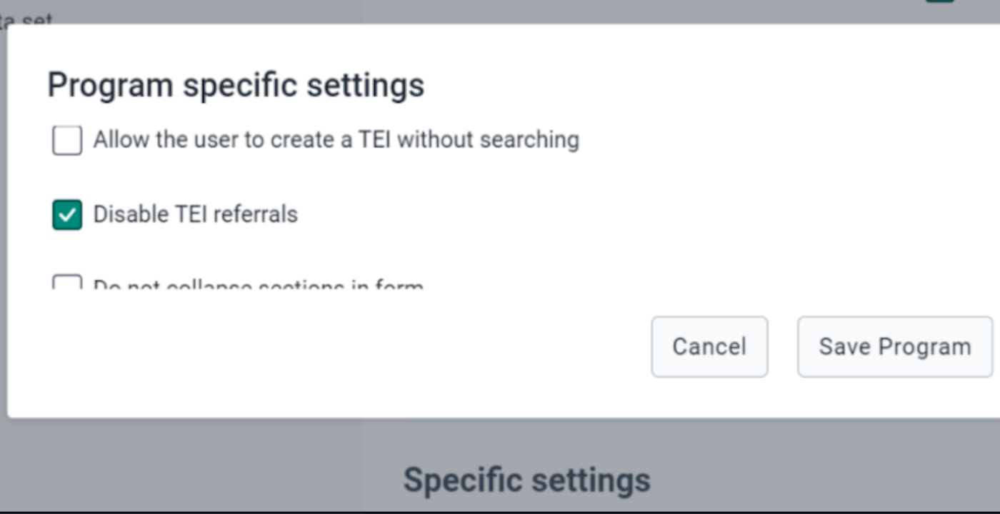
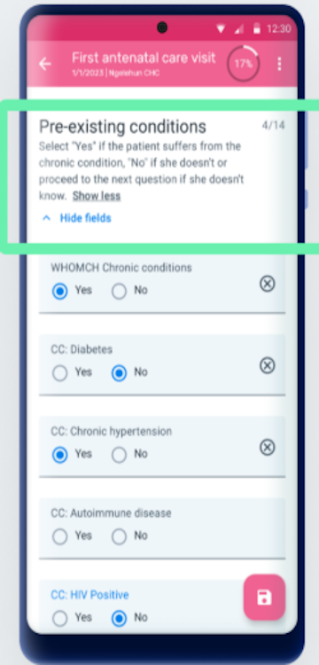
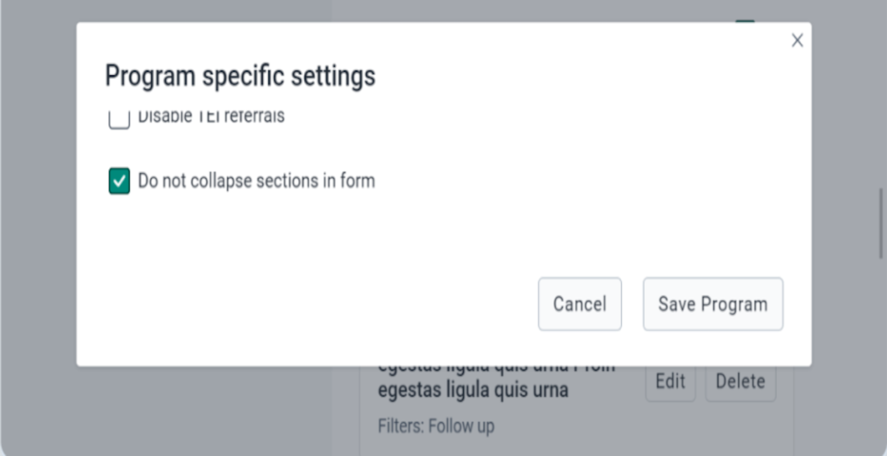
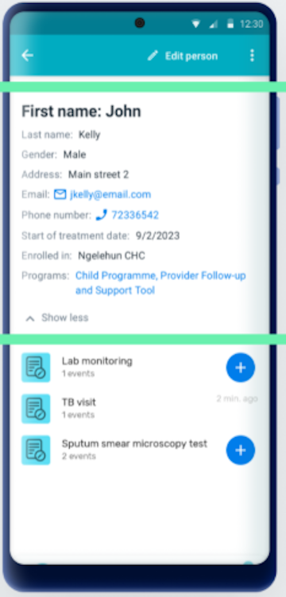
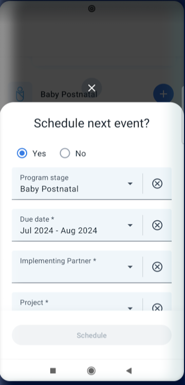
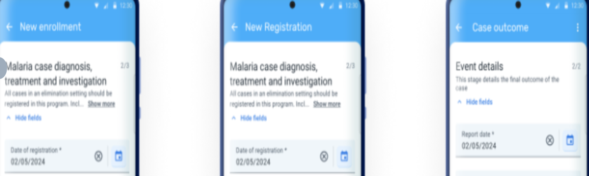
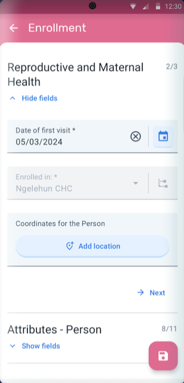

## Version update document

This document provides an overview of the key features and enhancements introduced in different versions of the DHIS2 Android app, specifically Android 2.9, 3.0. It highlights compatibility with DHIS2 core versions and details improvements in usability, configuration, and functionality.

| Feature | Android 2.9 | Android 3.0||
| :---- | :---- | :---- | :---- |
| Compatible DHIS2 web version | Compatible with DHIS2 versions 2.30 through 40| Compatible with DHIS2 core versions 2.39, 2.40, and 2.41|
| **Disable referral in tracker programs** | The referral option can be hidden using the Android Settings Web App. [Documentation](https://docs.dhis2.org/en/use/android-app/program-features.html#capture_app_programs_referrals)| This feature was introduced in Android Capture App version 2.9 and continues to be supported in version 3.0  and up|  |
| **Skip home screen if only one program is available** | The app skips the home screen if the user has access to only one program/dataset. [More info](https://docs.dhis2.org/en/use/android-app/android-specific-features.html#capture_app_home)  |This feature was introduced in Android Capture App version 2.9 and continues to be supported in version 3.0|
| **Display program stage description** | To provide more context and information at the moment of data collection, the description has now been brought to the user interface and will be displayed below the section name [More info](https://docs.dhis2.org/en/use/android-app/program-features.html#capture_app_programs_common_features_data_entry_form_program_stage_description) | This feature was introduced in Android Capture App version 2.9 and continues to be supported in version 3.0 |
| **Disable collapsible sections in forms** | Stage sections are displayed with collapsible menus.that enable the user to open one section at a time. The purpose of this accordion-like implemementation is to help the user navigate very long forms, however some implementations would prefer to list the sections one after the other.[Documentation](https://docs.dhis2.org/en/use/android-app/program-features.html#capture_app_programs_common_features_data_entry_form_collapsible_sections)  | This feature was introduced in Android Capture App version 2.9 and continues to be supported in version 3.0  |
| **Working lists under the search bar** | Working lists are now visible under the search bar for better filtering.In 2.9, the working lists have been moved from the filters section to the main program screen. In earlier versions the user had to open the filters to be able to see and select a working list, from this version the working lists are always visible under the search bar facilitating its selection for filtering out Tracked Entity Instances [More info](https://docs.dhis2.org/en/use/android-app/program-features.html#capture_app_programs_common_features_working_lists) | This feature was introduced in Android Capture App version 2.9 and continues to be supported in version 3.0  |
| **New design for Dataset, Event, and TEI cards** | Cards have a cleaner layout with descriptive text. (Cards are used for listing datasets, events and TEIs. The new design offers a cleaner and more intuitive layout, replacing the use of colored icons by descriptive text when relevant) [Documentation](https://docs.dhis2.org/en/use/android-app/datasets-features.html#capture_app_datsets_cards_design)  | This feature was introduced in Android Capture App version 2.9 and continues to be supported in version 3.0|
| **Implement changes in TEI Dashboard details** | Improved layout with secondary actions moved to hidden menus. [More info](https://docs.dhis2.org/en/use/android-app/program-features.html#capture_app_programs_tei_design)  |This feature was introduced in Android Capture App version 2.9 and continues to be supported in version 3.0 |
| **Redesigned inputs for all value types** | Tappable areas and texts have been increased and selection modes are improved to offer a cleaner and more intuitive user experience. [Documentation](https://docs.dhis2.org/en/use/android-app/program-features.html#capture_app_programs_common_features_data_entry_form_new_inputs)  |This feature was introduced in Android Capture App version 2.9 and continues to be supported in version 3.0 |
| **\[EXPERIMENTAL\] TEI Header** | The TEI Header is a title that can be added to the TEI cards and dashboards in the app. This feature is experimental, and depending on feedback and adoption it will be refined and incorporated in the web Capture app. [Documentation](https://docs.dhis2.org/en/use/android-app/program-features.html#capture_app_programs_tei_header) | This feature was introduced in Android Capture App version 2.9 and continues to be supported in version 3.0  |
| **Schedule after completion** | This feature is not there in 2.9| Redesigned schedule dialog for better event creation.  |  |
| **Maps** | When displaying maps there are different layers that can be displayed by clicking on the specific button on the uppper right corner. The user can select one or more layers to be displayed. Both coordinate and polygons types will be displayed. |From 3.0 custom map layers are supported.These custom map layers configured in the maintenance app will be downloaded and displayed as additional layers to the default ones. [More info](https://docs.dhis2.org/en/use/android-app/program-features.html?h=android%2B3.0&capture_app_programs_common_features_maps) !|
| **Customized Tracker Terminology** | This feature is not there | In 3.0, the terms "event" (used in a program stage context) and "enrollment" are customizable. | |
| **TEI Dashboard** | The TEI Dashboard has been redesigned for both portrait and landscape view. The new design offers a cleaner and more intuitive layout replacing the use of coloured icons by explicit text when relevant and moving some secondar actions to the hidden menus.Edit Registration Form: The “Open TEI details” button has moved from the bottom of the dashboard card to the top bar, now labeled “Edit TEI” (e.g., “Edit Patient”).**Follow-Up:** The follow-up icon is no longer on the card. Use the three-dot menu to select “Mark for follow-up.”**Card Title:** Previously, the title showed the first three Tracked Entity Attributes (TEAs) marked as “Display in list.” Now, it can show either the first TEA or a custom TEI header configured via program indicators in the Android Settings Web App. [More info here]**Tracked Entity Attributes:** All TEAs marked as “Display in list” are shown. The first three are always visible; tap “Show more” to expand.**Programs:** If enrolled in multiple programs, the dashboard lists them. Tapping a program label opens the full list of enrollments. |Main changes in 3.0:**Event list:** fresh and more clean look of the list of events, with more space and less -not critical- information displayed.**Timeline view:** the button for creating new events has been moved to the top.|
| **Search Flow** | TEI search before enrollment is now mandatory | TEI search before enrollment is now optional.If the feature is enabled, the Android App will display a "create new" button after opening a program and a search won't be required. If the feature is not enabled or the user is in a previous version of the app, a search must be performed to avoid possible duplicates. Once the search is performed the search button will become "Add" button for the user to create a new enrollment. |  |
| **Delete TEIs and Enrollments** |This confirmation message was not there in 2.9 version | Delete options available in TEI dashboard.To delete a TEI or an enrollment, select the desired option in the three dots menu of TEI dashboard.From 3.0, there is a confirmation message to reduce errors when tapping on the delete button.   | |
| **Data Entry Flow** | This feature is not there in 2.9 version| Improved form structure for better data entry.(From 3.0, the details are displayed inside the form, as the first opened section for completion. Once they are filled in, for example when the user reopens the event or enrollment form, the details section will be visible and easily available, but collapsed to leave more space for the data collection)  | |
| **Relationships** | The relationship tab displays sections once the tab is open. Each section represents a different relationship type and the + icon will be available only if the user has capture access to the relationship type.| No major changes |
| **Transfers** | No major changes| Significant enhancements to the transfer flow, aimed at making the process more user-friendly and transparent. The transfer button has been moved to a more accessible location within the three dot menu in the TEI Dashboard, ensuring that users can easily find and initiate transfers without unnecessary navigation.Also, the ownership organisation unit has been added as a parameter in the TEI card. If the ownership org unit and enrollment org unit are the same, then the enrollment one will be hidden.Once the transfer process has started, the user will see a dialog with all the org units available (search scope), once an org unit is selected, the transfer button will be activated. After tapping on the button, the ownership org unit will change to the new one. The user must sync data to reflect the changes in the instance. |

