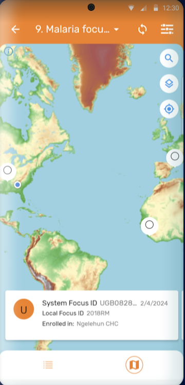

## Version update document

This document provides an overview of the key features and enhancements introduced in different versions of the DHIS2 Android app, specifically Android 3.0 and 3.1.It highlights compatibility with DHIS2 core versions and details improvements in usability, configuration, and functionality.

| Feature  | Android 3.0 | Android 3.1 |
 | :---- | :---- | :---- |
| Compatible DHIS2 web version|Compatible with DHIS2 core versions 2.39, 2.40, and 2.41| Compatible with DHIS2 core versions 2.39, 2.40, and 2.41|
| **Schedule after completion** |Redesigned schedule dialog for better event creation.  | No major changes |
| **Maps** | Custom map layers supported. [More info](https://docs.dhis2.org/en/use/android-app/program-features.html?h=android%2B3.0&capture_app_programs_common_features_maps)| From 3.1, the capture coordinates process now includes a feature that displays the precision of the captured location. This allows users to see how accurate their location data is in real-time [Documentation](https://docs.dhis2.org/en/use/android-app/program-features.html#capture_app_programs_common_features_map_accuracy).By dragging the map the user can choose the pin location manually. At the bottom of the map, the label "selected location" will be displayed with the respective coordinates.In 3.1 the manual capture can be disabled (Android settings webApp configuration).This will hid the search bar and won't allow the user to select any location on the map. It will be restricted to save the current location only. |
| **Customized Tracker Terminology** |  Terms like “event” and “enrollment” are now customizable. | In 3.1, the term "event" (program context) is now customizable|
| **TEI Dashboard** |  The TEI Dashboard has been redesigned for both portrait and landscape view. The new design offers a cleaner and more intuitive layout replacing the use of coloured icons by explicit text when relevant and moving some secondar actions to the hidden menus.Main changes in 3.0:**Event list:** fresh and more clean look of the list of events, with more space and less -not critical- information displayed.**Timeline view:** the button for creating new events has been moved to the top.| No major changes |
| **Search Flow** | In 3.0, the search form has been improved to provide a cleaner look and a more intuitive user experience. The buttons have been made more explicit for differencing search from creation. In addition the flow for searching TEIs using attributes rendered as bar / QR codes has been made more agile. If there is only one result and the attribute is unique, the app will open the TEI Dashboard directly. If there are multiple results, the app will display all the cards on the TEI list (this is equal to the current workflow), and if there are no results, the app will display the create button and allow the user to “search outside the program” if the configuration allows it.| Aimed at aligning it with the web instance for a more consistent user experience, 3.1.0, by default, sorts the unique attributes (QR, barcode) at the top of the list of searchable attributes. Users can quickly and easily find the attributes for a more exact search.  |
| **Delete TEIs and Enrollments** | Delete options available in TEI dashboard.To delete a TEI or an enrollment, select the desired option in the three dots menu of TEI dashboard.There is a confirmation message to reduce errors when tapping on the delete button.   | No changes |
| **Data Entry Flow** | From 3.0, the details are displayed inside the form, as the first opened section for completion. Once they are filled in, for example when the user reopens the event or enrollment form, the details section will be visible and easily available, but collapsed to leave more space for the data collection.Improved form structure for better data entry.  | No major changes |
| **Relationships** |  The relationship tab has been modified to display sections once the tab is open. Each section represents a different relationship type and the + icon will be available only if the user has capture access to the relationship type. |In 3.1.0, the relationship cards have also been updated with a new design to offer a more intuitive and visually appealing experience. The new design emphasizes clarity and usability, making it easier to view and manage relationships at a glance.|
|**Transfers**| Significant enhancements to the transfer flow.The transfer button has been moved to a more accessible location within the three dot menu in the TEI Dashboard, ensuring that users can easily find and initiate transfers without unnecessary navigation.|No major changes|
|**Discard changes**| No changes|From 3.1.0 Discard changes will not only apply to new events but also when edit them.|
|**Visual configuartions**|From 3.0 it is possible to display custom icons in the Android App. DHIS2 (41 version) now allows uploading custom Icons to be used in addition to the built-in Icon library. This is useful for use cases not related to health or that require very specific iconography. The Android App will render the custom icons that need to be uploaded and configured using the Maintenance DHIS2 Web App.|From 3.1 it is possible to display the custom icon when a relationship is displayed. **Note** Icons will initially only render in the new Android app. The new web-based Capture App will incorporate them in the near future|
|**Skip DHIS2 version validation**|When connecting to DHIS2 instances, the app typically verifies compatibility with supported versions. However, in some cases, connecting to unsupported instances may be necessary or useful. Please note that the default behavior is to enforce strict version validation. To skip the validation process for DHIS2 version compatibility, select the checkbox.**Note**This option is only applicable when using Android Capture app version 3.0 or later.|No major change|
|**Event visualization**| The DHIS2 Android App can render analytics that have been created in the line listing app.Analytics to be displayed require to be configured using the Android Settings WebApp where administrators will be able to decide the tables to be displayed for end users.|From 3.1.0, the Android App introduces support for the Category Option Dimension in line listings. Additionally, it has been improved the text alignment within the Line Listing tables to support left alignment. This enhancement ensures better readability and a cleaner presentation of data, making it easier for users to review and analyze their information quickly.|
|**Legends**|The Android App displays the full description of the legend when tapping on the information icon once a legend is active. These feature is available only in event and registration forms.|From 3.1.0, the legend in a data element will now automatically update after seconds of inactivity. This means that users no longer need to move to the next field to prompt the legend update, making the process smoother and more efficient.|
|**Home screen**|The home screen of the DHIS2 Android App shows the list of programs and data sets available for the user.|In 3.1.0, a new dynamic home screen that adapts to the number of programs (up to 4 programs) available has been implemented. This update replaces the old static list that didn’t adjust to the screen, providing a more responsive and user-friendly interface.The responsive design makes better use of screen real estate, providing a more engaging and functional home screen layout.|