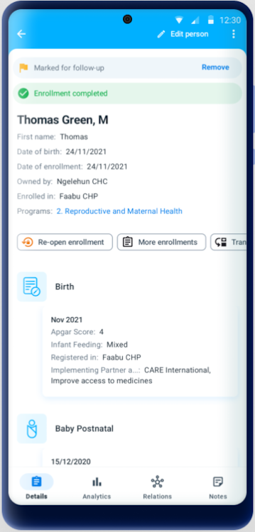
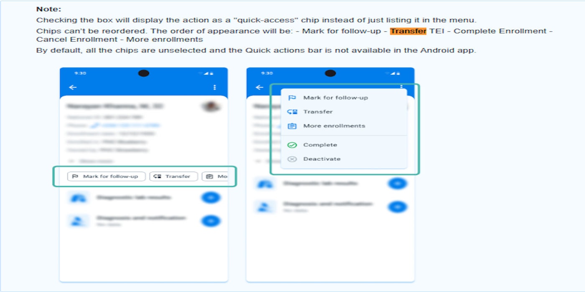
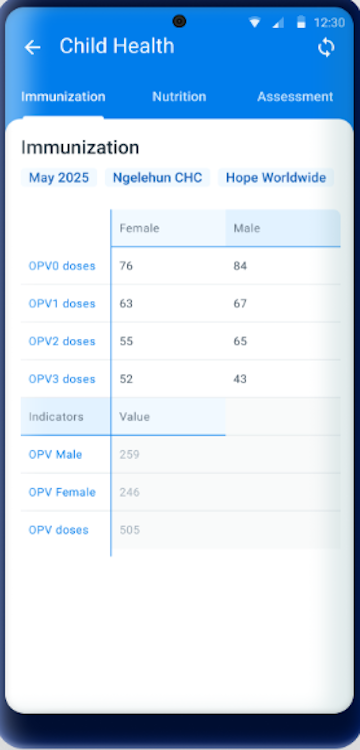
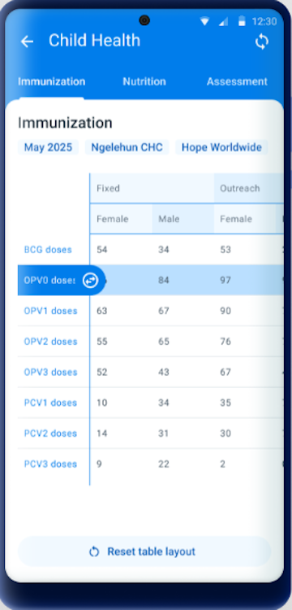
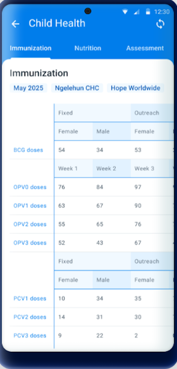
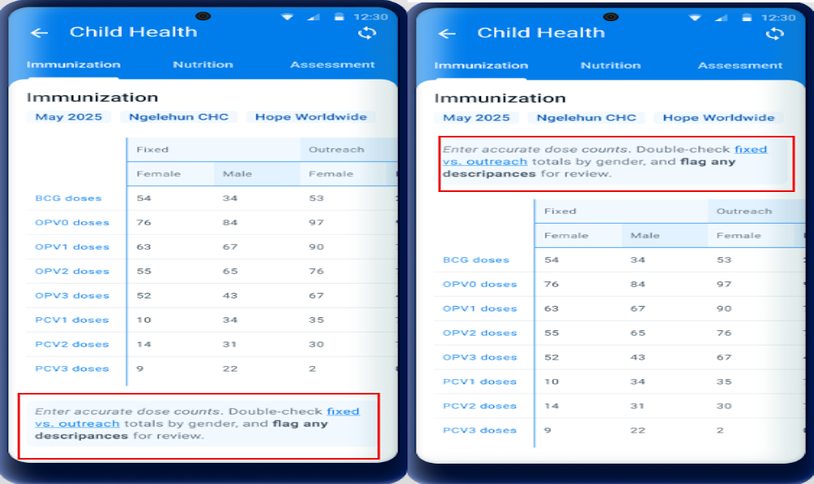

# Version update document v3.1 and v3.2

This document provides an overview of the key features and enhancements introduced in different versions of the DHIS2 Android app, specifically Android v3.1 and v3.2.It highlights compatibility with DHIS2 core versions and details improvements in usability, configuration, and functionality.

## Summary of v3.2 updates:
Here's a short summary of the DHIS2 Android Capture App updates in version 3.2.0:

### Data Entry Enhancements
1. Modernized table and input dialog for easier and more intuitive data entry.
2. Row/column resizing and a reset button for better table navigation.
3. Indicators now visible at the bottom of data entry forms.
4. Card redesign with clearer labels and sync status indicators.

### Coordinate Capture (New)
1. A search bar helps locate places using street names/numbers, similar to tracker behavior.

### Removed Overview Screen
1. Users now land directly on the data entry screen after selecting a dataset.

### Saving and Validation Improvements
1. Integrated validation and completion flow:
    * If validation is required for completion, data must pass validation.
    * If not required, users can still complete with errors but are shown rule descriptions.

### Configurable Forms (New)
1. New options to better match national paper tools.
2. Disable automatic grouping of data elements.
3. Pivot table layouts (default, full, or partial transposition).
4. Add custom content before/after sections.
5. Vertical tabs layout in landscape view.

## Comparison between v3.1 and v 3.2

| Feature  | Android v3.1 | Android v3.2 |
 | :---- | :---- | :---- |
| Compatible DHIS2 web version|Compatible with DHIS2 core versions 2.39, 2.40, and 2.41| Compatible with DHIS2 core versions 2.39, 2.40, 2.41 and 2.42|
| **Schedule after completion** |Redesigned schedule dialog for better event creation.  | "Schedule After Completion" feature was not introduced or changed for aggregate data sets.In earlier versions, and continuing in 3.2, “Schedule After Completion” can be configured in the web-based program settings.|
| **Maps** | From 3.1, the capture coordinates process now includes a feature that displays the precision of the captured location. This allows users to see how accurate their location data is in real-time [Documentation](https://docs.dhis2.org/en/use/android-app/program-features.html#capture_app_programs_common_features_map_accuracy).By dragging the map the user can choose the pin location manually. At the bottom of the map, the label "selected location" will be displayed with the respective coordinates.In 3.1 the manual capture can be disabled (Android settings webApp configuration).This will hid the search bar and won't allow the user to select any location on the map. It will be restricted to save the current location only.| To enhance the process of capturing coordinates and align to the behavior in tracker programs, a search bar has been implemented. This feature allows users to input textual information, such as street names or numbers, to facilitate the identification of specific locations. |
| **Customized Tracker Terminology** | **In 3.1, the term "event" (program context) is now customizable.** To customize the terms, the admin can go to the Maintenance and when creating or editing the program add a text to: 1. "Custom label for enrollment" in the Enrollment details section OR 2. "Custom label for event" in the stage details section |These customized terms, configured via the DHIS2 Web Maintenance App (starting from DHIS2 core version 2.41), are now reflected in the Android Capture App|
| **TEI Dashboard** |  The TEI Dashboard has been redesigned for both portrait and landscape view. The new design offers a cleaner and more intuitive layout replacing the use of coloured icons by explicit text when relevant and moving some secondar actions to the hidden menus.Main changes in 3.0:**Event list:** fresh and more clean look of the list of events, with more space and less -not critical- information displayed.**Timeline view:** the button for creating new events has been moved to the top.| The **Quick Action Bar** is a new feature in version 3.2 that enables users to access requently used actions directly from the Tracked Entity Instance (TEI) Dashboard. These actions are displayed as customizable chips, streamlining workflows and reducing the number of taps needed to perform routine tasks. But the Feature parity is maintained where 3-dot menu will remain available. *Note*: The **Quick Action feature** is available only when configured via Android setting Web App (v2.4.2)  |
| **Search Flow** | Aimed at aligning it with the web instance for a more consistent user experience, 3.1.0, by default, sorts the unique attributes (QR, barcode) at the top of the list of searchable attributes. Users can quickly and easily find the attributes for a more exact search.|No major changes |
| **Delete TEIs and Enrollments** | Delete options available in TEI dashboard.To delete a TEI or an enrollment, select the desired option in the three dots menu of TEI dashboard.**From 3.0,there is a confirmation message to reduce errors when tapping on the delete button.**   | No major changes |
| **Data Entry Flow (Event form)** | From 3.0, the details are displayed inside the form, as the first opened section for completion. Once they are filled in, for example when the user reopens the event or enrollment form, the details section will be visible and easily available, but collapsed to leave more space for the data collection.Improved form structure for better data entry. No major changes are seen in v3.1| No major changes |
| **Relationships** | From v3.1 it is possible to display the custom icon when a relationship is displayed.In v3.1, the relationship cards have also been updated with a new design to offer a more intuitive and visually appealing experience. The new design emphasizes clarity and usability, making it easier to view and manage relationships at a glance.|No major changes|
|**Transfers**| Significant enhancements to the transfer flow.The transfer button has been moved to a more accessible location within the three dot menu in the TEI Dashboard, ensuring that users can easily find and initiate transfers without unnecessary navigation. Also, the ownership organisation unit has been added as a parameter in the TEI card. If the ownership org unit and enrollment org unit are the same, then the enrollment one will be hidden.|No major changes|
|**Discard changes**|From 3.1.0 Discard changes will not only apply to new events but also when edit them.|No major changes|
|**Visual configuartions**|From 3.1 it is possible to display the custom icon. **Note** Icons will initially only render in the new Android app. The new web-based Capture App will incorporate them in the near future|No major changes|
|**Skip DHIS2 version validation**|When connecting to DHIS2 instances, the app typically verifies compatibility with supported versions. However, in some cases, connecting to unsupported instances may be necessary or useful. Please note that the default behavior is to enforce strict version validation. To skip the validation process for DHIS2 version compatibility, select the checkbox.**Note**This option is only applicable when using Android Capture app v3.0 or later.|No major changes|
|**Event visualization**| TFrom 3.1.0, the Android App introduces support for the Category Option Dimension in line listings. Additionally, it has been improved the text alignment within the Line Listing tables to support left alignment. This enhancement ensures better readability and a cleaner presentation of data, making it easier for users to review and analyze their information quickly. |No major changes|
|**Legends**|From 3.1.0, the legend in a data element will now automatically update after seconds of inactivity. This means that users no longer need to move to the next field to prompt the legend update, making the process smoother and more efficient.|This auto-update legend behavior remains in place and continues to function the same way|
|**Home screen**|In 3.1.0, a new dynamic home screen that adapts to the number of programs (up to 4 programs) available has been implemented. This update replaces the old static list that didn’t adjust to the screen, providing a more responsive and user-friendly interface.The responsive design makes better use of screen real estate, providing a more engaging and functional home screen layout.|Overview screen for Data Sets has been removed from the Android Capture App in v3.2. Users are now taken directly to the data entry screen after selecting a Data Set.|
|**Data Entry (Data sets)**|The data entry table and input dialog were still based on the older design|The data entry table in the app has been redesigned to be cleaner, simpler, and easier to navigate.The input screen that appears when entering data has also been improved.  |
|**Save Dataset**|The validation and completion process was not fully integrated into the save button actions.Users often had to manually run validation rules before completion|Validation rules and completion of data sets are integrated in the save button actions.The save button now handles both validation and completion in a more seamless way.Android v3.2 introduced a significant improvement by tightly integrating validation and completion into a single, user-friendly flow.|
|**Increase Row and column Headers**|Users are allowed to resize the row headers and columns in datasets, making it easier to view and work with larger tables.To resize any column, tap on its header and then drag and drop until the desired size. A maximum and minimum size limit is given for the columns that can be resized to ensure a good layout.If the column have multiple headers, the resizing will be available only for the child header (lowest level). Users can also resize all collumns at once by clicking on the top left of the table.|From 3.2.0 the Data Sets table includes a Reset button to complement the increment and decrement input controls in columns.It appears only while resizing is active and lets users quickly revert any resized columns to their original (default) width.|
|**Indicators**|In Android v3.1, indicators were not available in the default and section forms of aggregate data sets.|Indicators are now available in default and section forms and are displayed at the bottom of the data entry form.|
|**Configurable forms/Pivot options**|This feature is not there in v3.1|In DHIS2 Android v3.2, the Configurable Forms / Pivot Options feature was introduced for aggregate data sets, allowing more flexible and user-friendly layouts that reflect paper-based tools or country-specific reporting needs. * Disable auto grouping of Data Elements, Controls how data elements and category options are arranged in tables Content before and after SectionsRender Sections as Tabs (vertical layout)|
|