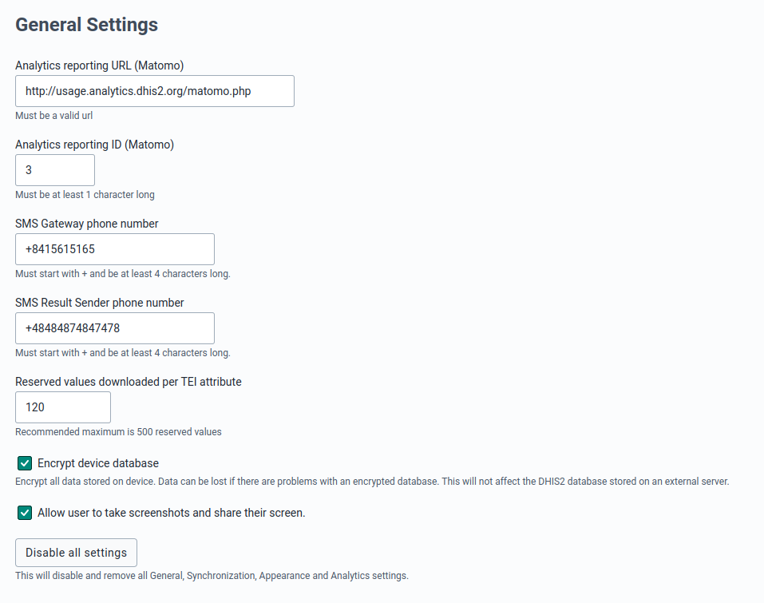
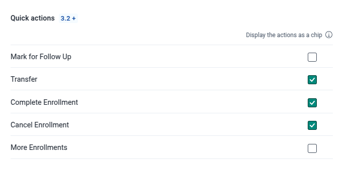
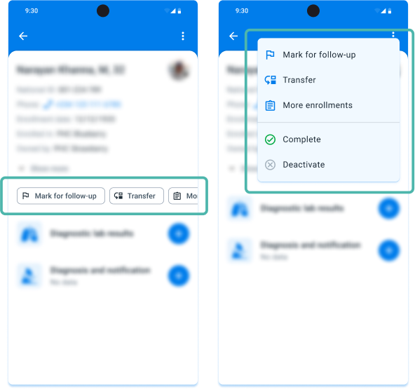
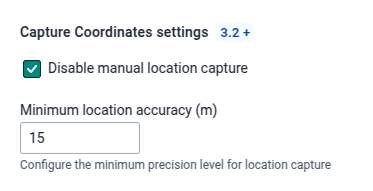
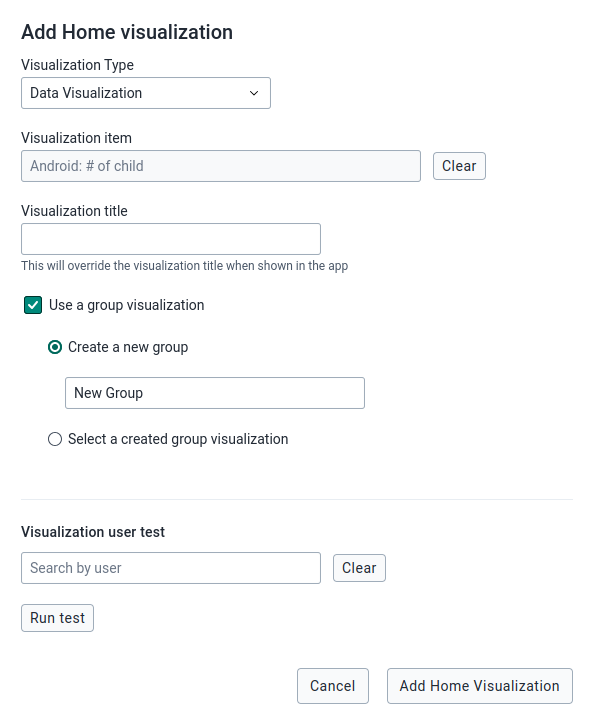
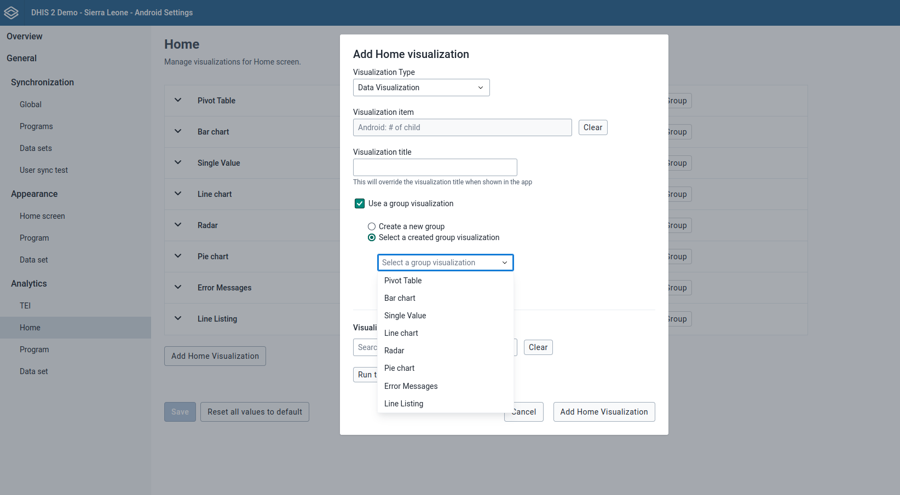
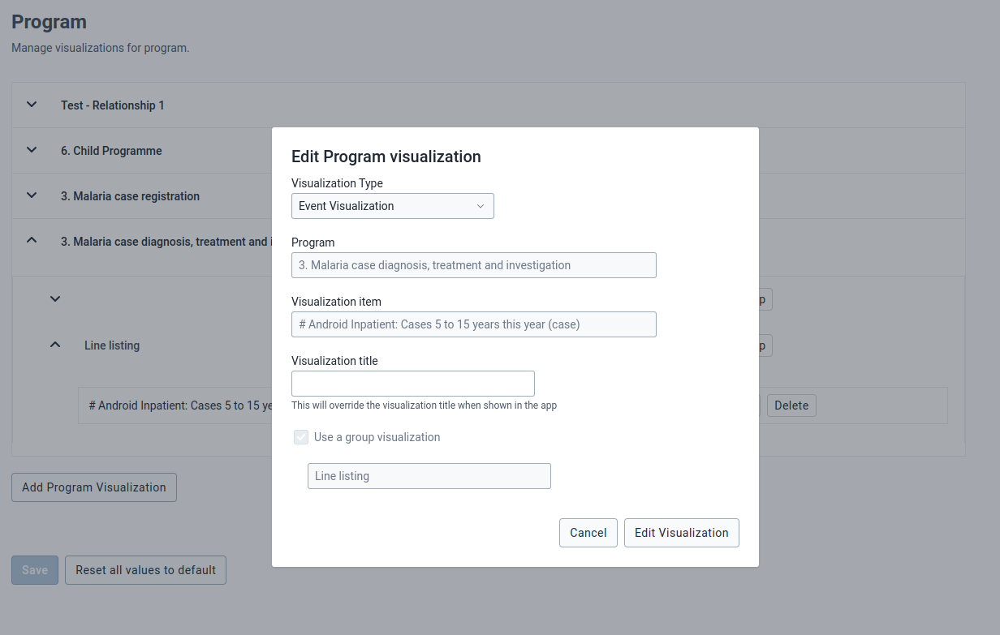
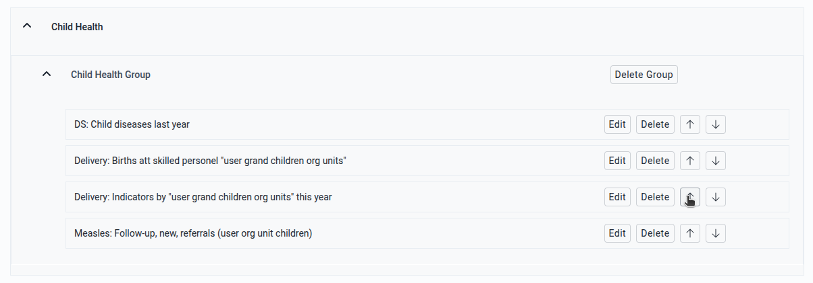
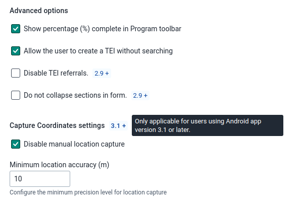

# Android Settings Web App { #capture_app_android_settings_webapp }
## Overview { #capture_app_android_settings_webapp_overview }

This section focuses on the [Android Settings Web App](https://apps.dhis2.org/app/a1bd6b5b-de8c-4998-8d34-56c18a139683) implementation.

The [Android Settings Web App](https://apps.dhis2.org/app/a1bd6b5b-de8c-4998-8d34-56c18a139683) allows admins to configure synchronization parameters for the DHIS2 Android App, encrypt the local database of the Android devices, customize the appearance of Programs, Data sets, and Home screen, and add TEI Analytics items. The configuration parameters defined within this web app will overwrite the settings of all Android devices using the DHIS2 Android Capture App.

Please note that in this version of the Web App (2.3), if the DHIS2 version is equal to or higher than 2.40, only users with "M_androidsettingsapp" or "ALL" authority can define those parameters in the configuration. Other users accessing the web app can see the value of the parameters but cannot edit them.

> **Warning**
>
> If the DHIS2 version is not above 2.40, only users with 'ALL' authority can define those parameters in the configuration.
> 

## General settings { #capture_app_android_settings_webapp_general }

Includes configurations such as the Matomo URL and project ID, the number of reserved values to download per TEI, and encrypt the device database.

### Matomo configuration { #capture_app_android_settings_webapp_general_matomo }

The DHIS2 Android App sends anonymize analytics that can be used to evaluate performance and/or detect problems at an early stage. [Matomo](https://matomo.org) is the tool used for this and running in a specific server not accessible to the general public. However, implementations can set up their own
 Matomo instance (or using the cloud version) in order to collect and analyse the statistics. 

Once you have your Matomo instance ready you should get the URLs and the project ID like shown in the picture below (left). The ID can be introduced directly but the URL needs to be followed with */matomo.php* and start with *https* or *http* as shown below (right).

{width=33%}
{width=33%}

### Mobile configuration { #capture_app_android_settings_webapp_generalmobile_configuration }
This section allows admin users to edit the SMS gateway ad result sender phone number.
This configuration can be found in the Android app.
- Click on Settings
- Click on SMS Settings

{width=33%}

### Reserved values { #capture_app_android_settings_webapp_general_reserved_values }
This will specify the number of values per TEI attribute reserved to download in the devices. By default, the Android App reserves 100 Ids, but it is possible to add or reduce this number.

To find this configuration in the Android app:
- Click on Settings
- Click on Reserved Values
- To refill them click on *Manage Reserved Values*

{width=33%}
{width=33%}

### Encrypt device database { #capture_app_android_settings_webapp_general_encrypt_database }
This will force all the devices to store the database encrypted increasing the security level against data theft attacks.

By default, the DHIS2 Android App database is not encrypted, but an admin can check the *Encrypt device database* to encrypt the metadata and data stored in every device. Encrypting the database will have an impact on the database volume and performance (degradation between 10-15%) of the Android app. Note that at the moment of selecting or unselecting this option, no data is lost (even if it hasn't been previously synchronized with the server)

> **Warning**
>
> This is a critical action and will affect the local database of all Android devices synchronizing with the server (it won't affect the server DHIS2 database).
>
> By default, the Android app database is not encrypted, but an admin can check the *Encrypt device database* to encrypt the metadata and data stored in every device. Encrypting the database will have an impact on the database volume and performance of the Android app. Note that at the moment of selecting or unselecting this option, no data is lost (even if it hasn't been previously synchronized with the server)

### Allow screenshots { #capture_app_android_settings_webapp_general_screenshots }
This section allows to configure the possibility to take screenshots or screen sharing using the Android Capture App (which is required to remote support with applications like Teamviewer, Teams, etc.). Please note that the default behavior is deactivated screenshots.

> **Warning**
>
> The DHIS2 Android App disables the possibility of taking screenshots (and capturing the screen from other apps) by default following security and privacy recommendations. Allowing screenshots might be useful for support and/or sharing purposes in same cases but make sure you understand the security and privacy implications of this setting before enabling it.
>

### Skip DHIS2 version validation (**v2.4**) { #capture_app_android_settings_webapp_general_skip_version_validation }
When connecting to DHIS2 instances, the app typically verifies compatibility with supported versions. However, in some cases, connecting to unsupported instances may be necessary or useful. Please note that the default behavior is to enforce strict version validation. To skip the validation process for DHIS2 version compatibility, select the checkbox.

> **Warning**
>
> This option is only applicable when using Android Capture app version 3.0 or later.
>

### Opt-in Features (**v2.3.1**) { #capture_app_android_settings_webapp_general_optin_features }
Opt-in features are additional functionalities or settings within the application that the user can choose to enable based on preferences. Unlike default settings, these features require an explicit consent or action ('opting in') to activate.
Opting in allows the user to customize the experience by adding extra capabilities to the app. Keep in mind that these features might come with specific considerations, so it is recommended to review any associated information before opting in.

To enable a feature:

- Click on *Opt-in Features*. 
- A list of available opt-in settings will appear.
- Click on the feature's checkbox to enable it.

**Data entry Form (**v2.4**):** The inputs for all value types have been redesigned in the Android Capture App with an improved selection mode and increased tappable areas and texts to offer a cleaner and more intuitive user experience. By default, the Android Capture App will display the new forms. Admin users can opt out of using the new version of forms by clicking the checkbox option.

### Disable all settings { #capture_app_android_settings_webapp_general_disable_settings }
By clicking this button, the user will remove all Android configuration settings. No configuration will be applied to the Android App (if this is the case, the sync parameters applied are the ones defined in the Android Capture app).

## Synchronization { #capture_app_android_settings_webapp_synchronization }

It offers additional parameters to control metadata/data synchronization.

### Global { #capture_app_android_settings_webapp_synchronization_global }

Metadata sync
:	Admin users can choose how often the metadata will sync. e.g. Sync metadata every 24 hours.

Data sync
:	Admin users can choose how often the data will sync. e.g. Syncing data every 6 hours.

{width=50%}
{width=33%}

Use the new Tracker Importer
:	Admin users can choose which tracker importer endpoint will be used.

> **Warning**
>
> This option is only available if the Android Settings Webapp is used from version 2.38 DHIS2 API onwards.
>
> By default, if the DHIS2 API version is 2.38 or higher, the Android app will use the importer introduced in 2.37 */api/tracker* endpoint but an admin can deselect this option and the legacy tracker importer */api/trackedEntityInstances* will be used.
> 
> {width=50%}
>

Use the new Tracker Exporter (**v2.3**)
:	Admin users can choose which tracker exporter endpoint will be used.

> **Warning**
>
> This option is only available if the Android Settings Webapp is used from version 2.40 DHIS2 API onwards. 
> 
> By default, if the DHIS2 API version is 2.40 or higher, the Android app will use the exporter introduced in the 2.37 */api/tracker* endpoint, but an admin can deselect this option, and the legacy tracker importer */api/trackedEntityInstances* will be used.
>
>
> {width=50%}
>

Limit the file size to download (**v2.3**)
:	Admin users can limit the maximum size of the file resources downloaded in KB.

{width=33%}

> **Note**
>
> Admin users the ability to set the maximum file resource size for downloads. Admins can now leave the field with no value to indicate no limit on the maximum file size. (**v2.4.1**) 
> - no value: Allows unlimited file resource size for downloads. By default, this is the initial value.
> - 0: Restricts downloads to 0 KB.
> - Any positive value: Restricts downloads to files within the specified maximum size limit (in megabytes or another unit). 
> 
> This provides flexibility for admins to either enforce a file size limit or allow unrestricted downloads depending on their needs.
>

### Program { #capture_app_android_settings_webapp_synchronization_program }

This section controls the program data synchronization parameters. It has a section to define global or default parameters to be used in the synchronization of all programs.

#### Global settings { #capture_app_android_settings_webapp_synchronization_program_global }

Global settings apply to all programs that an Android user has access to. The settings can be enabled globally, per Org Unit, per program or per OU and program.

{width=50%}

TEI to download
:	Maximum number of TEIs to download from the server.

TEI download period
:	It downloads the TEIs that have been updated within a period. e.g. TEIs that have been updated within last month

Event to download
:	Maximum number of Events to download (from events programs, see note below).

Event download period
:	It downloads Events which event date belongs to a specific period.

> **Note**
>
> User might find misleading the amount of data downloaded When setting a number of TEIs and a number of Event. The Android App will download the number of TEIs and all their events following the number of TEI set in the field. The Android App will limit the number of Event to download only for the *event programs* (and not *tracker programs*) according to the field. 
>
> For example, imagine there is *tracker program* in the server with several program stages and each TEI has 5 events (enrollments and program stages). The *TEI to download* value is set to 100. Also, in the server there is an *event program* which contains 1000 events. The *Event to download* value has been set to 200. The Android App will download the following: 100 x 5 events from the tracker program, 200 events from the event program, therefore the Android App will end up downloading 700 events.
>

#### Specific settings { #capture_app_android_settings_webapp_synchronization_program_specific }

This section allows the admin users to specify the behaviour of a particular program/s when syncing the data. The specific configuration overwrites the general settings for the programs listed in this section. To add a setting for a specific program:
 
- Click on *Add a Program-specific setting*, a Dialog will appear. 
- Bellow "Values per Program" title, click and find a list of programs.
- Clicking on a program will show the different parameters to configure. The number of parameters depends on the program type (with or without registration). 

**Settings for Program Without Registration**

{width=50%}

**Settings for a Program With Registration**

{width=50%}

In the case that any specific settings has been saved, a table will show a summary with the specific configuration per program, and the options to edit or delete these settings.

{width=50%}

> **Caution**
>
> Using specific settings per program might have unexpected results in the number of TEIs downloaded and the total amount might exceed the one defined in the Global Settings. This is due to how the application download the TEIs from the server. The Android client will first download a max number of TEIs from the server based on the Organisation Units where the user has access and based on the lastUpdate field. Afterwards it will download a max number of TEIs from the specific programs. Therefore, if the TEIs downloaded from the Global setting (500 in the example above) have been updated more recently than any of the TEIs from a specific program (500 for Malaria case diagnosis, treatment and investigation) the Android client will end up downloading 1000 TEI.
> 
> This might look confusing at first, but once understood can be used to ensure a minimum (and maximum) number of TEIs for a specific program will be downloaded which can be very useful in specific implementations.
>
> Imagine an implementation where it must be ensured that the Android user has all the TEIs of a specific program in a server where the same user has access to other Organisation Units where other TEIs might be enrolled in another program. The program is called Community Care, and it has 17 TEIs which have been updated very long time ago. The administrator can ensure that the 17 TEIs will be downloaded by setting anything in Global Settings (if needed to reduce bandwidth a very low value should be set) and an at least 17 for the specific program as show in the image below:
>
> {width=50%}
>
> When the initial synchronization is triggered the Android device will first download the last TEIs updated on the server (which according to our example do not belong to the specific program) and secondly up to 20 TEI from the specific program resulting in the following (notice all the TEIs for the program were downloaded):
>
> {width=33%}
>
> And by going to the settings it can be appreciated how the total number of TEIs is the expected 37, 20 from the Global Setting, and 17 from the program specific.
>
> {width=33%}
>

#### Reset all values { #capture_app_android_settings_webapp_synchronization_program_reset_all }

By clicking on *Reset all values*, the admin user will restore the default settings values of the program section. Please note that in this case it means no specific settings per program. 

To save any configuration, the admin user needs to click on the *Save* button (this button is disabled for the users who don't have "ALL" or "M_androidsettingsapp" authority)

### Data set { #capture_app_android_settings_webapp_synchronization_data }

This section controls the aggregated data synchronization parameters.

#### Global settings { #capture_app_android_settings_webapp_synchronization_data_global }

The first part is for global settings that apply to all data sets an Android user has access to. 

{width=50%}

The maximum number of periods defines the amount of past periods the app will download in the data synchronization process.

If a data set has future periods ("open future periods" configuration) the app won't take them into consideration in the restriction of the amounts of periods to download.

For example, in a data set with "open future periods" = 2 and a "maximum number of periods to download" = 1, the app will download 3 periods.

#### Specific Settings { #capture_app_android_settings_webapp_synchronization_data_specific }

To add a specific setting:

- Click on *Add a Data set specific setting*, a dialog with a list of data sets will appear. 
- Click on a data set, and this field will be autocompleted with the default value based on the dataset period type.

{width=50%}

{width=50%}

### User Sync Test { #capture_app_android_settings_webapp_synchronization_user_sync_test }

This section checks the amount of data and metadata a user would sync to his/her device. You can run this test on any user that you have access to. This test shows up the number of organisation units, data sets, program rules, programs, etc., that an android user has access to (so the resources that the android app will download), and the metadata and data download size (approx estimation). Please note that a user doesn't need to have the "ALL" or "M_androidsettingsapp" authority to run this test.

{width=50%}

> **Note:** 
>
> The values that are highlighted in red are because the value is considered greater than the maximum recommended value.

## Appearance { #capture_app_android_settings_webapp_appearance }

These settings give control over the appearance of the data entry and list forms.

- Filter: it defines the filters that can be enabled in the different app menus.
- Completion spinner: it turns on/off the completion spinner that shows the progress in the data entry form.

These settings refer to visual components, so they must be consumed by the app.
For more information about filters feel free to review filters [documentation](https://docs.dhis2.org/en/use/android-app/android-specific-features.html#capture_app_generic_filter). 

### Home screen { #capture_app_android_settings_webapp_appearance_home_screen }

It allows the admin user to enable or disable the option to show the filters related to Date, Organisation Unit, Sync Status, and Assigned to me on the Home screen.

{width=75%}

### Program { #capture_app_android_settings_webapp_appearance_program }

Program appearance allows to hide/show features within the program according to the configuration needs. These changes can happen globally, applying to ALL the programs, or specifically to a single one.

#### Global settings { #capture_app_android_settings_webapp_appearance_program_global }

Global settings apply to all programs that an android user has access to.

{width=75%}

Percentage (%) complete in Program: 
Enable or disable the option to show the completion percentage of the data entry form.

TEI referrals (**v2.3.1**):	
It allows to switch off/on the TEI referral option.

Collapse sections in form (**v2.3.1**):  
Current behavior lets the sections collapse and expand in an accordion style. This option overrides the behavior by keeping all the sections of the form (registration and events) open and removing the "next" button in each section.	

#### Specific settings { #capture_app_android_settings_webapp_appearance_program_specific }

This section allows the admin user to customize features such as filter, completion percentage, mandatory search, referrals, TEI headers, referral options and collapse sections in form. Each explained in the section below.

To add a specific setting:

- Click on *Add a Program Settings*, and a dialog will appear.
- Click on the dropdown that will show a list of programs.
- Clicking on a program will show the different filters to configure. The category combo filter depends on the category combo name.

{width=75%}

{width=75%}

TEI without searching:
Offer online and offline search, as well as allow the user to create a TEI without a prior search.

TEI Header (**v2.3.1**):
Assign a specific attribute or expression that will be displayed as a header in TEI cards. 

To add a TEI Header:

- Select a Program Indicator
- An expression related to the program indicator will be displayed

> **Note:**
>
> A notice box will be displayed if the selected program lacks expressions related to program indicators that are valid for Android. 
> 
> An expression is considered valid for Android only if it is composed exclusively of attributes and/or functions.
> 
> 
> 
> 
> 

If any specific settings have been saved, a table will summarize the particular configuration per program, and the options to edit or delete these settings. 

The option "Show percentage (%) complete in Program toolbar" refers to: 
{width=50%}

**Search Tracked Entity (v2.2)**

Searching before entering a new TEI is mandatory to avoid possible duplicates, and the DHIS2 Android App has been designed as such. This new version gives the possibility to choose to keep this process or allow the user to create a TEI without searching first.
By default, allowing the user to create a TEI without searching is disabled.

**Capture Coordinates (v2.4.1)**

This section provides admin users with two configurable options for managing location capture on mobile devices:

- Disable Manual Location Capture:
By enabling this option, manual location entry on mobile devices is disabled. This ensures that location data is captured automatically, preventing manual errors or alterations.

- Minimum Location Accuracy:
This field allows admins to define the minimum precision level (in meters) required for capturing location data. The lower the value, the higher the accuracy required. The minimum recommended value is 5 meters, ensuring reliable and precise location capture.

These options provide admins with greater control over how location data is captured and ensure consistency in the accuracy of recorded positions.

**Quick Actions (New 2.4.2)**

The Quick Actions Bar is a new feature in the Android App that allows users to configure and add "chips" representing different actions for easy access in the TEI Dashboard.
This section aims to enhance user productivity by providing a streamlined and customizable interface for frequently used functions.

> **Note:**
>
> Checking the box will display the action as a "quick-access" chip instead of just listing it in the menu.
>
>
> 
>

### Data set { #capture_app_android_settings_webapp_appearance_data }

It allows admins to enable/disable filters for the Data set section

#### Global settings { #capture_app_android_settings_webapp_appearance_data_global }

The first part is for global settings that apply to all data sets an android user has access to.

{width=75%}

#### Specific settings { #capture_app_android_settings_webapp_appearance_data_specific }

To add a specific setting:

- Click on *Add a Data set Settings*. A dialog box will pop up with a dropdown with a list of data sets.
- Click on a data set, and a list of options to enable or disable filters will be displayed.

{width=75%}

{width=75%}

**Capture Coordinates (New 2.4.2)**

This section provides admin users with two configurable options for managing location capture on mobile devices:

- Disable Manual Location Capture:
  By enabling this option, manual location entry on mobile devices is disabled. This ensures that location data is captured automatically, preventing manual errors or alterations.

- Minimum Location Accuracy:
  This field allows admins to define the minimum precision level (in meters) required for capturing location data. The lower the value, the higher the accuracy required. The minimum recommended value is 5 meters, ensuring reliable and precise location capture.

These options provide admins with greater control over how location data is captured and ensure consistency in the accuracy of recorded positions.

## Analytics { #capture_app_android_settings_webapp_analytics }

Analytics settings define TEI, Home, Program and Data Set analytics items (charts, tables) that will be displayed to the user. Any item defined in the settings app will overwrite the default behaviour of the android app, only showing the items defined in the settings app. 

Also, even though these analytics are created using the android settings web app, the data aggregation happens offline using only data stored in the device.

### TEI { #capture_app_android_settings_webapp_analytics_tei }

The scope of the analysis is the TEI, so the visualizations will be displayed in the TEI dashboard of the android app.

The purpose of this section is to define visualizations to show evolution of *data elements* and *program indicators* over time. Based on that, it will only take into consideration data elements that belongs to a repeatable program stage, or program indicators which formula contains at least one data element that belongs to a repeatable program stage.

To create a **TEI Analytics** item:

1. Click on *Add TEI Analytics*. A dialog box will pop up with a small form.
2. Choose a program and a repeatable program stage, and fill the form. The **Short name** is the only optional field.
3. If an item visualization other than WHO Nutrition has been chosen, the next fields to select are the period type (monthly, weekly, daily), an element type (Program Indicator, Data Element), and an element that will be based on the element type previously selected. Remember that these elements are related to the program and repeatable program stage chosen at the beginning.

To create a **WHO Nutrition Analytics** item:

1. Select a program, a program stage, and WHO nutrition as visualization type.
2. Choose a WHO visualization type that can be Height for Age (HFA), Weight for Age (WFA) or Weight for Height (WFH).
3. Select the tracked entity attribute that represents the gender. You have then to specify the option for Male 'Male title' and the option for Female 'Female title'. Normally they will be option codes.
4. Choose the data element/program indicator that will be displayed in the Horizontal (x) axis
5. Choose the data element/program indicator that will be displayed in the Vertical (y) axis

If any TEI Analytics item has been created, a table will show the item's title and program name, and action buttons to delete or edit that item.

### Home { #capture_app_android_settings_webapp_analytics_home }

Home visualizations are displayed in the home screen (Analytics tab) of the android app.

All items available are first created in the Data visualizer or Line Listing app in DHIS2 and configured in the Android Settings app.

> **Note:**
>
> Visualization items can be sourced either from the **Data Visualizer** or the **Line Listing** app. 
> 
> When choosing a visualization type, the items shown automatically change; if "Data Visualization" is selected, only visualizations created in the Data Visualization app will be displayed. 
> 
> When selecting "Event Visualization" (**v2.4**), only elements created in the Line Listing app will appear in the Visualization search box.
>

To create a **Home** item:

1. Click on "Add Home Visualization" Button.
2. Choose a "Visualization Type" (**v2.4**)
3. Click on the search box and select the visualization from the list or type the name of the visualization item.
4. Add an alternative title, otherwise, the app will display the name of the visualization.
5. By default, the app will enable the group visualization setting.
   1. Create a new group: A free text box will pop up to type the name or
   2. Select a created group visualization: Choose an option from the list to add the visualization or
   3. Disable the group visualization by clicking on the checkbox.
6. Click on the "Save" button.

> **Note:**
>
> Visualizations that are added with no group selected, will be displayed in a common "group"
>
> 
>

To edit the title of a **Home** item (**v2.2.1**):

1. Search for the item by expanding the groups.
2. Click the "Edit" button next to the item's name.
3. A pop-up with only the visualization title available will be available, the other fields will be disabled. If wanted change the visualization title.
4. Click on the "Save" button.

To remove a **Home** item:

1. Search for the item by expanding the groups
2. Click the "Delete" button next to the item's name
3. Click on "Delete"
4. Click on the "Save" button

To reorganize a **Home** item inside a group (**New 2.4.2**):

1. Search for the item by expanding the groups
2. Click on the "Up" or "Down" arrow button next to the item's name
3. Keep clicking on the button until the item is in the wanted position 
4. Click on the "Save" button

To remove a **Home** group:

1. Search for the specific group to delete
2. Click on "Delete Group"
3. Click on "Delete"
4. Click on the "Save" button

All the items associated to that group will be deleted

To reset all values:

1. Click on "Reset all values to default"
2. Click on the "Save" button

### Program { #capture_app_android_settings_webapp_analytics_program }

Program visualizations are displayed in the search screen (Analytics tab) in tracker programs or in the list screen (Analytics tab) in event programs of the android app.

All items available are first created in the Data visualizer or Line Listing (**v2.4**) app in DHIS2 and configured in the Android Settings app.

> **Note:**
>
> Visualization items can be sourced either from the **Data Visualizer** or the **Line Listing** app.
>
> When choosing a visualization type, the items shown automatically change; if "Data Visualization" is selected, only visualizations created in the Data Visualization app will be displayed.
>
> When selecting "Event Visualization" (**v2.4**), only elements created in the Line Listing app will appear in the Visualization search box.
>
> 
> 

To create a **Program** item:

1. Click on "Add Program Visualization" Button.
2. Choose a Visualization Type (**v2.4**).
3. Select a Program.
4. Click on the search box and select the visualization from the list or type the name of the visualization item.
5. Add an alternative title, otherwise, the app will display the name of the visualization
6. By default, the app will enable the group visualization setting.
   1. Create a new group: A free text box will pop up to type the name or
   2. Select a created group visualization: Choose an option from the list to add the visualization or
   3. Disable the group visualization by clicking on the checkbox.
7. Click on the "Save" button.

To edit the title of a **Program** item (**v2.2.1**):

1. Search for the item by expanding the groups.
2. Click the "Edit" button next to the item's name.
3. A pop-up with only the visualization title available will be available, the other fields will be disabled. If wanted change the visualization title.
4. Click on the "Save" button.

To remove a **Program** item:

1. Search for the item by expanding the program and group
2. Click the "Delete" button next to the item's name
3. Click on "Delete"
4. Click on the "Save" button

To reorganize a **Program** item inside a group (**New 2.4.2**):

1. Search for the item by expanding the program and groups
2. Click on the "Up" or "Down" arrow button next to the item's name
3. Keep clicking on the button until the item is in the wanted position
4. Click on the "Save" button

To remove a **Program** group:

1. Search for the specific group to delete in the corresponding program
2. Click on "Delete Group"
3. Click on "Delete"
4. Click on the "Save" button

All the items associated to that group will be deleted

To reset all values:

1. Click on "Reset all values to default"
2. Click on the "Save" button

### Data Set { #capture_app_android_settings_webapp_analytics_data }

Data Set visualizations are displayed in the list screen (Analytics tab) in a Data Set of the android app.

All items available are first created in the Data visualizer app in DHIS2 and configured in the android settings app.

To create a **Data Set** item:

1. Click on "Add Data Set Visualization"
2. Select a Data Set
3. Click on the search box and select the visualization from the list or type the name of the visualization item.
4. Add an alternative title, otherwise, the app will display the name of the visualization
5. By default, the app will enable the group visualization setting.
   1. Create a new group: A free text box will pop up to type the name or
   2. Select a created group visualization: Choose an option from the list to add the visualization or
   3. Disable the group visualization by clicking on the checkbox.
6. Click on the "Save" button.

To edit the title of a **Data set** item (**v2.2.1**):

1. Search for the item by expanding the groups.
2. Click the "Edit" button next to the item's name.
3. A pop-up with only the visualization title available will be available, the other fields will be disabled. If wanted change the visualization title.
4. Click on the "Save" button.

To remove a **Data Set** item:

1. Search for the item by expanding the Data Set and group
2. Click the "Delete" button next to the item's name
3. Click on "Delete"
4. Click on the "Save" button

To reorganize a **Data Set** item inside a group (**New 2.4.2**):

1. Search for the item by expanding the Data Set and groups
2. Click on the "Up" or "Down" arrow button next to the item's name
3. Keep clicking on the button until the item is in the wanted position
4. Click on the "Save" button

To remove a **Data Set** group:

1. Search for the specific group to delete in the corresponding Data Set
2. Click on "Delete Group"
3. Click on "Delete"
4. Click on the "Save" button

All the items associated to that group will be deleted

To reset all values:

1. Click on "Reset all values to default"
2. Click on the "Save" button

### Visualization user test { #capture_app_android_settings_webapp_analytics_visualization_user_test }

The visualization user test is a feature available in Home, Program and Data Set Analytic setting that helps the admin user to identify if any particular user will be able to see the visualization.

The android settings app checks for at least one of these three permissions:

1. Visualization is public
2. User has individual access to the visualization
3. User is in a group that has access to the visualization

To run the test:

1. Select the user from the list
2. Click on "Run test"

### Analytics Limitations { #capture_app_android_settings_analytics_limitations }

Since the aggregations and calculations displayed are calculated in the device, the implementation of analytics is limited compared to web. 

In summary the compatible and supported objects and features for Data Visualizations are:

- Well-formed analytic objects (series, categories, filters)
- Use of relative periods (Fix periods are not supported)
- User has view access
- Limitations for Pivot Tables
  - Number of header lines: 1 or 2 (*v2.3*)
  - Number of header columns: 2
- Limitations for Charts
  - Number of Series: No limit (but remember you are rendering in a small screen)
  - Number of Categories (doesn't apply for pie chart): No limit

There are many more restrictions which apply to Android Analytics regarding the many configuration options available in the Web Visualizer as well as the supported functions and calculations related to indicators and program indicators. [This table](https://docs.google.com/spreadsheets/d/1127cz7M0K4fux5CU0V54V2Z77NZWCr0BTrZ6jcCec4Q) summarises all supported features.

In the same way, Event visualizations are considered valid if:

- Visualization was created using Line Listing app
- Visualization type is Line List
- Use of relative periods
- Limitations for Table
  - Number of columns: 15

> **Note (v2.2.1)**
>
> When searching for a visualization to add as part of the Analytics visualizations, all visualizations will be listed, but visualizations that don't meet the above restrictions will be disabled. 
>
> 
>

## Installation { #capture_app_android_settings_webapp_installation }

A user can easily install the Android Settings Web App by logging into the DHIS2 and going to **App Management**.

- Click on **App Hub**
- Go to *Android Settings App*
- Click on *Install V2.X.X*

## Log in and first time setup { #capture_app_android_settings_webapp_login }

After a user installs and launches the Android Settings Web App for the first time, the web app will require setting and saving the default values of the configuration. This will apply default settings to all android devices connected to the instance. 

{width=50%}

> **Warning**
>
> Be aware that previous versions are deprecated, so you will start with a new default configuration.

{width=50%}

> **Warning (v2.3)** 
>
> When using DHIS2 version equal to or higher to 2.40, only users with "M_androidsettingsapp" or "ALL" authority can *save or update* the configuration, but any user will have *view* access once it is created.
> 

{width=50%}

## Enter and save configuration parameters { #capture_app_android_settings_webapp_enter_and_save }

### Datastore { #capture_app_android_settings_webapp_datastore }

Internally all settings are stored in [Datastore](https://docs.dhis2.org/en/develop/using-the-api/dhis-core-version-240/data-store.html) in JSON format.

Datastore structure:

| Item      | Description                                 | Data type |
|-----------|---------------------------------------------|-----------|
| Namespace | Namespace for organization of entries       | String    |
| Key       | Key for identification of values            | String    |
| Value     | Value holding the information for the entry | JSON      |

### Save configuration parameters { #capture_app_android_settings_webapp_save_config }

At the form footer of all settings sections, admin users can find a *Save* button.

Only when an admin user clicks on this button, all changes made on the current section are saved on the Datastore. These changes will apply to the Android Capture App when they synchronize their configuration.
 
Unsaved changes
:	In case an admin user wants to go to another section when there are still some unsaved changes, an alert will be displayed before navigating away from the current section. In case the user accepts leaving the page, the unsaved changes will be lost.

 
#### Reset all values to default { #capture_app_android_settings_webapp_reset_all }

An admin user can restore the settings at any time. There is a *Reset all values to default* button at the form footer of all settings sections. 

The default values will be only restored on Datastore and applied after clicking on *Save*. 

## Uninstall the app { #capture_app_android_settings_webapp_uninstall_app }

In case of needing to uninstall the Android Settings App it is recommended to also delete all the data from the reserved datastore namespace.

#### Delete data { #capture_app_android_settings_webapp_delete_data }

- Go to *General* section
- Click on *Disable all settings*
- A modal will pop up, click on *Disable*

#### Uninstall app { #capture_app_android_settings_webapp_uninstall_app }

- Go to **App Management**
- Click on **Custom Apps**
- Go to *Android Settings App*
- Click on *Uninstall V2.X.X*

> **Warning**
>
> This is a critical action, be aware that by doing this, all previous configurations will be permanently deleted.
>

## App Compatibility { #capture_app_android_settings_webapp_app_compatibility }

A label is displayed to indicate the minimum Android app version required to use specific features or functionalities. This ensures that users are informed about compatibility requirements and can update their app if necessary to meet the minimum version.

For example, if a feature requires Android app version 2.9 or higher, the label will show the required version clearly for the user.

[This table](https://docs.google.com/spreadsheets/d/1HZv4iYD9_UVbMAxEgIHYXD_peK_ppzpJLo85MojNmMQ/edit?usp=sharing) summarises all supported features and the compatibility of them with the Android Capture app.