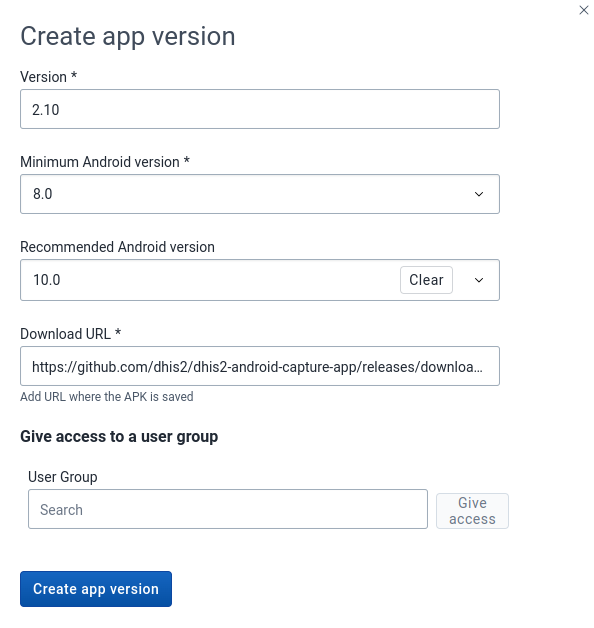

# APK Distribution Web App { #capture_app_apk_distribution_webapp }
## Overview { #capture_app_apk_distribution_webapp_overview }

This section focuses on the [APK Distribution Web App](https://apps.dhis2.org/app/dff273fc-909e-48af-b151-c4d7e9c8a12c) implementation.

The [APK Distribution Web App](https://apps.dhis2.org/app/dff273fc-909e-48af-b151-c4d7e9c8a12c) enables implementation administrators to manage and control the version of the Android app, making it easier to manage app updates and ensure compatibility with the DHIS2 system. 

Admins can upload the desired version to the server and mobile users will get a prompt message to update (on their first connection and every 24 hours) whenever they are not in the last updated version. More information about how to manage devices can be found in the "Distribution of the App" section of the [Android Implementation Guide](https://docs.dhis2.org/en/implement/android-implementation/scale-up.html)

Please note that in this version of the Web App, only users with "ALL" authority are able to define the Android app versions. Other users having access to the web app can see the version history list and download the latest version, but cannot edit them.

## Installation { #capture_app_apk_distribution_webapp_installation }

A user can easily install the Use Case Configuration Web App by logging into the DHIS2 and going to **App Management**.

- Click on **App Hub**
- Go to *APK Distribution App*
- Click on *Install V1.X.X*

## Log in and first time setup { #capture_app_apk_distribution_webapp_webapp_login }

After a user installs and launches the APK Distribution Web App for the first time, the web app will require saving the default values of the configuration. This will allow android devices connect to the instance.

{width=50%}

> **Warning**
>
> Only users with 'ALL' authority are able to *upload or delete* APK versions, but any user will have view access once it's created.
>

{width=50%}

## APK Versions { #capture_app_apk_distribution_webapp_versions }

The APK Distribution Web App allows the admin users to update or remove versions of the Android app.

### Upload version

Follow the steps below to upload an **Android app version**:

1. Click on *Upload new version* button.
2. Assign a version number.
3. Choose the minimum and/or recommend Android OS version.
4. Add a URL that contains the APK of the Android app.
5. Click on the "Create app version" button.

> **Note:**
>
> App versions must follow semantic versioning. Read more about [semantic versions](https://docs.npmjs.com/about-semantic-versioning). 
>
> When uploading a new apk, make sure that the app version is higher than the current/latest version.
> 
> 
> 
> To choose the minimum or recommended Android OS version for the app version, it is suggested to review the [Mobile Device Specification documentation](https://docs.dhis2.org/en/implement/android-implementation/mobile-device-specifications.html).
>

### Delete version

To remove an **Android App version**:

1. Search for the Android app version to delete.
2. Click on "Delete".
3. Click on the "Delete" button.

### Using mobile device

This Web App can also be manipulated from a mobile device. To use it, open DHIS2 in the browser from a mobile or tablet device.

The mobile version allows the administrator user to **upload** and **download** app versions.

When downloading a version, the APK will be stored in the device.

