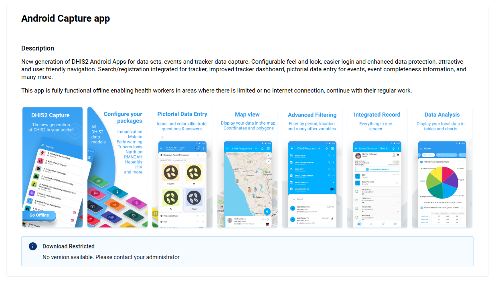
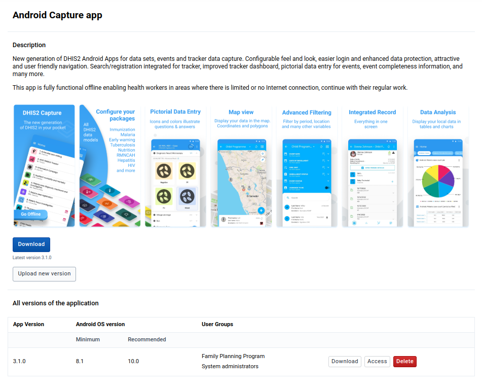
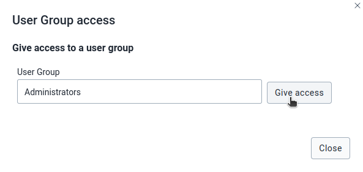
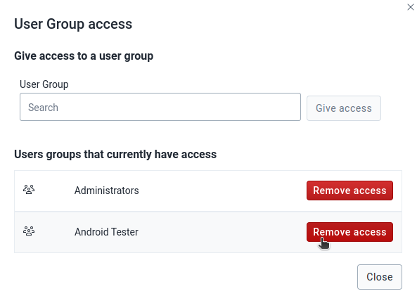

# APK Distribution Web App { #capture_app_apk_distribution_webapp }
## Overview { #capture_app_apk_distribution_webapp_overview }

This section focuses on the [APK Distribution Web App](https://apps.dhis2.org/app/dff273fc-909e-48af-b151-c4d7e9c8a12c) implementation.

The [APK Distribution Web App](https://apps.dhis2.org/app/dff273fc-909e-48af-b151-c4d7e9c8a12c) enables implementation administrators to manage and control the version of the Android app, making it easier to manage app updates and ensure compatibility with the DHIS2 system. 

Admins will be able to upload the desired version and users will get a prompt message to update when they are not in the last updated version.

Please note that in this version of the Web App, only users with "ALL" authority are able to define the Android app versions. Other users having access to the web app can see the version history list and download the latest version, but cannot edit them.

## Installation { #capture_app_apk_distribution_webapp_installation }

A user can easily install the Use Case Configuration Web App by logging into the DHIS2 and going to **App Management**.

- Click on **App Hub**
- Go to *APK Distribution App*
- Click on *Install V1.X.X*

## Log in and first time setup { #capture_app_apk_distribution_webapp_webapp_login }

After a user installs and launches the APK Distribution Web App for the first time, the web app will require saving the default values of the configuration. This will allow android devices connect to the instance.

{width=50%}

> **Warning**
>
> Only users with 'ALL' authority are able to *upload or delete* APK versions, but any user will have view access once it's created.
>

{width=50%}

## APK Versions { #capture_app_apk_distribution_webapp_versions }

The APK Distribution Web App allows the admin users to update or remove versions of the Android app.

The app provides two distinct interfaces based on user roles:

**User Interface**: Regular users have a simplified interface where they can:
- Download APK (**New 1.2**): A download button is displayed, showing the APK associated with their user group.
If no APK is assigned to their user group, no button or related content will be displayed.
This design ensures admins have full control over APK management, while regular users only see content relevant to their access permissions.

**Admin Interface**:
This special interface is designed exclusively for admin users, allowing them to:

- *Upload APKs*: Admins can upload APK files to the platform.
- *Grant Access*: Admins can assign APK access to specific user groups.
- *Delete APKs*: Admins can remove uploaded APKs when necessary.

### Upload version

Follow the steps below to upload an **Android app version**:

1. Click on *Upload new version* button.
2. Assign a version number.
3. Choose the minimum and/or recommend Android OS version.
4. Add a URL that contains the APK of the Android app.
5. Optionally, select one or more "user groups" to grant them access. (**v1.1**)
6. Click on the "Create app version" button.

> **Note:**
>
> App versions must follow semantic versioning. Read more about [semantic versions](https://docs.npmjs.com/about-semantic-versioning). 
>
> When uploading a new apk, make sure that the app version is higher than the current/latest version.
> 
> 
> 
> To choose the minimum or recommended Android OS version for the app version, it is suggested to review the [Mobile Device Specification documentation](https://docs.dhis2.org/en/implement/android-implementation/mobile-device-specifications.html).
>

### Grant access to User Groups (**v1.1**)

To give access to one or more User Groups:

1. Click on "Access".
2. A pop-up will appear with a search field.
3. Search a User Group.
4. Click on "Give access" button.
5. Click on "Close".

> **Note:**
>
> The APK Distribution web application empowers administrators to allocate access to user groups for specific "Android App" versions.
> - User groups can be assigned to multiple "Android app" versions, yet individual users within those groups will only have access to the latest version allocated to their group. 
> - It's feasible to refrain from assigning a user group to an "Android app" version. In such cases, all users within that instance will automatically gain access to that version. 
> - In instances where no user group is assigned to any "Android app" version, the latest version will be designated as the *Default*. Consequently, only the latest version will be accessible to all users within the instance.
>
>

### Remove access to User Groups (**v1.1**)

To give access to one or more User Groups:

1. Click on "Access".
2. A pop-up will appear with a search field and a list of User groups that currently have access.
3. Find the User group whose access will be removed.
4. Click on "Remove access" button.
5. Click on "Close".

### Delete version

To remove an **Android App version**:

1. Search for the Android app version to delete.
2. Click on "Delete".
3. Click on the "Delete" button.

### Using mobile device

This Web App can also be manipulated from a mobile device. To use it, open DHIS2 in the browser from a mobile or tablet device.

The mobile version allows the administrator user to **upload** and **download** app versions.

When downloading a version, the APK will be stored in the device.

## Uninstall the app

In case of needing to uninstall the APK Distribution App it is recommended to also delete all the data from the datastore namespace.

#### Delete data

- Click on *Erase settings*
- A modal will pop up, click on *Erase*

#### Uninstall app

- Go to **App Management**
- Click on **Custom Apps**
- Go to *APK Distribution*
- Click on *Uninstall V1.X.X*

> **Warning**
>
> This is a critical action, be aware that by doing this, all previous configurations will be permanently deleted.   