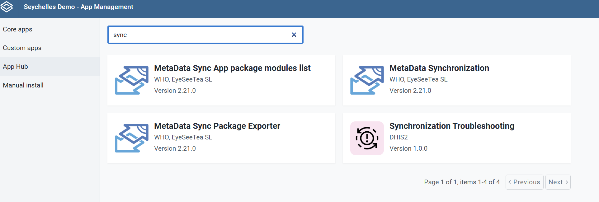
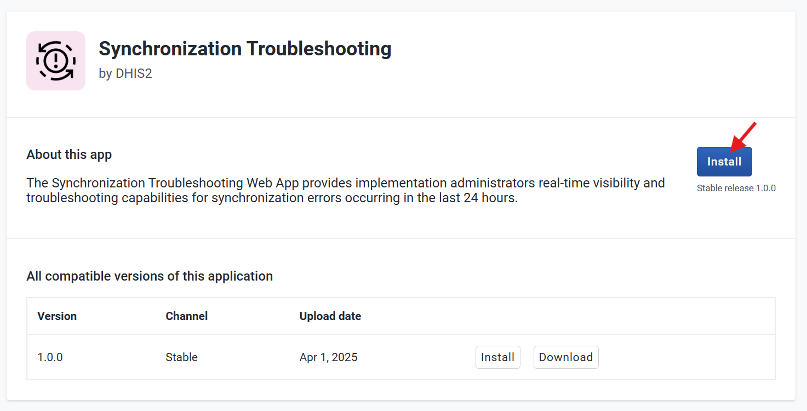
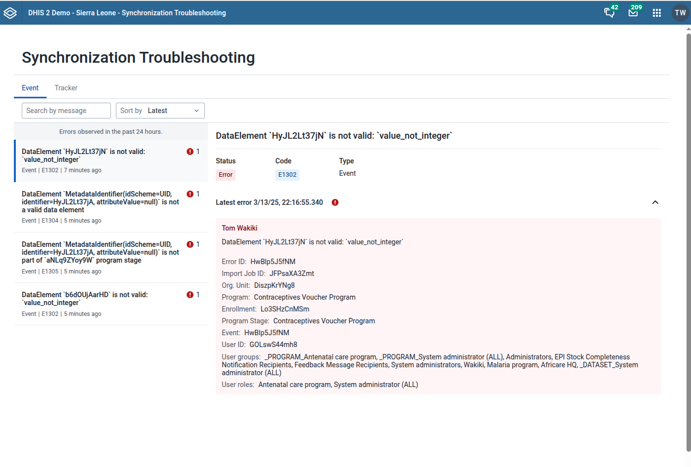
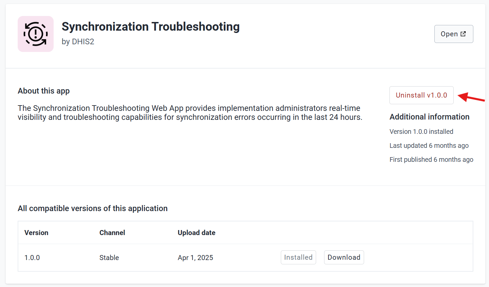

# Synchronization Troubleshooting Web App { #capture_app_sync_troubleshooting_webapp }
## Overview { #capture_app_sync_troubleshooting_webapp_overview }

This section focuses on the [Synchronization Troubleshooting Web App](https://apps.dhis2.org/app/64e70334-be30-4f2e-8883-636beb74ae13) implementation.

The [Synchronization Troubleshooting Web App](https://apps.dhis2.org/app/64e70334-be30-4f2e-8883-636beb74ae13) provides administrators with real-time visibility into synchronization errors. These error records are automatically removed by the backend after a default period of 24 hours.

This cleanup period is defined in System Settings and applies to all single-run jobs (such as data imports). The value can be changed through the API. Increasing the period will retain errors for longer but also increase database storage.

**To check current cleanup period:**

> 
> GET /api/systemSettings/jobsCleanupAfterMinutes
>

**To update cleanup period (value in minutes):**
>
> POST /api/systemSettings/jobsCleanupAfterMinutes?value=<value_in_minutes>
>

Please note that in this version of the Web App, only users with "F_JOB_LOG_READ" authority are able to monitor the detailed error information. Other users will not have access to the web app.

## Installation { #capture_app_sync_troubleshooting_webapp_installation }

A user can easily install the Synchronization Troubleshooting Web App by logging into the DHIS2 and going to **App Management**.

- Click on **App Hub**
- Go to *Synchronization Troubleshooting App*
- Click on *Install V1.X.X*

## Synchronization Troubleshooting { #capture_app_sync_troubleshooting_monitoring }

The Synchronization Troubleshooting provides admin users with a dedicated interface to monitor and manage synchronization errors efficiently.

- View Error List: Admins can access a detailed list of errors that occurred during synchronization.
- Sort Errors: The list can be sorted by error name, latest, oldest or error code, making it easier to identify and troubleshoot specific issues.
- Search Errors: Quickly find specific errors using the error message as a search filter.

This functionality helps admins track and resolve synchronization problems quickly, ensuring a smoother data transfer process.

**Understanding Error Details: Identifying Android vs. Web Users**

In the error detail cards, additional information is provided to help identify the source of the error. Key details include:

- User Group & Role: These indicate the permissions and access level of the user involved in the error.
- Error Origin: By analyzing the user role and group, admins can determine whether the error was caused by an Android user or a web user.

This information helps troubleshoot synchronization issues more efficiently by pinpointing whether the error is related to a specific platform or user type.

> **Note:**
>
> To monitor synchronization errors in the web app, users must have specific permissions:
> 
> - "F_JOB_LOG_READ" Authority: Required to access and read the list of synchronization errors.
> - "F_USER_VIEW" Authority: Required to read the list of users
> - Additional Access for Error Details: To view more details about each error, the user must have permission to access the lists of:
> Users
> Events
> Programs
>
> Without these permissions, users may only see basic error information or be restricted from viewing certain details. This ensures that sensitive data is only accessible to authorized users.
>
>

## Uninstall the app { #capture_app_sync_troubleshooting_webapp_uninstall }

In case of needing to uninstall the APK Distribution App it is recommended to also delete all the data from the datastore namespace.

- Go to **App Management**
- Click on **Custom Apps**
- Go to *Synchronization Troubleshooting*
- Click on *Uninstall V1.X.X*

