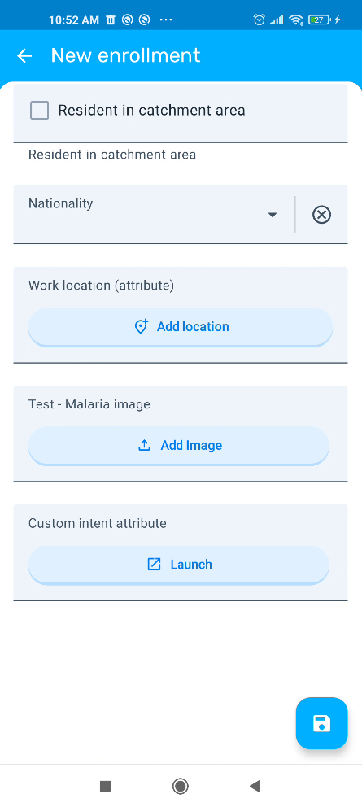
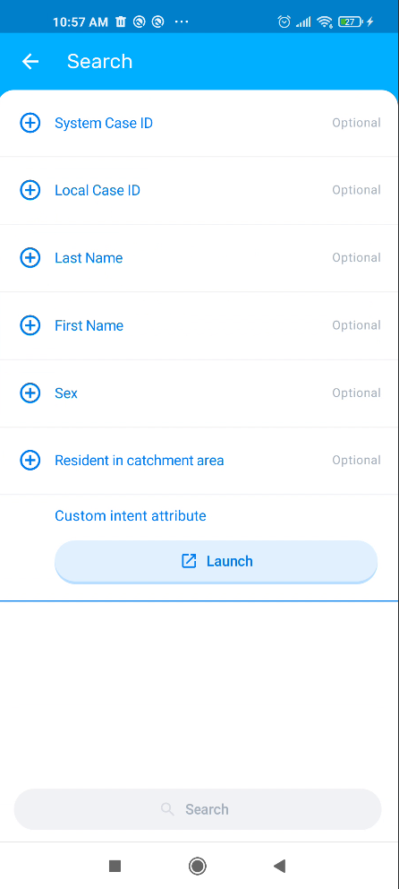
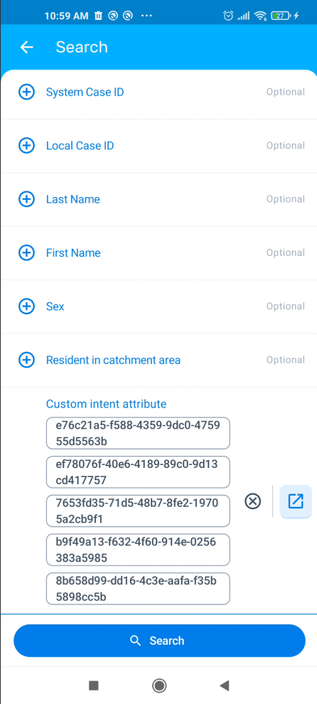
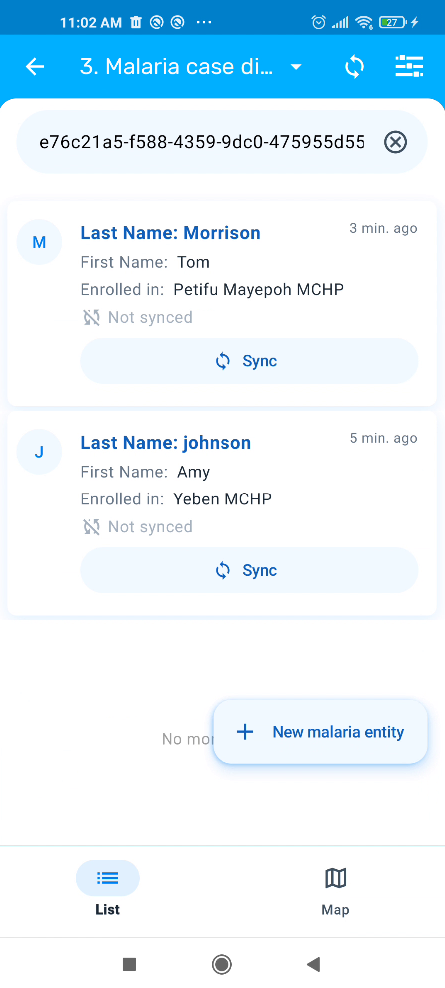

# Custom Intents { #capture_app_custom_intents }

## Overview { #capture_app_custom_intents_overview }

Custom Intents is a powerful feature that allows the DHIS2 Android Capture App to integrate with third-party Android applications. By configuring custom intents, administrators can enable the Android app to launch external applications, send data to them, and receive data back to populate fields automatically.

This feature enables seamless integration with specialized apps such as:
- Barcode and QR code scanners
- GPS and mapping applications
- Biometric identification systems
- Custom data collection tools
- Camera applications
- Medical device applications
- Any other Android application that supports intent-based communication

Custom Intents are configured using the [Android Settings Web App](https://apps.dhis2.org/app/a1bd6b5b-de8c-4998-8d34-56c18a139683) and can be linked to Tracked Entity Attributes or Data Elements.

> **Note**
>
> Custom Intents leverage the Android Intent system, which is a fundamental component of Android's inter-app communication mechanism. Understanding basic Android Intent concepts can be helpful when configuring this feature.

## Configuration { #capture_app_custom_intents_configuration }

To configure a Custom Intent, access the Android Settings Web App and navigate to the Custom Intents section. The configuration allows administrators to define how the DHIS2 Android App interacts with third-party applications.

### Adding a Custom Intent { #capture_app_custom_intents_configuration_adding }

To add a new Custom Intent:

1. Open the Android Settings Web App
2. Navigate to the Custom Intents section
3. Click on **Add Custom Intent**
4. Fill in the configuration parameters as described below

{width=50%}

### Configuration Parameters { #capture_app_custom_intents_configuration_parameters }

#### Basic Information { #capture_app_custom_intents_configuration_basic }

Intent Name
:   A unique, descriptive name for the custom intent. This name helps identify the intent in the configuration interface.

Intent Description
:   A detailed description of what the custom intent does and which third-party app it integrates with. This helps other administrators understand the purpose of the intent.

#### Element Binding { #capture_app_custom_intents_configuration_binding }

Element Type
:   Specifies where the custom intent will be attached. Options include:
    
    - **Tracked Entity Attribute**: Links the intent to a specific tracked entity attribute
    - **Data Element**: Links the intent to a specific data element

Attribute/Data Element
:   Select the specific tracked entity attribute or data element that will trigger the custom intent. When a custom intent is configured for a field, users must use the third-party application to enter or search data for that field. Manual data entry will not be available.

> **Note**
>
> Only Data Elements or Tracked Entity Attributes with **TEXT** or **LONG_TEXT** value types are currently supported for custom intents.

Screen/Action
:   Defines where in the Android app the custom intent will be triggered. Available options:
    
    - **SEARCH**: The intent will be available during search operations, allowing users to search for tracked entity instances using data from external apps
    - **DATA_ENTRY**: The intent will be available during data entry, allowing users to populate fields with data from external apps

#### Third-Party Application { #capture_app_custom_intents_configuration_app }

Package Name
:   The complete package name and action of the third-party Android application to launch. This should include both the package identifier and the specific action.
    
    Format: `com.apppackageName.id.CAPTURE`
    
    Example: `com.google.zxing.client.android.SCAN` for a barcode scanner app

> **Important**
>
> The third-party application must be installed on the Android device for the custom intent to work. If the app is not installed, users will receive an error message when attempting to trigger the intent.

### Request Configuration { #capture_app_custom_intents_configuration_request }

The Request section defines the parameters that will be sent to the third-party application when the intent is launched. This allows you to customize the behavior of the external app based on your requirements.

#### Request Parameters { #capture_app_custom_intents_configuration_request_params }

Request Parameters
:   A list of key-value pairs that will be sent as extras to the third-party application's intent. Each parameter consists of:
    
    - **Key**: The parameter name expected by the third-party application
    - **Value**: The parameter value to send
    
> **Note**
>
> Request parameters are type-safe. Follow these formatting rules:
> - **Strings**: Must be surrounded by single quotes (e.g., `'QRCODE'`, `'portrait'`)
> - **Integers**: No quotes needed (e.g., `100`, `640`)
> - **Floats**: No quotes needed (e.g., `3.14`, `2.5`)
> - **Booleans**: No quotes needed (e.g., `true`, `false`)

**Example Request Parameters:**

| Key          | Value       | Description                   |
|--------------|-------------|-------------------------------|
| PROJECT_ID   | 'sample_id' | Id needed for third party app |
| ORIENTATION  | 'portrait'  | Set camera orientation        |
| TIMEOUT      | 30000       | Set timeout in milliseconds   |
| ENABLE_FLASH | true        | Enable camera flash           |

{width=50%}

### Response Configuration { #capture_app_custom_intents_configuration_response }

The Response section defines how to extract and process data returned from the third-party application. This determines which value will be populated in the linked tracked entity attribute or data element.

#### Response Parameters { #capture_app_custom_intents_configuration_response_params }

Extra Name
:   The exact name of the extra field in the intent returned by the third-party application. This is the key used by the external app to send data back to DHIS2.
    
    Example: `SCAN_RESULT`, `LATITUDE`, `BARCODE_VALUE`

Extra Type
:   The data type of the returned value. Available options:
    
    - **String**: Plain text value
    - **Integer**: Whole number value
    - **Float**: Decimal number value
    - **Boolean**: True/false value
    - **JSON Object**: A single JSON object
    - **List of JSON Objects**: An array of JSON objects

Property in JSON Object
:   *Only applicable when Extra Type is "JSON Object" or "List of JSON Objects"*
    
    Specifies the property name to extract from the JSON object(s). This should be a direct property of the JSON object.
    
    Example: `value`, `latitude`, `name`

> **Note**
>
> - Only direct properties are supported. Nested properties (e.g., `location.coordinates.latitude`) are not currently supported.
> - Array indexing (e.g., `results[0].name`) is not currently supported.
> - When using **List of JSON Objects** as the Extra Type:
>   - For **SEARCH**: The specified property will be extracted from all objects in the list, allowing users to search for tracked entity instances that match any value in the list.
>   - For **DATA_ENTRY**: The values will be extracted from all objects and concatenated into a single string separated by commas (e.g., `value1,value2,value3`).

{width=50%}

## Use Cases and Examples { #capture_app_custom_intents_examples }

### Example 1: Barcode Scanner Integration { #capture_app_custom_intents_examples_barcode }

This example shows how to integrate a barcode scanner app to populate a patient ID field.

**Configuration:**
- **Intent Name**: Barcode Scanner for Patient ID
- **Intent Description**: Scans patient ID barcodes using ZXing scanner
- **Element Type**: Tracked Entity Attribute
- **Attribute**: Patient ID
- **Screen/Action**: DATA_ENTRY
- **Package Name**: `com.google.zxing.client.android.SCAN`

**Request Parameters:**
| Key | Value |
|-----|-------|
| SCAN_MODE | 'QR_CODE_MODE' |
| PROMPT_MESSAGE | 'Scan patient ID barcode' |

**Response:**
- **Extra Name**: `SCAN_RESULT`
- **Extra Type**: String
- **Property in JSON Object**: *(leave empty for string type)*

### Example 2: GPS Coordinates Integration { #capture_app_custom_intents_examples_gps }

This example demonstrates capturing GPS coordinates from a mapping application that returns JSON data.

**Configuration:**
- **Intent Name**: GPS Location Capture
- **Intent Description**: Captures GPS coordinates from mapping app
- **Element Type**: Data Element
- **Data Element**: Household Location
- **Screen/Action**: DATA_ENTRY
- **Package Name**: `com.example.gpsapp.CAPTURE_LOCATION`

**Request Parameters:**
| Key | Value |
|-----|-------|
| ACCURACY | 'HIGH' |
| TIMEOUT | 60000 |

**Response:**
- **Extra Name**: `LOCATION_DATA`
- **Extra Type**: JSON Object
- **Property in JSON Object**: `coordinates.latitude`

**Example JSON response:**
```json
{
  "coordinates": {
    "latitude": -1.2921,
    "longitude": 36.8219
  },
  "accuracy": 5.0,
  "timestamp": "2025-11-03T10:30:00Z"
}
```

### Example 3: Custom Data Collection Tool { #capture_app_custom_intents_examples_custom }

This example shows integration with a custom medical device app that returns multiple measurements in a JSON array.

**Configuration:**
- **Intent Name**: Blood Pressure Monitor
- **Intent Description**: Captures blood pressure from external monitor device
- **Element Type**: Data Element
- **Data Element**: Systolic Pressure
- **Screen/Action**: DATA_ENTRY
- **Package Name**: `com.medical.bpmonitor.MEASURE`

**Request Parameters:**
| Key | Value |
|-----|-------|
| MEASUREMENT_TYPE | 'BLOOD_PRESSURE' |
| UNIT | 'mmHg' |

**Response:**
- **Extra Name**: `MEASUREMENTS`
- **Extra Type**: List of JSON Objects
- **Property in JSON Object**: `systolic`

**Example JSON response:**
```json
[
  {
    "systolic": 120,
    "diastolic": 80,
    "pulse": 72,
    "timestamp": "2025-11-03T10:30:00Z"
  }
]
```

## User Experience in the Android App { #capture_app_custom_intents_user_experience }

When a custom intent is configured for a tracked entity attribute or data element, the field will only accept data from the configured third-party application. Manual data entry will not be available for that field.

### Data Entry Flow { #capture_app_custom_intents_user_experience_flow }

1. User navigates to the form containing the configured field
2. User taps the custom intent button/icon next in the field
3. The third-party application launches with the configured request parameters
4. User completes the action in the third-party app (e.g., scans a barcode, captures location)
5. The third-party app returns the result to DHIS2
6. The configured response value is automatically populated in the field
7. User can review the value before saving

{width=25%}

> **Note**
>
> When the Extra Type is **List of JSON Objects**, the returned values will be concatenated into a single string separated by commas (e.g., `120,118,122`). This allows storing multiple values from the list in a single field.

### Search Flow { #capture_app_custom_intents_user_experience_search }

When configured for the SEARCH screen:

1. User navigates to the search screen for tracked entities
2. User taps the custom intent button for the search field
3. The third-party application launches
4. The returned value is used as a search parameter
5. Search results are displayed based on the captured value

{width=25%}

> **Note**
>
> When the Extra Type is **List of JSON Objects**, the search will match tracked entity instances that contain any of the values in the returned list. This allows searching for multiple entities at once.

{width=25%}
{width=25%}

## Limitations and Considerations { #capture_app_custom_intents_limitations }

### Third-Party App Requirements { #capture_app_custom_intents_limitations_app }

- The third-party application must be installed on all Android devices that will use the custom intent
- The third-party app must support Android Intent-based communication
- The package name and action must be correctly configured and match the third-party app's implementation

### Data Type Compatibility { #capture_app_custom_intents_limitations_datatype }

- The Extra Type configured in the response must match the actual data type returned by the third-party application
- The tracked entity attribute or data element value type should be compatible with the returned data
- Type mismatches may result in errors or unexpected behavior

### Device Compatibility { #capture_app_custom_intents_limitations_device }

- Custom Intents rely on Android's Intent system and are only available on Android devices
- Some third-party apps may have specific Android version requirements
- Testing should be performed on all target device models

### Security Considerations { #capture_app_custom_intents_limitations_security }

> **Warning**
>
> When configuring custom intents that integrate with third-party applications, consider the following security implications:
> - Data sent to third-party apps may be stored or transmitted according to the third-party app's privacy policy
> - Ensure third-party applications are from trusted sources
> - Review the permissions requested by third-party applications
> - Sensitive health data should only be shared with certified and compliant applications
> - Consider implementing Mobile Device Management (MDM) to control which apps can be installed

### Network and Offline Behavior { #capture_app_custom_intents_limitations_offline }

- Custom intents work in offline mode as long as the third-party app is installed and doesn't require network connectivity
- Some third-party apps may require internet access to function properly
- Ensure the solution works in the expected connectivity scenarios for your deployment

## Troubleshooting { #capture_app_custom_intents_troubleshooting }

### Common Issues { #capture_app_custom_intents_troubleshooting_common }

**Issue: Custom intent button doesn't appear**
- Verify that the custom intent is correctly configured in the Android Settings Web App
- Check that the device has synchronized the latest configuration
- Ensure you're viewing the correct tracked entity attribute or data element

**Issue: "Application not found" error**
- The third-party application is not installed on the device
- The package name is incorrectly configured
- The third-party app doesn't support the specified action

**Issue: No data is returned**
- Verify the Extra Name matches the key used by the third-party app
- Check that the Extra Type is correct
- Review the third-party app's documentation for the expected response format

**Issue: Wrong value is populated**
- Verify the Property in JSON Object path is correct
- Check that the JSON structure matches the expected format
- Ensure the Extra Type matches the actual returned data type

**Issue: App crashes when launching intent**
- Review the request parameters for syntax errors (e.g., missing quotes for strings)
- Verify the third-party app supports the configured parameters
- Check Android logs for detailed error messages

### Testing Custom Intents { #capture_app_custom_intents_troubleshooting_testing }

Before deploying custom intents to production:

1. Test with a small group of users on various device models
2. Verify the third-party app is available and properly licensed
3. Test both online and offline scenarios
4. Verify data validation rules are applied to returned values
5. Test error handling when the third-party app is not installed
6. Document the configuration and user instructions

> **Note**
>
> Consider creating a test program or data set specifically for testing custom intent configurations before deploying to production programs.

## Best Practices { #capture_app_custom_intents_best_practices }

1. **Clear Naming**: Use descriptive intent names that clearly indicate the purpose and third-party app being used

2. **Documentation**: Maintain documentation of all configured custom intents, including the required third-party apps and their versions

3. **User Training**: Provide clear instructions to users on how to use custom intents and what to expect. Ensure users understand that manual data entry will not be available for fields with custom intents configured.

4. **App Distribution**: Use Mobile Device Management (MDM) to ensure third-party apps are properly installed and updated on all devices

5. **Testing**: Thoroughly test custom intents in a non-production environment before deployment

6. **Validation**: Implement appropriate validation rules on fields that use custom intents to ensure data quality

7. **Reliability**: Ensure the third-party application is stable and reliable, as it will be the only way to populate the configured field. Have a contingency plan if the third-party app becomes unavailable.

8. **Version Control**: Keep track of third-party app versions and test compatibility when apps are updated

9. **Privacy Compliance**: Ensure custom intent configurations comply with data privacy regulations (GDPR, HIPAA, etc.)
