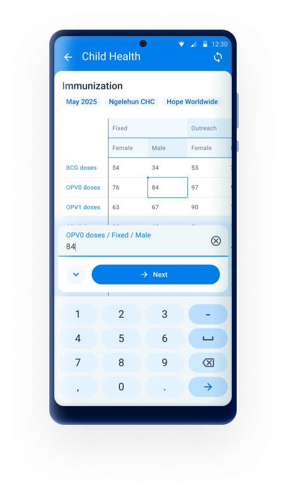
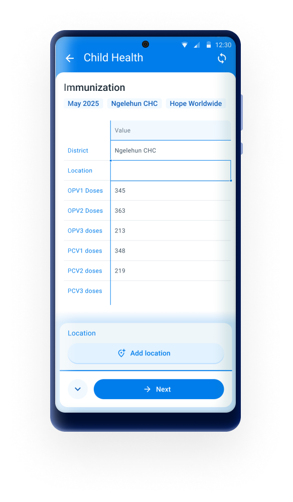
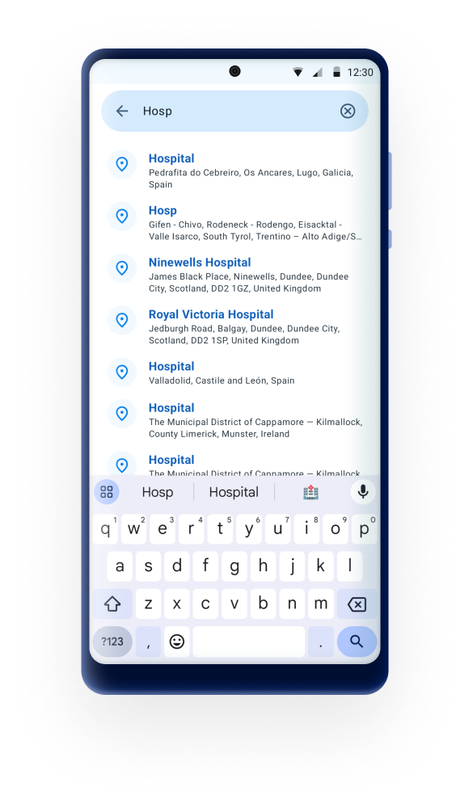
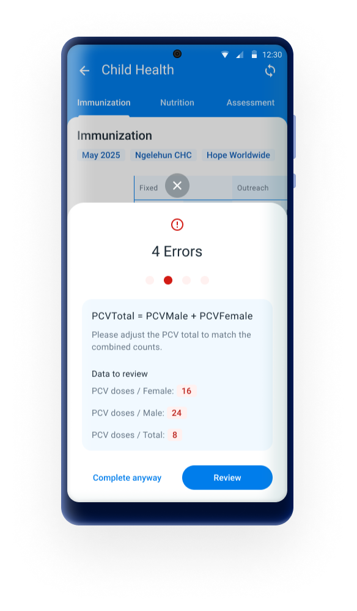
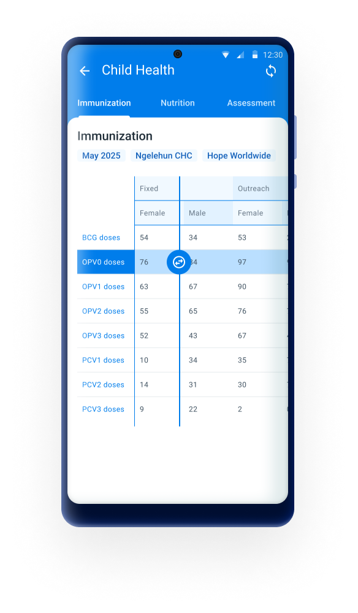
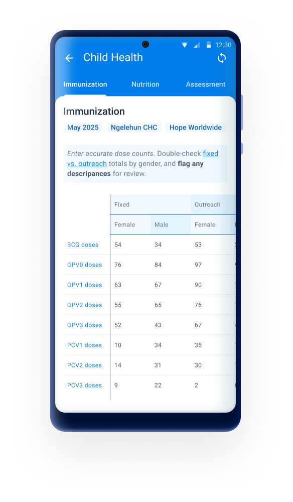
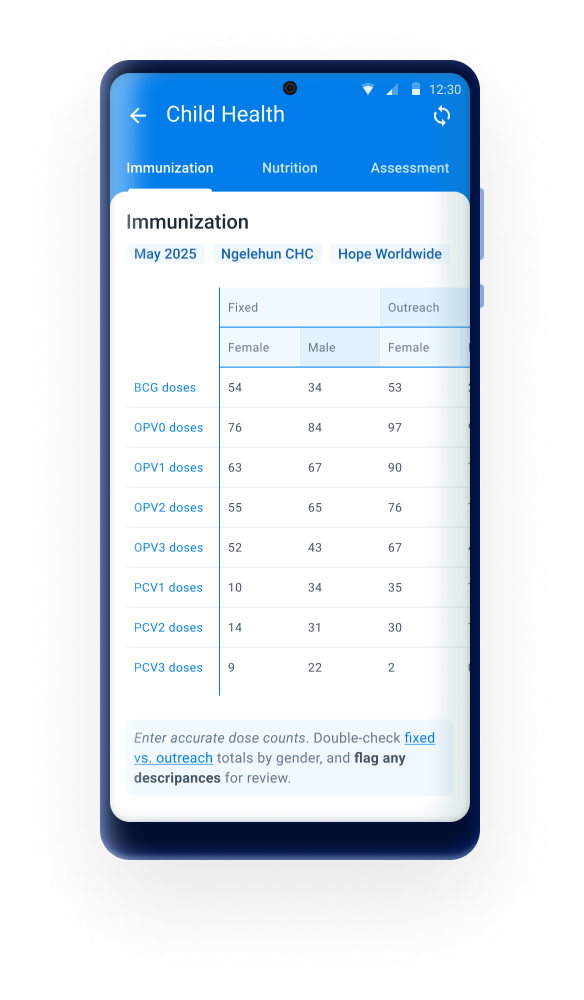
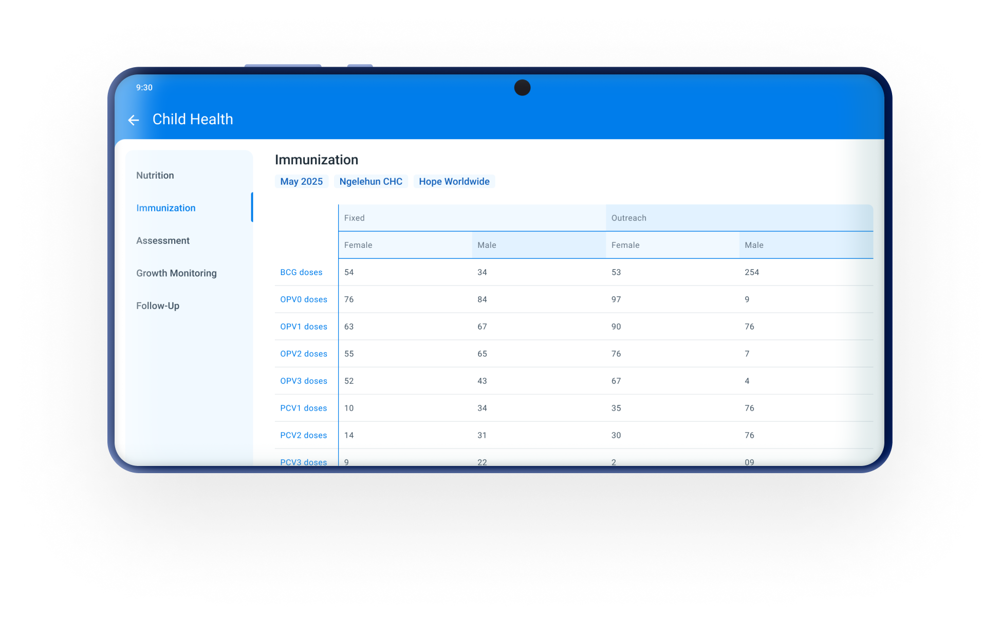

# Data sets { #capture_app_datsets }

### Data Entry (Improved 3.2.0) {#capture_app_data_sets_data_entry}

From 3.2.0, to improve usability and align with user expectations, the DHIS2 Android Capture App has undergone a comprehensive redesign of the data entry table and input dialog for Data Sets.

**Key Enhancements:**

* Modernized Table Layout: The data entry table now features a cleaner and more intuitive design, facilitating easier data input and review.
* Enhanced Input Dialog: The input dialog has been revamped to provide a more user-friendly interface, streamlining the data entry process.

{ width=25%}
{ width=25%}

#### Capturing Coordinates (New 3.2.0) {#capture_app_data_sets_data_entry_capture_coordinates}

To enhance the process of capturing coordinates and align to the behavior in tracker programs, a search bar has been implemented. This feature allows users to input textual information, such as street names or numbers, to facilitate the identification of specific locations.

{ width=25%}
{ width=25%}
{ width=25%}

### Navigation Bar { #capture_app_data_sets_navigation_bar }

Use the navigation bar located at the bottom of the data set to switch between the data entry form and the overview screen.

{ width=25%}

### Overview Screen (Removed 3.2.0) { #capture_app_data_sets_overview_screen }

the Overview screen for Data Sets has been removed from the Android Capture App in version 3.2.0. Users are now taken directly to the data entry screen after selecting a Data Set.

All relevant metadata is now either pre-selected or directly accessible within the data entry screen.

### Saving a data set (Improved 3.2.0) { #capture_app_data_sets_saving }

Validation rules and completion of data sets are integrated in the save button actions:

- When a Data set is configured to *complete only if validation passess*. If the validation is successful, a dialog asking to mark as complete will show up. The App will allow completion only if all mandatory fields have value.

{ width=25%}
  
- if it is not successful, then an error dialog should show and the dataset will not be marked as complete. The description and instructions of the validation rule will be displayed to help the user identify the error.

{ width=25%}

- On a dataset that does not have setup "Complete allowed only if validation passes". When clicking on the save button; if the data set has validation rules associated to it, then the app will ask the user to run the validation rules.
  
{ width=25%}

- If the validation is not successful, an error dialog should show but with the possibility to complete the data set anyway. The description and instructions of the validation rule will be displayed to help the user identify the error.

{ width=25%}

- If the data set does not have validation rules, the data set will be marked as complete if all mandatory fields have value.

### Increase Row and column Headers (Improved 3.2.0) { #capture_app_data_sets_row }

Users are now allowed to resize the row headers and columns in datasets, making it easier to view and work with larger tables.

To resize any column, tap on its header and then drag and drop until the desired size. A maximum and minimum size limit is given for the columns that can be resized to ensure a good layout.

If the column have multiple headers, the resizing will be available only for the child header (lowest level). Users can also resize all collumns at once by clicking on the top left of the table.

{ width=25%}

From 3.2.0 the Data Sets table includes a Reset button to complement the increment and decrement input controls in columns.It appears only while resizing is active and lets users quickly revert any resized columns to their original (default) width.

The button is contextual and will:

* Disappear once the user navigates to a different section.
* Be hidden when an input dialog is opened.

{ width=25%}

### Indicators (Improved 3.2.0) { #capture_app_data_sets_indicators }

Indicators are now available in default and section forms and are displayed at the bottom of the data entry form.

{ width=25%}

### Cards design { #capture_app_datsets_cards_design }

The new design of cards offers a cleaner and more intuitive layout replacing the use of coloured icons by explicit text when relevan.

#### Main changes { #capture_app_datsets_cards_design_main_changes }

**Sync button:** It now appears as a button at the bottom of the card and it is only displayed if there are unsynced data or an error or warning after a sync.

**Completion status:** After the data set is completed, the app will add a label in each card to specify the completion status.

{ width=25%}

### Configurable forms/ Pivot options (New 3.2.0) { #capture_app_datsets_pivot_options }

This new feature supports a variety of layout and display configurations, allowing data sets to better reflect national paper tools, simplify workflows, and reduce user errors. It requires a configuration in the maintenance app whithin a DHIS2 Web version: 2.41+.

The following configurations are supported:

#### 1. Disable Automatic Grouping of Data Elements

Ensures data elements retain their defined order, even if they share category combination and prevents the default behavior where data elements are grouped by category combination and sorted alphabetically.

{ width=25%}

#### 2. Transpose (Pivot) Layout Options

Controls how data elements and category options are arranged in tables:

|Mode | Description|
|---|---|
|Default | Data elements as rows, categories as columns (standard layout)|
|Full Pivot | Categories as rows, data elements as columns|
|Move Specific Category to Row | Shift only one category to rows for partial transposition|

{ width=25%}
{ width=25%}

#### 3. Content Before and After Sections

Adds  instructional text or HTML content above and below each section and supports simple styling: < a >, < u >, < b/strong >, and < em >.

{ width=25%}
{ width=25%}

#### 4. Render Sections as Tabs (vertical layout)

When the feature is enabled in the section configuration, the form displays a left panel listing all the sections as vertical tabs.This panel is only shown in landscape orientation. In portrait mode, the traditional tab bar remains.

{ width=25%}

## Supported features overview { #capture_app_datsets_supported_features }

The following is a comprehensive list of all features available for Data Sets in DHIS2 and notes on whether or not these have been implemented in the Android Capture app.

In the notes, ‘admin’ refers to someone who develops and configures a DHIS2 system, and ‘user’ refers to someone who uses apps to capture data, update it, and review reports.

|Legend|Description|
|:--:|:------|
||Feature implemented|
||Feature not implemented&nbsp;(will be ignored)|
||Not applicable|
||Work in progress. Feature not completely implemented yet or with unexpected behaviour already reported.|

|Feature|Description of feature|Status|Notes on implementation|
|-|---|:-:|---|
|Period type|Determines the period covered by data-entry.| | |
|Expiry days|Sets the deadline (days after period) after which DHIS2 locks all data entry for the period (0 means no locks at all).  Periods can still be opened, but cells will be greyed out.|  | |
|Open future periods for data entry|This setting can be used to unlock the current period or all periods up to a certain point in the future.| | |
|Data input periods|Allows you to set a specific range of dates for a period's data-entry, and prevents data capture for periods outside of this date range.| | |
|Days after period to qualify for timely submission|Sets the deadline (days after period) after which DHIS2 treats data entry as 'late'.| | |
|[Attribute] category combination|Allows an admin to attach a Category (set of Options) to the Data Set, generating a separate data entry screen for each Option (This is called an Attribute Category Combination in DHIS2).| | |
|[Attribute] Category Combination option restrictions|If Attribute Category Combinations (see above) are used, then this features gives admins the ability to restrict which specific options are available in the drop-down.  Each option can be restricted to a particular range of dates and/or organisation units, and that option will not be shown if data is being captured outside of these dates or org units.| ||
|Complete notification recipients|Sends a DHIS2 message to the selected User Group when the Data Set is marked 'complete'.|| |
|Send notification to completing user|Sends a DHIS2 message to the data-entry user when the Data Set is marked 'complete'.|| |
|All fields for data elements required|Where one or more Categories are used to disaggregate a data element, this setting forces the user to either complete all disaggregations, or to leave them all empty.| | |
|Complete only if validation passes|Only allows the Data Set to be marked complete if no Validation Rules are triggered.|| |
|Skip offline|Requires the user to add a 'comment' if a value is left blank (or Data Set cannot be 'completed'). Only allows Data set to be selected for data entry while connected to the internet (although once selected, data entry can continue offline).|| |
|Data element decoration|Shows the description of the Data Element when the mouse hovers over the Data Element Name.| | |
|Section forms - render sections as tabs|Displays each section in the form as a separate tab, instead of all together on the same page.|| |
|Section forms - render vertically||| |
|Data Element - CatCombos|Enables an individual Data Element to be automatically disaggregated into one or more categories (eg both male/female and child/adult), with separate fields/values collected for each of these disaggregations.|| |
|Inline indicators / section form totals|Enables the default CatCombo for each data element to be overridden with a different CatCombo for this Data Set only.|| |
|Section forms - render sections as tabs|Adding indicators to Data Sets makes them available for use in section forms and custom forms; row and/or column totals can also be added to these forms.  (Both are displayed on the screen alongside data capture cells, and update automatically as values are captured.)|| |
|Organisation unit assignment|Ensures the Data Set is only available for those organisation units to which it has been assigned.| | |
|Compulsory data elements|This allows the marking of specific Data Elements/CatCombos as ‘compulsory’, which means users must enter a value (they cannot be left blank).| | |
|Forms - default forms|DHIS2 automatically renders the form as table(s), with a new table started every time the Category Combinations change (= different column headings).| | |
|Forms - section forms|Form sections and section titles can be specified, giving you more control over the grouping and layout of the form (but it is still rendered automatically).  This section form automatically overrides the default form if implemented.| | |
|Forms - custom forms|A custom HTML form can be designed, giving total control over layout, and enabling JavaScript code to be included within the form.  This custom form automatically overrides the default and section forms if implemented.|| |
|Section forms - disable fields (grey)|With section forms, this enables you to individually 'grey out' fields (a whole data element, or specific CatCombo Options) so that users cannot enter data into it.| | |
|Multi-organisation unit forms|When this server setting is enabled, form layouts are changed to show multiple org units as rows, and all data elements/CatCombos as columns (ie very flat and wide form per org unit).|| |
|Data value pop-up: mark value for follow-up|Enables the user to mark this specific data value for follow-up (marked values can be reviewed in the Data Quality web app).|| |
|Data value pop-up: add comment to value|Enables the user to add a comment to this specific data value.|| |
|Data value pop-up: display data element history|Shows the history over time of this specific data element (i.e. previous 12 months' values).|| |
|Data value pop-up: display audit trail|Shows a history of previous edits to this specific data value.|| |
|Data value pop-up: min/max ranges (also accessible via Data Administration app)|This enables users to set minimum and maximum expected values for a data element, enabling DHIS2 to highlight values outside this range during data entry (but it does not prevent saving or 'completing').  You can set min/max ranges automatically/in-bulk (via the Data Administration app) or manually/individually (via the Data Entry app).|| |
|Print form / print blank form|Enables printing of a data-entry form, to permit data capture on paper, and data-entry later.|| |
|Save data|Data entered into the screen is not captured until 'saved' - until then, it is only held in memory, and is lost if power is switched off etc.|| |
|Complete data set|This enables user to mark data-entry for a period/org unit/etc as 'complete'.  Note that this is just for data-entry tracking and timeliness purposes, and does not lock the data set or prevent further edits.|| |
|Data elements: validation rules|Enables the creation of rules (at the data element level) to enforce data quality, based on comparing different values/collections of values.  (Eg number of patients seen in the month must be less than the number of visits for the month.)|| |
|Data sharing levels/Can capture data|Enables the user to add new values, edit values and delete values in the dataset.| | |
|Data sharing levels/Can view data|Enables the user to see values within the dataset.| | |
|Data sharing levels/No access|The user won’t be able to see the dataset.| | |
|Data approval workflow|If an admin selects a pre-configured Data Approval Workflow, this will be used to enforce an ‘approval’ or ‘acceptance and approval’ cascade, enabling users to sign-off and lock data.| | The process of the approval has to be done in web. Once a data set is approved, the data will not longer be editable in the app. |
|Missing values requires comment on complete|Any missing values will require a comment to justify their absence.|-||
