# Programs { #capture_app_programs }

## Event and Tracker common features { #capture_app_common_features }

### Navigation Bar

Use the bottom navigation bar to move from one screen to another.

#### Event Dashboard

While entering information of the event, the bottom navigation bar allows the user to choose among:

1. Details
2. Data Entry
3. Analytics (when available)
4. Notes

{ width=25%}

#### TEI Dashboard

While in the TEI dashboard the bottom navigation bar allows the user to choose among:

1. Details
2. Analytics (when available)
3. Relationships
4. Notes

{ width=25%}

#### Event listing for event and tracker programs

The bottom navigation bar also allows switching the visualization mode if the event program or the tracker program have been defined with coordinates. More information about the map view can be found on the specific section below.

  1. List view
  2. Map view

{ width=25%}
{ width=25%}

### Data Entry Flow { #capture_app_common_features_Data_flow }

#### creating/editing an event { #capture_app_common_features_newEdit_event }

When creating an event or an enrollment, there are a number of fields that are not data elements or attributes, for example, event date, org unit, coordinates, enrollment date, category combinations. 

Those elements are referred to as event/enrollment details and in previous versions they were displayed in different screens separated from the data elements or attributes. From 3.0,  the details are displayed inside the form, as the first opened section for completion. Once they are filled in, for example when the user reopens the event or enrollment form, the details section will be visible and easily available, but collapsed to leave more space for the data collection.

{ width=25%}
{ width=25%}
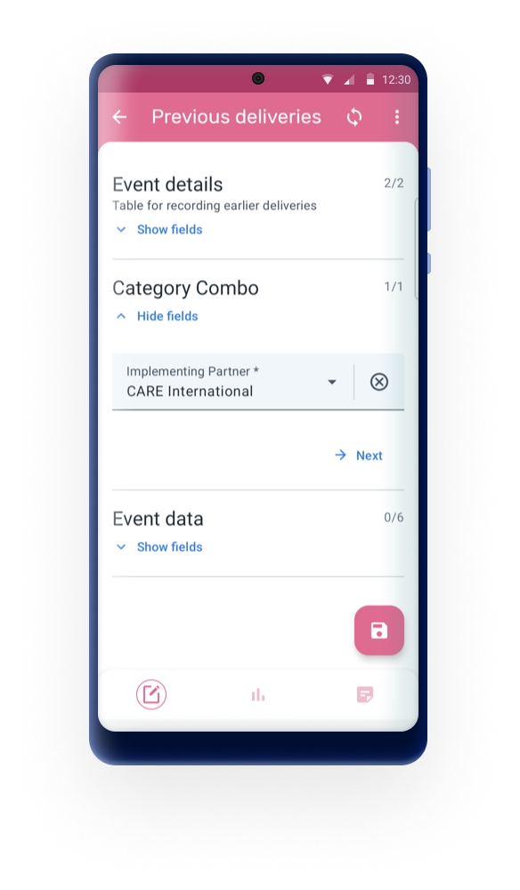{ width=25%}

#### Complete/Re-open event { #capture_app_common_features_complete_reopen }

When adding an event to an event program or inside a tracker program the user should fill the information and scroll down to make the *save* icon appear at the bottom right corner.

{ width=25%}
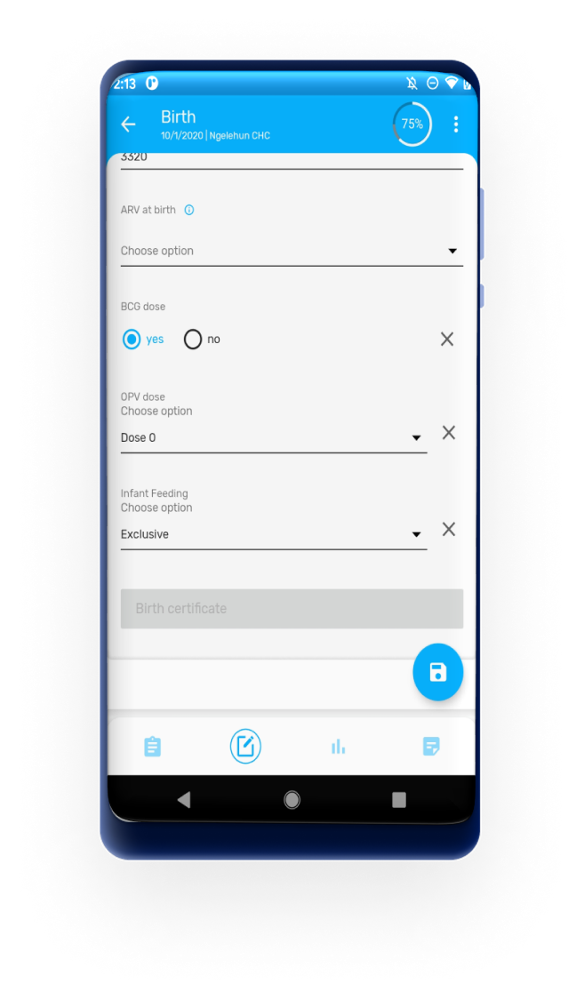{ width=25%}

After tapping on the 'save' button, if the form does not contain any errors, warnings or empty mandatory fields, the app will ask if the user wants to complete the form. Two options are given to the user:

1. 'Not now': The app saves the form and go back to the event listing screen (or TEI dashboard for tracker programs). The status of the event will remain open.
2. 'Complete': The app saves the form and go back to the event listing. The status of the event changes to completed.

{ width=25%}

> **Note**
>
> To verify if an event is completed look at the icon, it must be a green checked box.
>

> **Note**
>
> If the event is non-editable, the app will hide the 'save' button
>

To re-open an event, the app now displays a "Re-open form" button in the Details screen. This button will be available only if the user has the correct authority (‘Uncomplete events’) to reopen a completed event.

{ width=25%}

#### Discard changes { #capture_app_programs_common_features_discard_changes }

Tapping the back arrow in an enrollment or event form now provide two options:

1. 'Discard changes',  which allows the user to restored the fields to their previous values or,
2. 'Review' to remain in the form and update the fields.

If the user is in a new enrollment or event, the options allow the user to:

1. 'Discard changes': The enrollment or event is not created or,
2. 'Keep editing': Allowing the user to finish the enrollment or event.

{ width=25%}

From 3.1.0 Discard changes will not only apply to new events but also when edit them.

#### Field completion percentage { #capture_app_programs_common_features_field_percentage }

The percentage of data completed in each event is shown in the top right corner of an event when it is opened after first registration.

{ width=25%}

> **Note**
>
> The display of the percentage can be set up to be displayed or not using the [#capture_app_android_settings_webapp_appearance_program](Android Settings WebApp)

#### Sections Navigation { #capture_app_programs_common_features_sections_nav }

The sections can be collapsed for a simpler user experience.  Sections in enrollment forms are also supported and are aligned with the design of the event sections.

{ width=25%}
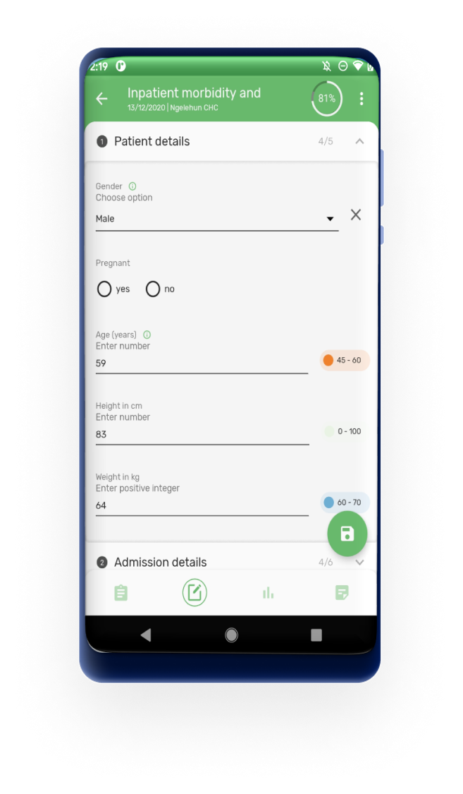{ width=25%}

#### Error messages { #capture_app_programs_common_features_errors }

The app will list the name of the mandatory fields missing when the user tries to complete an event or enrollment. The sections containing the missing fields will be highlighted to help the user find the missing fields.

{ width=25%}

After tapping on the 'save' button, the app will display two options:

1. 'Not now': Allowing the user to save the form with an 'open' status or,
2. 'Review': The app will remain in the form for the user to fill the empty mandatory fields.

The errors and warnings are also shown as an indicator next to the section name including the number of errors for each section. A list of the fields with the errors/warnings when the user tries to save the form will be displayed.

{ width=25%}

After tapping on the 'save' button, the app will display two options:

**Warnings**

1. 'Not now': Allowing the user to save the form with an 'open' status or,
2. 'Complete': The form is saved and its status changes to 'complete'

**Errorrs**

1. 'Not now': Allowing the user to save the form with an 'open' status or,
2. 'Review': The app will remain in the form for the user to review the fields with errors

If there is a combinantion of errors, warnings and missing mandatory fields, the app will display the 'Not now' and 'Review' options only.

### Event Notes { #capture_app_programs_common_features_event_notes }

It is possible to add notes to events in single event programs and program stage events. Notes are available in a new tab at the data entry form.

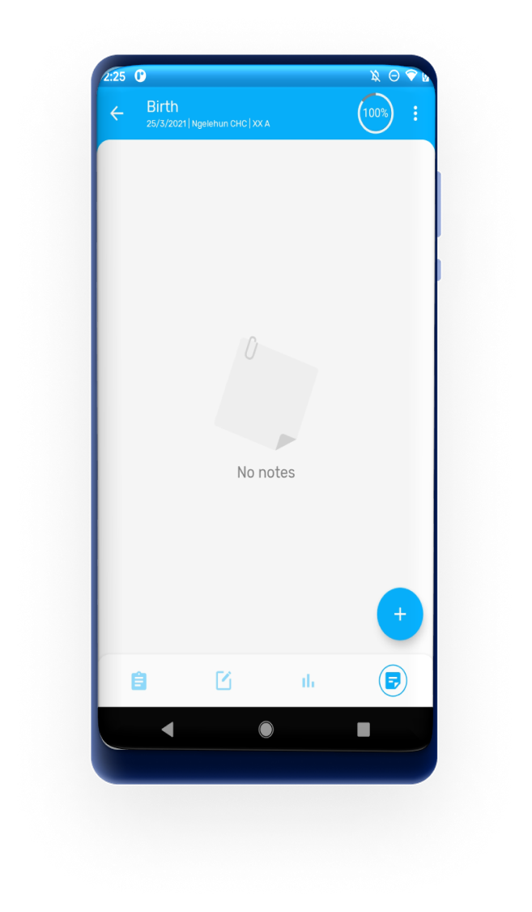{ width=25%}
{ width=25%}

### Maps { #capture_app_programs_common_features_maps }

#### Map Layers 

When displaying maps there are different layers that can be displayed by clicking on the specific button on the uppper right corner. The user can select one or more layers to be displayed. Both coordinate and polygons types will be displayed. The layers are depenandat on the type of program as explained below:

- Show events (For programs without registration)
- Satellite view
- TEI coordinates (By default in programs with registration)
- Enrollment Coordinates (Only for programs with registration)
- Program Stage coordinates (Only for programs with registration)
- Relationships (Only for programs with registration)
- Heatmap (Only for programs with registration)
- Tracked Entity Attributes (Coordinates Value Type - Only for programs with registration)
- Data Elements (Coordinates Value Type)

{ width=25%}
{ width=25%}

From 3.0 custom map layers are also supported by the Android App. These custom layers, configured in the [maintenance app](https://docs.dhis2.org/en/use/user-guides/dhis-core-version-240/configuring-the-system/metadata.html#manage_external_maplayer), will be downloaded and displayed as additional layers to the default ones.
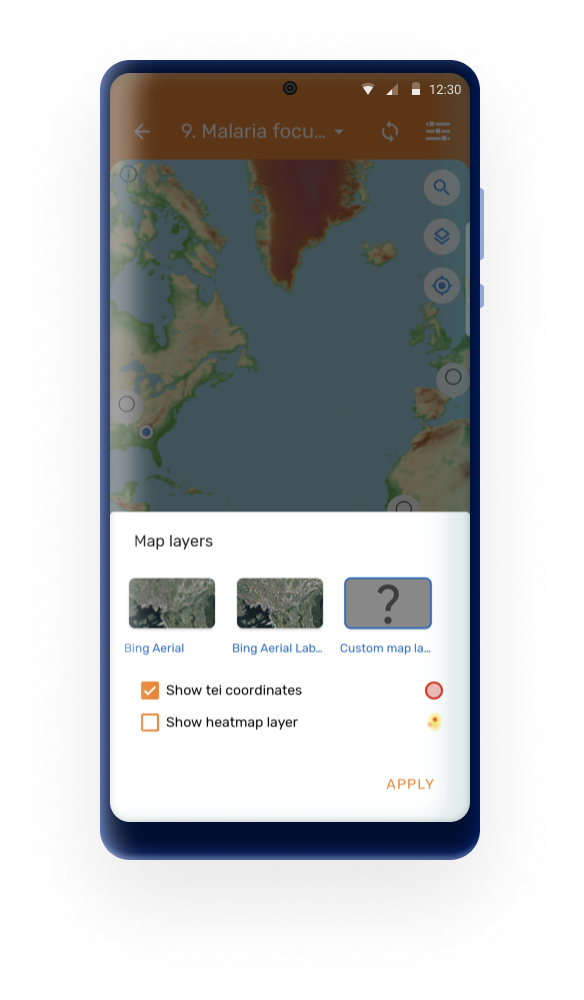{ width=25%}
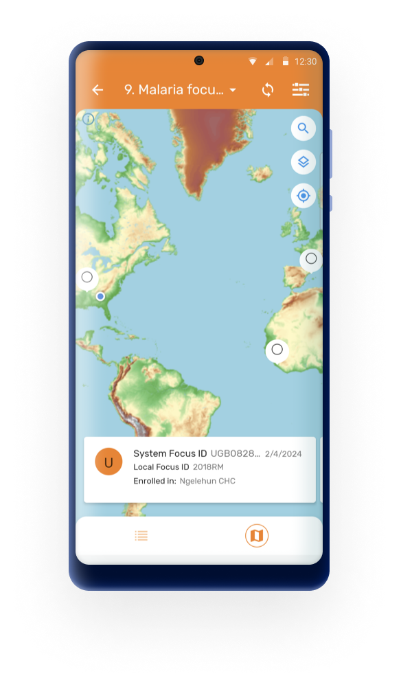{ width=25%}

#### Map Carousel { #capture_app_programs_common_features_map_carousel }

On the map view of the program, a carousel of cards is displayed, one for each enrolled TEI (Tracker programs) or Event (Event programs).

* TEI cards on the carousel follow the same design as the TEI list view.
* When scrolling horizontally the carousel, the map zooms into the selected coordinates. If coordinates field is empty a message is shown instead.

{ width=25%} 
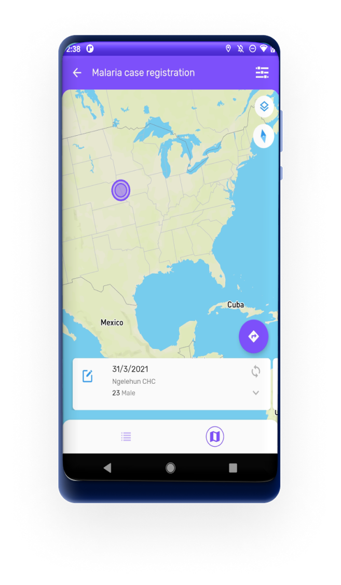{ width=25%}

Each card displays Tracked Entity Attributes (for Tracker Programs) and Data Elements (for Event programs) configured as 'Display in list'.

{ width=25%}

#### Current Location displayed in maps

If the user has granted location permissions to the App, the map will show the current location represented as a blue color dot. The maps in the DHIS2 Android Capture App include the possibility to center the map on the user location.

{ width=25%}

#### Navigation to Specific Location

If the TEI or event has coordinates a navigation icon will be displayed at the top right of the card. Click to open the location in the default maps app configured in the device.

{ width=25%}
{ width=25%}
{ width=25%}

#### Maps Accuracy { #capture_app_programs_common_features_map_accuracy }

From 3.1.0, the capture coordinates process now includes a feature that displays the precision of the captured location. This allows users to see how accurate their location data is in real-time.

The user will see the tags according to the following ranges:

1. Low: >= 100m
2. Medium: < 100m to 25m
3. Good: < 25m to 6m
4. Very good: < 6m

The coordinate can be captured even if the accuracy is low, but this behavior can change if there is a restriction/limit on the precision (configured in Android Settings WebApp). When there is a restriction, the  “Done” button will remain disabled until the precision meets the required threshold.

{ width=25%}
{ width=25%}

#### Maps Search { #capture_app_programs_common_features_map_search }

A new search functionality has been added, allowing users to look up specific locations by name or address. Once the user tap on the search bar, the keyboard will open and the user can enter any street or location name. The user can select any of the locations of the list or tap on the "select in map" to display all the locations in the map (blue pins). 

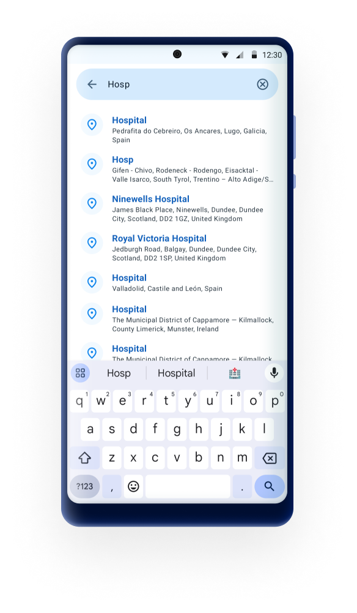{ width=25%}
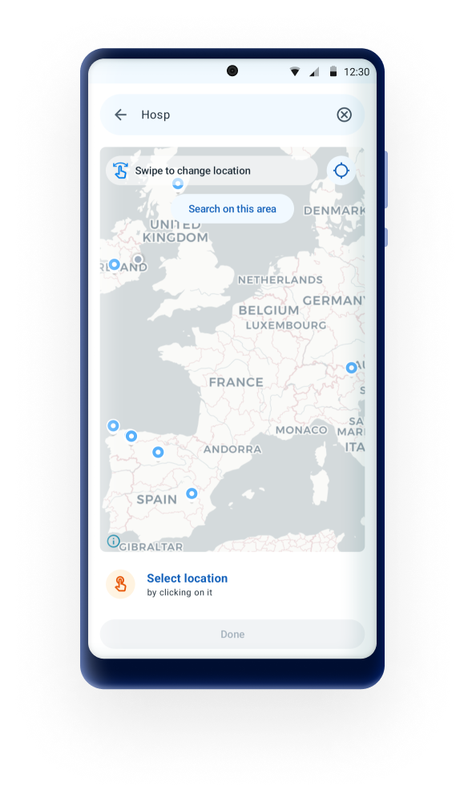{ width=25%}

When a place is selected, the location will be displayed as a card below the map, the pin will be positioned on the selected place and the search bar will be filled up with the place name.

The list of pins is based/limited on the current location. But once the search is done, if the user moves to a different area, the search can be done within the new area by tapping on the "search on this area" button.

#### Maps Manual Capture { #capture_app_programs_common_features_map_manual }

By dragging the map the user can choose the pin location manually. At the bottom of the map, the label "selected location" will be displayed with the respective coordinates.

In 3.1 the manual capture can be disabled (Android settings webApp configuration).This will hid the search bar and won't allow the user to select any location on the map. It will be restricted to save the current location only.

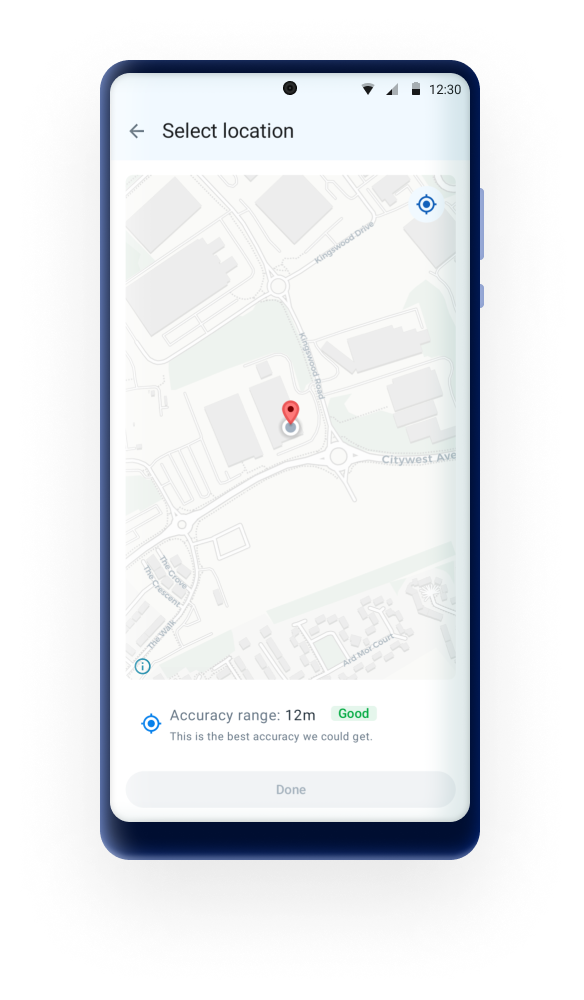{ width=25%}

### Working Lists { #capture_app_programs_common_features_working_lists }

Working lists are available in Event and Tracker Programs, once a list is selected the filters will be blocked and not allowed to change until the user resets the search.

The Android App supports the new tracker working lists, allowing users to filter by data elements. The working lists need to be configured in web using the web Capture App. The Android app will download the working lists that are configured and saved on the server side.

In 2.9, the working lists have been moved from the filters section to the main program screen. In earlier versions the user had to open the filters to be able to see and select a working list, from this version the working lists are always visible under the search bar facilitating its selection for filtering out Tracked Entity Instances

{ width=25%}

### Program Indicators

The analytics tab supports displaying text and key/value pair in feedback or indicator section.

{ width=25%}

### Legends

Legends can be assigned to Data Elements and they will be displayed next to value with the respective color and label.

{ width=25%}

### Data Entry Form { #capture_app_programs_common_features_data_entry_form }

#### Hint messages

The input fields will display had a hint message saying "Insert value here" which will remain until a value is entered by the user.

{ width=25%}

#### Navigation button

In forms with multiple sections, the App includes a "Next" button at the end of each section which calls the user to action. The funtion of the button is to close the current section and open the new one.

{ width=25%}

#### Program Stage section description { #capture_app_programs_common_features_data_entry_form_program_stage_description }

To provide more context and information at the moment of data collection the description has now been brought to the user interface and will be displayed below the section name. The description will always be visible but if the text is too long (more than 3 lines) the app will add an ellipsis and a show more/less button to expand or collapse.

{ width=25%}
{ width=25%}

#### Enable/disable collapsible sections in forms { #capture_app_programs_common_features_data_entry_form_collapsible_sections }

Stage sections in the Android App are displayed with collapsible menus that enable the user to open one section at a time. The purpose of this accordion-like implemementation is to help the user navigate very long forms, however some implementations would prefer to list the sections one after the other. 

This new version of the application enables the admin use to decide if the sections should appear in extended mode. This configuration is made through the [Android Settings Web App](https://docs.dhis2.org/en/use/android-app/settings-configuration.html#capture_app_android_settings_webapp_appearance_program_specific) and will display the sections one after the other with the name the secion acting as a separator. In extended mode, the "next" button at the end of each section is removed.

{ width=25%}

#### New inputs per value types { #capture_app_programs_common_features_data_entry_form_new_inputs }

The inputs for all value types have been redesigned. Tappable areas and texts have been increased and selection modes are improved to offer cleaner and more intuitive user experience. By default the Android App will display the current forms. Admin users are able to opt-in to use the new forms through the [Android Settings WebApp]().

{ width=25%}
{ width=25%}
{ width=25%}

### Actionable Icons  { #capture_app_programs_common_features_actionable_icons }

This feature enables users to take action on phone numbers and email addresses directly from the app.  When tapping on the icons, the app will dial a phone number or open an email app copying the address from the event or enrollment data entry form.

{ width=25%}

### Customized Tracker Terminology { #capture_app_programs_common_features_customized_terminology }

In order to facilitate the terminology used in DHIS2, it has been decided to gradually enable the possibility to customize certain terms to each particular use case. In 3.0, the terms "event" (used in a program stage context) and "enrollment" are customizable.

To customize the terms, the admin can go to the Maintenance and when creating or editing the program add a text to:

  1. "Custom label for enrollment" in the Enrollment details section OR
  2. "Custom label for event" in the stage details section
   
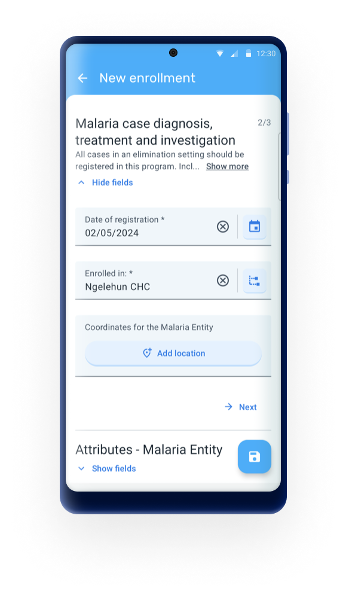{ width=25%}
{ width=25%}
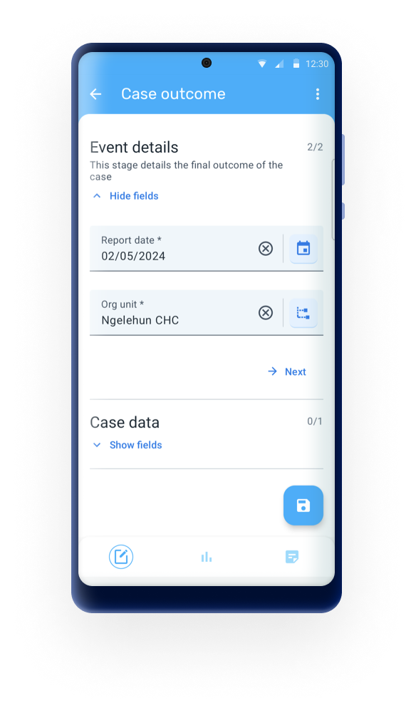{ width=25%}
{ width=25%}

In 3.1, the term "event" (program context) is now customizable.

### Relationships { #capture_app_programs_common_features_relationships }

The relationship tab has been modified to display sections once the tab is open. Each section represents a different relationship type and the + icon will be available only if the user has capture access to the relationship type. 

The name of the section will be the "relationship name seen from the initiating or receiving entity" depending on the configuration of the relationship.

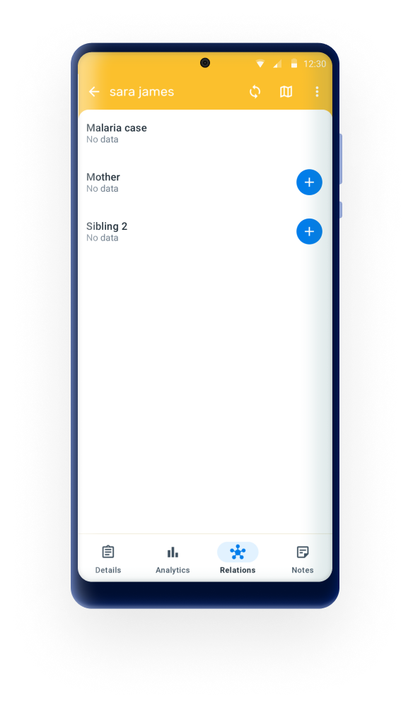{ width=25%}

In 3.1.0, the relationship cards have also been updated with a new design to offer a more intuitive and visually appealing experience. The new design emphasizes clarity and usability, making it easier to view and manage relationships at a glance.

{ width=25%}

#### Delete a relationship

To delete a card, long press on it and select one or more. Then, tap on the remove icon to display the dialog. Finish the process by tapping on the "Remove" button.

To prevent accidental deletions and enhance user control, a new confirmation dialog also has been added when deleting a relationship. This dialog will prompt users to confirm their action, ensuring that relationships are only deleted intentionally.

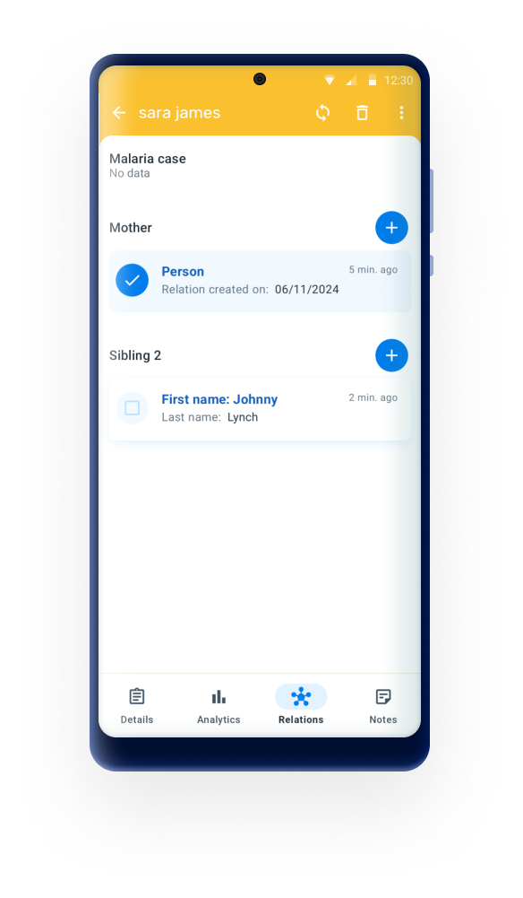{ width=25%}
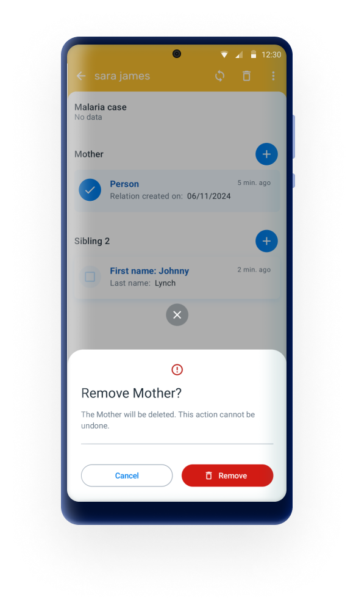{ width=25%}

## Event Programs specific features { #capture_app_programs_events }

### Event - TEI relationships

The app allows adding relationships from single events (in event programs) to TEIs. There is a new tab in the event screen, named relationships, that will be displayed only when this type of relationships are configured in the server for the specific program.

> **Note**
>
> The current version does not allow TEIs to event relationships, or using events that belong to an enrollment.

{ width=25%}

### Cards design { #capture_app_programs_common_features_cards_design }

The new design of cards offers a cleaner and more intuitive layout replacing the use of coloured icons by explicit text when relevant.

#### Main changes

**Sync button:** It now appears as a button at the bottom of the card and it is only displayed if there are unsynced data or an error or warning after a sync.

**Event status:** After an event program is completed, the app will add a label in each card to specify the status.

{ width=25%}

## Tracker Programs (program with registration) specific features { #capture_app_programs_tracker }

### Relationships in maps { #capture_app_programs_map_relationships }

In tracker programs, the user can see relationships on a map by tapping the map icon on the relationships tab.

* An arrow is shown on the direction of the relationship.
* For bidirectional relationships, the arrow points both sides.
* Each relationship type displays a different color.
* If one or both TEIs have a polygon as coordinate, the line goes from (and to) the nearest point in the polygon of both TEIs.

{ width=50%}

### TEI Dashboard { #capture_app_programs_TEI_Dashboard }

The TEI Dashboard has been redesigned for both portrait and landscape view. The new design offers a cleaner and more intuitive layout replacing the use of coloured icons by explicit text when relevant and moving some secondar actions to the hidden menus.

#### Dashboard card

Main changes in 2.9:

**Edit registration form:** In previous versions, there was a button "Open TET details" at the bottom of the TEI dashboard card. Now, the button is located at the top bar of the screen with the label "Edit TET" (For example: Edit Patient)

**Follow-up:** In previous versions, there was an icon at the top right corner of the card to mark the TEI. Now, to mark for follow up, the user needs to tap the three dot menu and select the "Mark for follow-up" option.

**Card title** In previous versions, the title included the values of the first 3 tracked entity attributes marked as Display in List. Now, the tile of the card can bdisplay the first Tracked Entity Attribute marked as Display in list OR a customize text, called TEI header, using program indicators and the Android Settings web App.

More information [here](https://docs.dhis2.org/en/use/android-app/program-features.html#capture_app_programs_tei_header) on how to configure the TEI header.

**Tracked Entity Attributes:** From 2.9, the complete list of tracked entity attributes marked as Display in List will be display in the dashboard card. The first three will always be visible and if there are more, a show "more" button will appear to expand the list.

**Programs:** From 2.9, if the TEI is enrolled to more than one program, a list of the programs will be display and will also allow the user to tap on the label and navigate to full list of enrollments.

{ width=50%}

#### Program stages { #capture_app_programs_TEI_Dashboard_program_stages }

Main changes in 3.0:

**Event list:** fresh and more clean look of the list of events, with more space and less -not critical- information displayed.

**Timeline view:** the button for creating new events has been moved to the top.

{ width=50%}

#### Navigation panel

To simplify and personalize the user experience, the user interface actions offered to the user at the TEI dashboard will be tailored to the specific configuration of each  program.

* Relationships tab will not be visible if the program relationships are not configured
* "Create event" button will be hidden when the user cannot create more events based on tracker configuration.
* The Indicator tab will not be visible if the program has no program indicators configured.
* Organisation Unit filter will not be visible if the user has only one Organisation Unit configured.

#### Creating A Stage

To create a new event, the user needs to tap on the plus icon on the stage card. This icon is always visible unless the stage is non-repeatable and already created.

When the user taps on the button, that program stage will unfold showing to the user all the already existing events of that particular program stage

{ width=50%}

If the user is creating a new stage and there is only one option based on the program configuration, the available program stage is selected automatically and program stage selection step is skipped.

#### Share a TEI 

The "Share" button has been removed from the TEI dashboard and the functionality to share a TEI through QR code has been relocated on the three vertical dot menu, at the top right corner of the screen.

{ width=50%}

### TEI Card Design { #capture_app_programs_tei_design }

The TEI Card has been designed to display as much information as possible considering the constrains of screen size.

From 2.9 the card has been redesigned to offer a cleaner and more intuitive layout replacing the use of coloured icons by explicit text when relevant.

The main changes are:

**Card title** The tile of the card can be composed by the first Tracked Entity Attribute marked as Display in list or a customize text, called TEI header, using program indicators and the Android Settings web App. More information [here](https://docs.dhis2.org/en/use/android-app/program-features.html#capture_app_programs_tei_header) on how to configure the TEI header.

**Sync button:** It now appears as a button at the bottom of the card and it is only displayed if there are unsynced data or an error or warning after a sync.

**Enrollment status:** After a program is completed or cancelled, the app will add a label in each card to specify the status.

**Overdue events:** Is now displayed as a red label with the text: "Overdue" + date of the event

**Follow-up:** After a TEI is marked for follow-up, an orange label with the text "Marked for follow-up" is added to the card

{ width=50%}

### Complete/Deactivate Enrollment { #capture_app_programs_complete_deactivate_enrollment }

To complete or deactivate an enrollment, click on three dot menu in the uppper right corner and select "Complete" or "Deactivate".

{ width=25%}

### Search Flow { #capture_app_programs_search }

#### Configurable TEI Search { #capture_app_programs_configurable_search }

Searching TEIs before creating is not mandatory now. Using the Android Settings App (v2.2.0) it is possible to configure the mandatoriness of the TEI search before creating an enrollment. Follow the steps below to enable the creation of TEIs without searching:

  1. Open the Appearance menu in the Android Settings App
  2. In 'Program' add a Program Setting
  3. Select a tracker program
  4. Tick the "Allow the user to create a TEI without searching" checkbox
  5. Save

If the feature is enabled, the Android App will display a "create new" button after opening a program and a search won't be required. If the feature is not enabled or the user is in a previous version of the app, a search must be performed to avoid possible duplicates. Once the search is performed the search button will become "Add" button for the user to create a new enrollment.

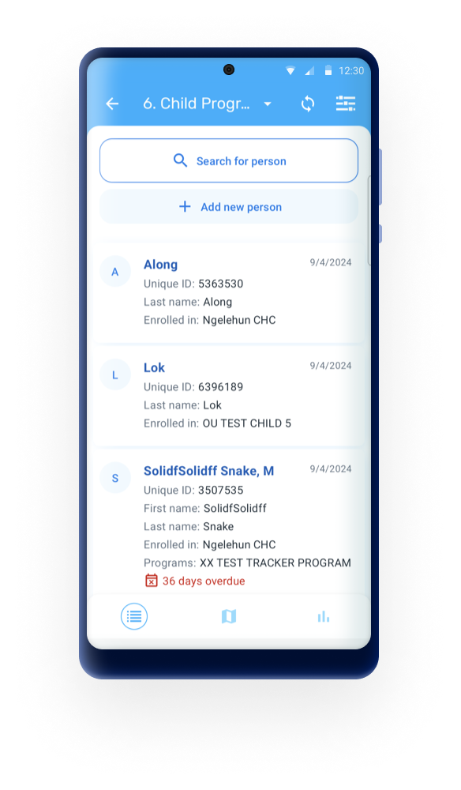{ width=25%}

#### Search by unique QR/bar Codes { #capture_app_programs_unique_qrBar_search }

In 3.0, the search form has been improved to provide a cleaner look and a more intuitive user experience. The buttons have been made more explicit for differencing search from creation. In addition the flow for searching TEIs using attributes rendered as bar / QR codes has been made more agile. If there is only one result and the attribute is unique, the app will open the TEI Dashboard directly. If there are multiple results, the app will display all the cards on the TEI list (this is equal to the current workflow), and if there are no results, the app will display the create button and allow the user to “search outside the program” if the configuration allows it.

Aimed at aligning it with the web instance for a more consistent user experience, 3.1.0, by default, sorts the unique attributes (QR, barcode) at the top of the list of searchable attributes. Users can quickly and easily find the attributes for a more exact search.

The sort of the attributes will follow:

- At the top: QR/barcode attributes (unique)
- QR/barcode attributes (not unique)
- Other Attributes (unique)
- Configured order or default order (if not configured)

#### Offline and Online Search { #capture_app_programs_offline_online_search }

To improve the response time in the search results, the Android App now searches offline first and displays the results while making an online search as a second step, transparent to the user.

Searching outside the program is offered as a second step when  the attributes used in the search contain at least one Tracked Entity Type (TET) attribute

#### Reset Search Fields { #capture_app_programs_reset_search }

The search fields are used to look up for a specific entity, and the circled arrow to reset the search. All fields will be blank for the user to do a new search.

{ width=25%}

#### Search screen for all Tracked Entity Type { #capture_app_programs_search_screen }

User can search across all programs by specific tracked entity type (TET). In the Search screen there is a drop down which shows all the programs available for the active TET (active TET is defined by the selection of the program in the home screen). That drop down should also have an option with TET name, for example: *All Person*.

When the user selects that option, the search fields available will only be the TET attributes (no program specific attributes). Search restrictions do not apply, because they belong to the programs.

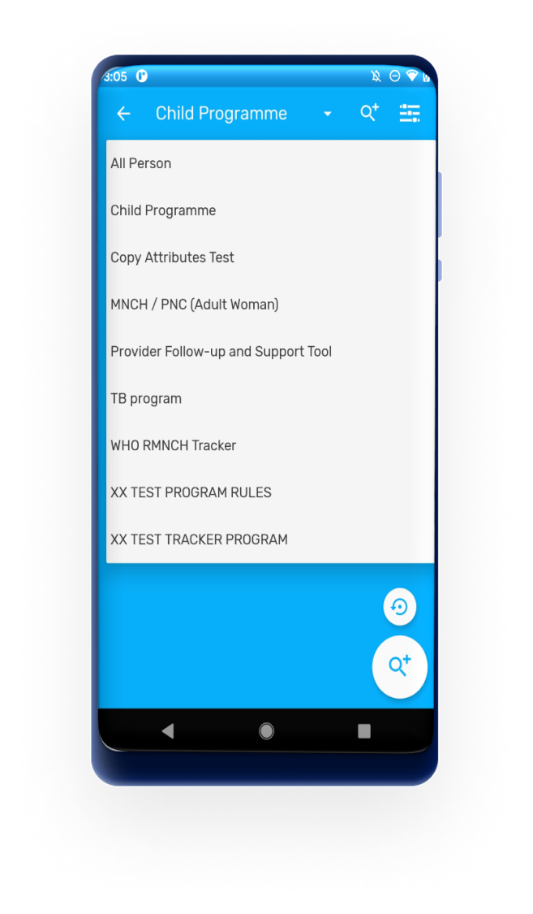{ width=25%}
{ width=25%}

The search will return the found TEI's in the local database and also those in the Search OU of the user (when user is online). For those found online, the user will have to select them and the whole record will be downloaded.

> **Note**
>
>  When configuring search org. units, make sure that your capture org. units are contained in your search org. units, to do that capture org. units have to be selected as well as search org. units.

### TEI Dashboard across programs { #capture_app_programs_tei_dashboard }

User can see the TEI dashboard without any program by selecting the TEI in the list if the search was without program.

The dashboards will show the list of active enrollments.

{ width=25%}
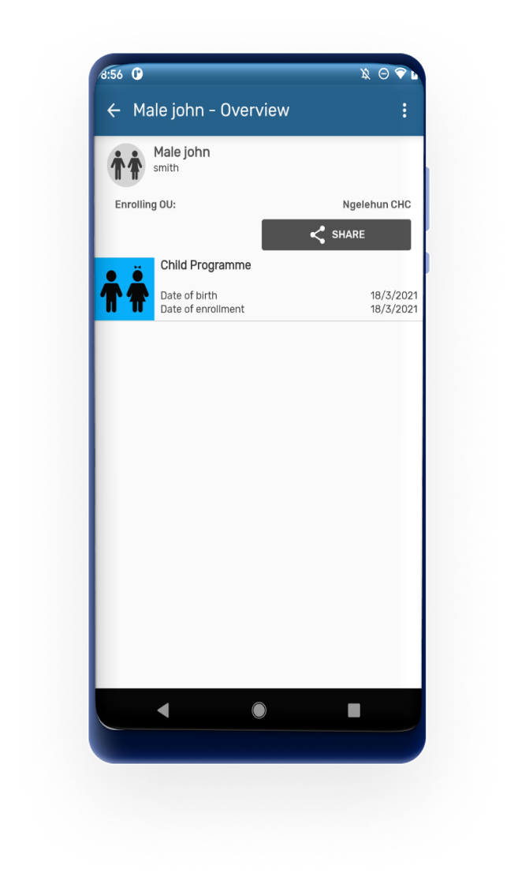{ width=25%}

### TEI enrollment history and new enrollment { #capture_app_programs_tei_history }

User can see the complete historical records of the TEI. Clicking on the upper right corner menu, select "Program Enrollments". A list of "Active enrollments" will be displayed, followed by a list of "Past enrollments" (completed or cancelled), followed by the programs in which the TEI could be enrolled.  User can also return to the "TEI Dashboard" without any program' by selecting "All enrollments".

{ width=25%}
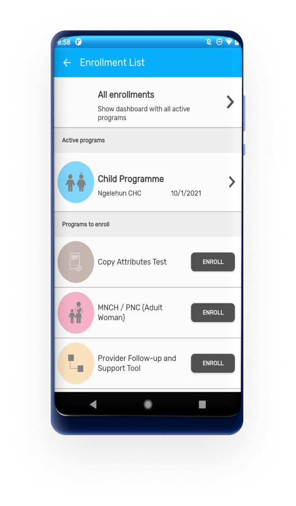{ width=25%}

### Delete TEI's & Enrollments { #capture_app_programs_delete_tei }

To delete a TEI or an enrollment, select the desired option in the three dots menu of TEI dashboard.  Local TEI or Enrollment will be deleted from the database. Records that has been previously synced with the server will be marked for deletion if the user has the following authorities:

* F_ENROLLMENT_CASCADE_DELETE
* F_TEI_CASCADE_DELETE

In this case they will be shown in the TEI search list, but will not be accessible.

{ width=25%}

From 3.0, there is a confirmation message to reduce errors when tapping on the dele button.

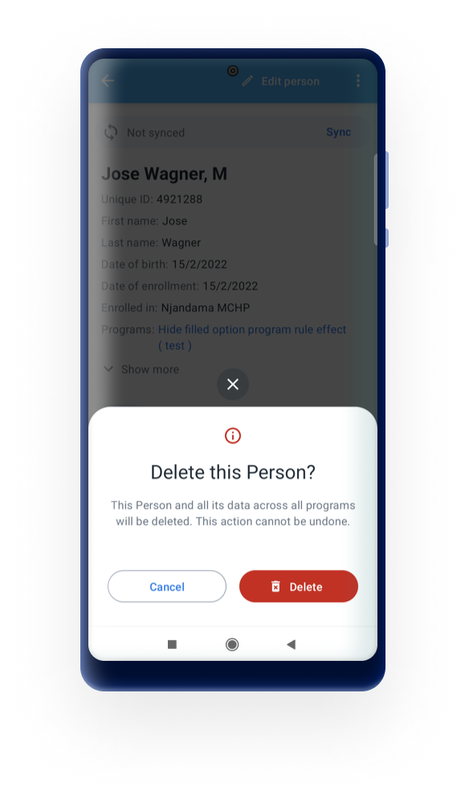{ width=25%}

> **Warning**
>
> When users enter a TEI and while it is not synced to the server they will be able to delete the TEI and the enrollment even if they have not been asigned these authorities. This is by design and to allow users rolling back in case of having entered wrong data (TEI and/or enrollment) and thus preventing it reaching the server and requiring another user with higher privileges to fix the issue.

### Group view of Program stages in TEI Dashboard { #capture_app_programs_group_view }

The TEI Dashboard offers the possibility to change the list of events from the chronological view to a stage grouping view. The stage grouping view will group and collapse the events per program stage. Each program stage group can be expanded by the user and the events will be displayed chronologically.

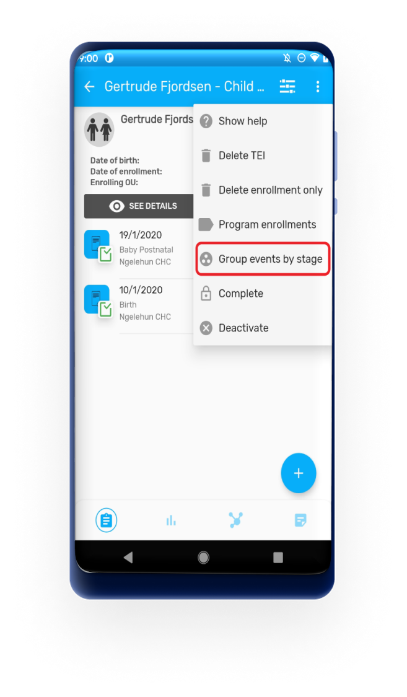{ width=25%}
{ width=25%}

### Inherit Values { #capture_app_programs_inherit_values }

When creating a new TEI for a relationship, inherit any program attribute marked with the inherit check in web.

This means that any existing attributes in the first TEI should have pass to the new TEI and be shown in the registration form.

### Breaking the glass { #capture_app_programs_breaking_the_glass }

The "breaking the glass" feature is now supported in DHIS2 Android Capture App. If the program is configured with an access level of "Protected" and a search is done outside the user scope, a dialog requesting a reason for access will be displayed for the user to temporarily override the ownership privilege of the proram. This means, the user will gain access to the program related data.

After the reason is written, the app will download the TEI and the dashboard will open. If the TEI being downloaded doesn't have an enrollment in the current program, an enrollment date and organisation unit will be asked.

{ width=25%}
{ width=25%}

### Analytic charts

It is possible to display the evolution in data elements as charts, values or tables. These data elements must be a numeric value type and configured in a repeatable stage.

1. Single value: It will display the newest value in the program.

{ width=25%}

2. Charts: It is possible to display the values as a line chart o as a bar chart.

{ width=25%}

The Nutrition Growth charts are shown according to the WHO standards.  This option will render a background image and apply the axis (0 to 5 monthly)according to the WHO model.

 { width=25%}

3. Tables: It will display the data elements or indicators in the rows and the periods in the columns.

{ width=25%}

### Referrals { #capture_app_programs_referrals }

when a user makes a permanent referral of a TEI, the ownership will be updated accordingly on the server.

From 2.9, admin users can now enable or disable the referrals in the DHIS2 Android Capture App through the [Android Settings WebApp](https://docs.dhis2.org/en/use/android-app/settings-configuration.html#capture_app_android_settings_webapp_appearance_program).

When users add events (tapping on the + icon) in a tracker program, the DHIS2 Android Capture App offers three options: Add (for new events), Schedule (for planning future events) and Refer (for referrals or transfers). IF the referral option is not needed, then the admin user can remove the option from the menu to simplify the user experience. The removal can be general (for all the programs) or for specific programs.

{ width=50%}

### Transfers { #capture_app_programs_transfers }

Significant enhancements to the transfer flow, aimed at making the process more user-friendly and transparent. The transfer button has been moved to a more accessible location within the three dot menu in the TEI Dashboard, ensuring that users can easily find and initiate transfers without unnecessary navigation. 

Also, the ownership organisation unit has been added as a parameter in the TEI card. If the ownership org unit and enrollment org unit are the same, then the enrollment one will be hidden.

Once the transfer process has started, the user will see a dialog with all the org units available (search scope), once an org unit is selected, the transfer button will be activated. After tapping on the button, the ownership org unit will change to the new one. The user must sync data to reflect the changes in the instance.

### [EXPERIMENTAL] TEI Header  { #capture_app_programs_tei_header }

The TEI Header is a title that can be added to the TEI cards and dashboards in the app. The title helps identify a TEI by displaying a summary of key information. It is formed by a concatenation of Tracked Entity Atributes and fixed text. The title is configured through a Program Indicator in the maintenance app and its assigned to the tracker program in the Android settings webapp. This feature is experimentan and depending on feedback and adoption it will be refined and incorporated in the Web Capture app.

> **Attention**
>
>  In the Maintenace app, text expressions aren't valid. Even though the error is display in the dialog, save the program indicator and assign it in the Android Settings Web App, the DHIS2 Android capture app will read the expression accordingly.

For more information on how to configure the TEI header, click [here.](https://docs.dhis2.org/en/use/android-app/settings-configuration.html#capture_app_android_settings_webapp_appearance_program)

{ width=50%}
{ width=50%}

### Scheduling { #capture_app_programs_scheduling }

#### Schedule after completion { #capture_app_programs_common_features_schedule_after_completion }

In 3.0, the schedule dialog after completion has been redisigned to facilitate the creation of the event.

{ width=25%}

#### Schedule events dialog

As a continuation of the new schedule dialog introduced in the version 3.0, a new  intuitive and user-friendly schedule dialog has been implemented to enhance the overall user experience, making it easier to book, reschedule, or cancel events.

Once an event has been scheduled, when the user taps on it, the app will display a dialog with the following:

1. Due date field: Allows the user to open the calendar by tapping on the icon or change the date manually. This will facilitate the process of re-scheduling an event.
2. Enter event button: after tapping on this button, the app will open the event with the current date and the user can start filling the form. 
3. Cancel event button: after tapping on this button, the app will close the event and mark it as "skipped". As before, the user can always enter the event, add a report date, changing the status from skipped to open.

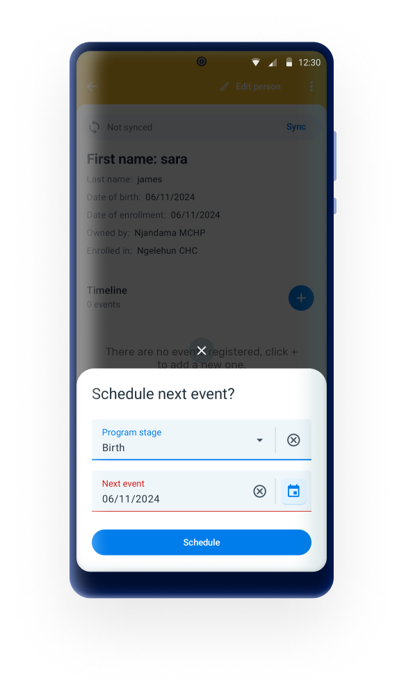{ width=25%}
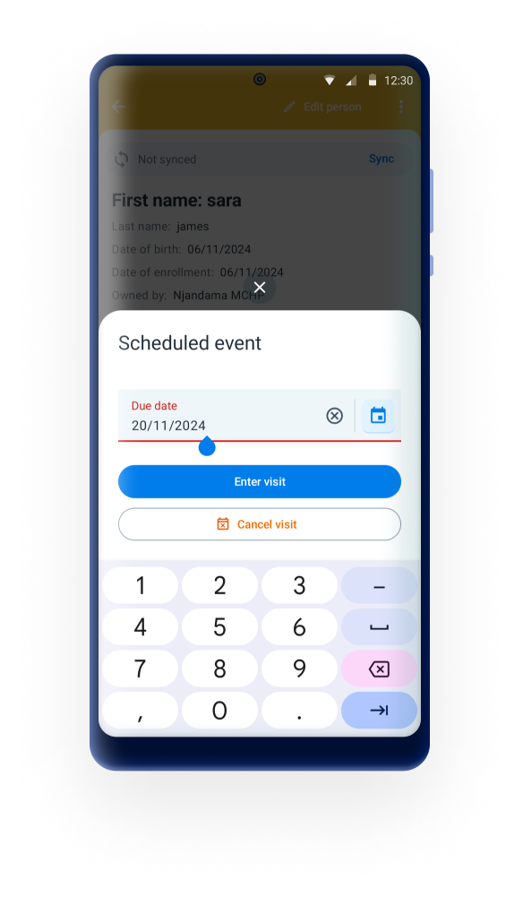{ width=25%}

### Dashboard quick actions (New 3.2.0)  { #capture_app_quick_actions }

The Quick Actions bar is a new feature in the DHIS2 Android Capture App that enables users to access frequently used actions directly from the Tracked Entity Instance (TEI) Dashboard. These actions are displayed as customizable chips, streamlining workflows and reducing the number of taps needed to perform routine tasks.

Each action is displayed as a chip in the TEI Dashboard. By default, all chips are unselected, and the Quick Actions bar is not displayed in the app. When tapped, the chip performs a predefined function. The available actions include:

1. Mark for follow-up
2. Transfer
3. Complete
4. Cancel
5. More enrollments

The chips cannot be reordered. The order of appearance is as the list above.

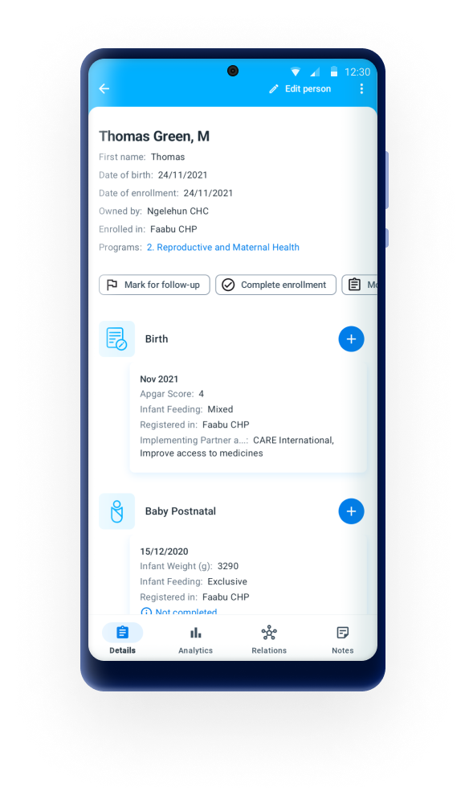{ width=25%}
{ width=25%}

### Limitations and considerations { #capture_app_quick_actions_limitations }

* Quick Actions are available only when configured via Android Settings WebApp (v2.4.2)
* Each program must be configured individually.
* Feature parity is maintained: actions remain available in the TEI Dashboard 3-dot menu even when Quick Actions are disabled.

## Supported features Overview { #capture_app_programs_supported_features }

The following is a comprehensive list of all features available for Programs with and without registration in DHIS2, and notes on whether or not these have been implemented in the Android Capture app.

In the notes, ‘admin’ refers to someone who develops and configures a DHIS2 system, and ‘user’ refers to someone who uses apps to capture data, update it, and review reports.

|Legend|Description|
|:--:|:------|
||Feature implemented|
||Feature not implemented (will be ignored)|
||Not applicable|
||Work in progress. Feature not completely implemented yet or with unexpected behaviour already reported.|

### Program { #capture_app_programs_supported_features_program }

|Feature|Description of feature|Program with registration|Program without registration|Notes on implementation|
|-|---|:-:|:-:|---|
|Data entry method for option sets|Enables an admin to choose how options will be displayed on-screen across the entire program (ie either as drop-down lists or as radio buttons)|||This will be replaced by the new rendering options.|
|Combination of categories (Attribute CatCombo)|Allows an admin to attach a Category (set of Options) to the Program, requiring users to categorize each enrolment. (This is called an Attribute Category Combination in DHIS 2.)||||
|Data approval workflow|If an admin selects a pre-configured Data Approval Workflow, this will be used to enforce an "approval" or "acceptance and approval" cascade, enabling users to sign-off and lock data.||||
|Display front page list|If this option is ticked, the landing page displays a list of active enrolments once an Org Unit and Program have been chosen. (Attributes shown are those ticked as "display in list".)||||
|First stage appears on registration page|When this option is chosen, then during Program enrolment, the screen for the first Program Stage is also shown (enrolment and the first event are captured together on one screen).||| In Android, this is implemented by opening automatically the event after enrollment is completed, instead of adding the form to the same screen.|
|Completed events expiry days|Enables admins to lock data-entry a certain number of days after an event has been completed.||||
|Expiry period type + expiry days|Enables admins to set a period (eg weekly, monthly), and to lock data-entry a certain number of days after the end of the period.||||
|Allow future enrolment dates|If ticked, this enables a user to enter future Enrolment dates during enrolment in a Program; otherwise users are restricted to today or past dates.||||
|Allow future incident dates|If ticked, this enables a user to enter future Incident dates during enrolment in a Program; otherwise users are restricted to today or past dates.||||
|Only enrol once (per tracked entity instance lifetime)|If ticked, prevents a TEI (eg person) from being enrolled in this Program more than once.||||
|Show incident date|If ticked, both Enrolment and Incident dates are shown to the user for data capture; otherwise, only the Enrolment date is shown/captured.||||
|Description of incident date|Allows an admin to customize the label that is used for the incident date.||||
|Description of enrolment date|Allows an admin to customize the label that is used for the enrollment date.||||
|Capture coordinates (enrolment)|Enables users to capture geographical coordinates during enrolment in the program.||||
|Capture Polygon (enrolment) |Enables users to capture locations (enclosed areas) during enrolment in the program.||||
|TEI Coordinates |Enables users to capture geographical coordinates for the TEI during the enrolment in the program.||||
|Relationships: create and update|Enables users to create and update relationships.||||
|Relationships - shortcut link to add a relative|This enables admins to add a link for one specific relationship to the Dashboard, enabling users to directly create a linked TEI (eg "child" patient).||||
|Attributes: display in list|This setting determines whether an Attribute can be viewed in lists such as search results, and whether it can be seen in the shortlist of Attributes shown under "Profile" in the Dashboard.|||The first three attributes will be shown|
|Attributes: mandatory|This enables an admin to mark an Attribute as "mandatory";, meaning the enrolment can"t be saved until a value is captured.||||
|Attributes:  date in future|For date Attributes, this enables an admin to either prevent or allow future dates to be captured.||||
|Registration form - default|The default data entry form simply lists all attributes defined for the TEI.||||
|Registration form - custom|This enables an admin to define a custom layout (using HTML) for the registration form.|-||Custom layouts are not supported in the Android App||
|Program notifications|You can set up automated notifications for when program enrolments or completions occur, or at a set interval before/after incident or enrolment dates. These can be sent as internal DHIS 2 messages, emails or SMSs.|||This functionality is executed on the server side, once data is received. Will not work when the app is working offline.|
|Activate/deactivate enrolment|Deactivating a TEI dashboard will cause the TEI to become &ldquo;read-only&rdquo;. This means you cannot enter data, enrol the TEI or edit the TEI profile.||||
|Complete allowed only if validation passes|Select check box to enforce that an event created by this program is only completed when all validation rules have passed.||||
|Org unit opening/closing dates|Enables an admin to set opening and closing dates for an Org Unit, which blocks users from adding or editing events outside of these dates.||||
|Data sharing levels/Can capture data|Enables the user to add new event, edit data and delete events in the program.||||
|Data sharing levels/Can view data|Enables the user to see list of events within the program.||||
|Data sharing levels/No access|The user will not be able to see the program||||

### Program stage { #capture_app_programs_supported_features_program_stage }

|Feature|Description of feature|Program with registration|Program without registration|Notes on implementation|
|-|---|:-:|:-:|---|
|Event form - default|The default data entry form simply lists all attributes belonging to a program registration||||
|Event form - section forms|Sections forms allow you to split existing forms into segments||||
|Event form - custom|Define a custom event form as a HTML page.|||Custom layouts are not supported in the Android App.|
|Program stage notifications|You can set up automated notifications for when the program stage is completed, or at a set interval before/after scheduled event dates. These can be sent as internal DHIS 2 messages, emails or SMS messages.|||This functionality is executed on the server side, once data is received. Will not work when the app is working offline.|
|Repeatable|If Repeatable Is ticked, this stage can be repeated during one program enrollment. If t is not, then the stage can only happen once during a program enrollment.||||
|Repeatable|If Repeatable Is ticked, this stage can be repeated during one program enrollment. If t is not, then the stage can only happen once during a program enrollment.||||
|Repeatable + Standard interval days|The system will suggest the due date as the calculation of the last event + standard interval dates.||||
|Period type|Enables an admin to configure a set of periods (e.g. weeks or months) for each event in the program stage, instead of just a date. When creating events, users are then asked to choose a period (instead of a date) for each new event they create within that program stage.||||
|Auto-generate event|If ticked, a "booking" is generated for this Program Stage upon enrolment, based on the "Scheduled days from start".||||
|Generate events based on enrolment date (not incident date)|Check on it for auto-generating due dates of events from program-stages of this program based on the enrollment date. If it is not checked, the due dates are generated based on incident date.||||
|Open data entry form after enrolment + report date to use|If selected, once an enrolment is complete, an event's data entry form should open directly afterwards.||||
|Ask user to complete program when stage is complete| If selected, upon completing the program stage the user should be asked to complete the program. (This setting is ignored if "Ask user to create new event" is also ticked.)||||
|Ask user to create new event when stage is complete|If selected, when the Program Stage is completed the user is prompted to book.||||
|Hide due date|Only shows the actual date for events, hiding the due date.||||
|Capture coordinates (event)/Feature Type-Point|Enables the user to capture geographical coordinates when each event is created  particularly useful in devices that have GPS (eg Android), as instead of having to type in coordinates, the user can automatically populate them with the press of a button.||||
|Capture Polygon (event)/Feature Type-Polygon |Enables users to capture locations (enclosed areas) when each event is created. A Polygon must contain at least 4 points.||||
|Description of report date|Allows an admin to customize the label that is used for the event's date.||||
|Data elements-compulsory|This enables an admin to mark a data element as "compulsory", meaning an event can not be saved until a value is captured.||||
|Data elements-allow provided elsewhere|On the form, this places a tick-box next to the selected data element, and enables previous data to be pulled into the data element.||||
|Data elements-display in reports|Displays the value of this data element into the single event without registration data entry function.||||
|Data elements-date in future|For date Data Elements, this enables an admin to either prevent or allow future dates to be captured.||||
|Data elements-render options as radio|Enables an admin to choose how options will be displayed on-screen for each Data Element (i.e. either as drop-down list or as radio buttons).||||
|Block entry form after completed|Prevents all edits to events after they have been completed.||||
|Event comments|Enables the user to add overall comments to an event. These comments are cumulative (new comments are added below existing comments).||||

### Program with registration: Tracked entity dashboard { #capture_app_programs_supported_features_program_with_reg }

|Feature|Description of feature|Status|Notes on implementation|
|-|---|:-:|---|
|Messaging|Enables users to send ad-hoc free-text messages to TEIs (e.g. patients) via SMS or email.|||
|Mark for follow-up (button with exclamation triangle)|Enables a user to mark a TEI (e.g. patient) as requiring follow-up.|||
|Display TEI audit history|Enables a user to see a history of all edits to Attributes for this TEI (e.g. patient).|-||
|Inline Program Indicators|If a program indicator "display in form" box is ticked, the indicator appears on the Tracker Capture dashboard, and is updated live as data capture occurs.|||
|Delete events|Enables the user to delete an event.|||
|Schedule events|In the event generation dialogue, the user should also see the option to schedule an event. The process is like creating an event, but the user will be sent back to the TEI dashboard after the event is scheduled.|||
|Referral of patients|In the event generation dialogue, the user should also see the option to refer a patient. The process is like creating/scheduling an event, but the user can change the org unit and has to specify if is a one-time or permanent referral. One time will just create the event in the specified OU.|||
|Reset search fields|User is able to clean up the search fields by pressing on the rounded arrow icon on the top right corner of the search screen.|||
|Search screen for all TE Type|User is able to search across all program of one tracked entity type (TET). In the Search screen there is a drop down which shows all the programs available for the active TET (active TET is defined by the selection of the program in the home screen). That drop down should also have an option with TET name. (Person in our server). When the user selects that option, the search fields available will only be the TET attributes (no program specific attributes). All search restrictions do not apply, because they belong to the programs.|||
|TEI Dashboard without program|User can see the TEI dashboard without any program by selecting the TEI in the list if the search was without program. The dashboards will show the TET attributes in the details card followed by a list of active enrollments.|||
|TEI enrollment history and new enrollment|User is able to see the complete historical record of the TEI. By clicking on the top right corner icon they will see a list of Active enrolments, followed by a list of past enrolments (completed or cancelled), followed by the programs in which the TEI could be enrolled. Users should be able to navigate to the different enrolments from the list.|||
|Access level-Breaking the glass|If the program is configured with access level protected, and the user searches and finds tracked entity instances that is owned by organisation unit that the user does not have data capture authority for, the user is presented with the option of breaking the glass. The user will gove a reason for breaking the glass, then gain temporary ownership of the tracked entity instance.|||

### Program without registration: Single event program { #capture_app_programs_supported_features_program_without_reg }

|Feature|Description of feature|Status|Notes on implementation|
|-|---|:-:|---|
|Events listing (grid)|A listing of existing events that is displayed once a program is selected.|||
|Sort and filter events in grid|Allows the user to sort listed events, or to filter events based on keywords or specific ranges of dates/numbers.||Events are sorted chronologically. The user can filter by period and organisation unit.|
|Edit events in grid|Allows the user to directly edit the data elements shown in the events listing/grid.|||
|View event audit history|Enables the user to see a history of all changes to the event's data elements.|||
|Show/hide columns (in event list/grid)|Enables the user to modify the data elements shown in the event listing/grid (applies to that user only).|||
|Field completion percentage|The percentage of data completed in each event is shown in the top right corner of an event when it is opened after first registration. The percentages should be adapted to the effects of the program rules in the forms.||The percentage of completion does not take into account the not-supported value types in the forms.|
|Delete events|Enables the user to delete an event.|||
