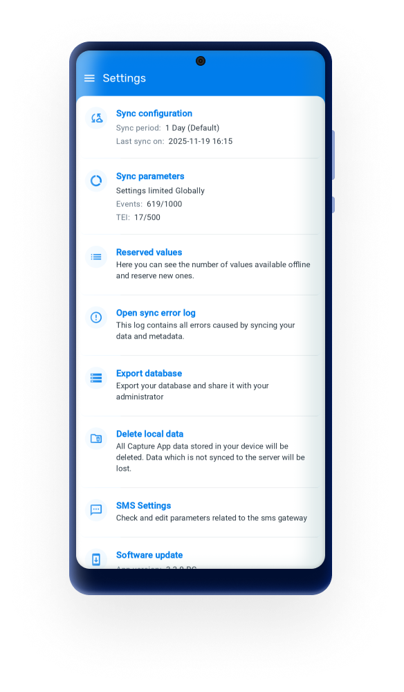
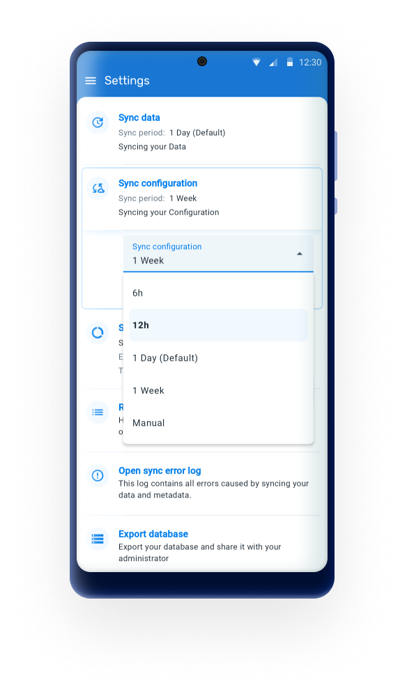
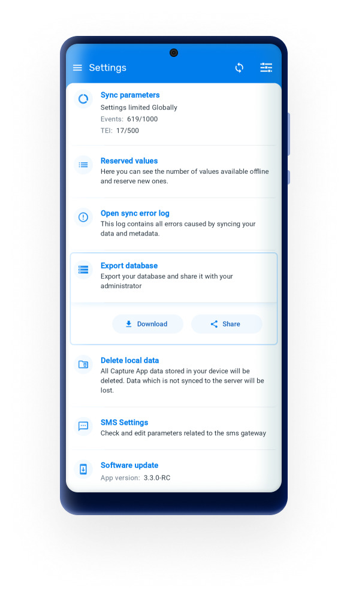
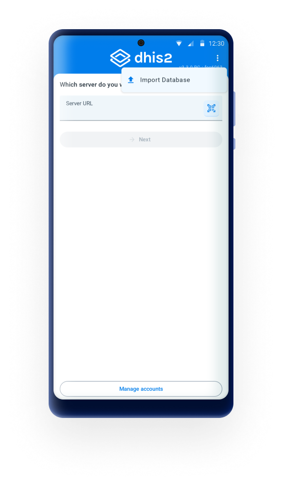
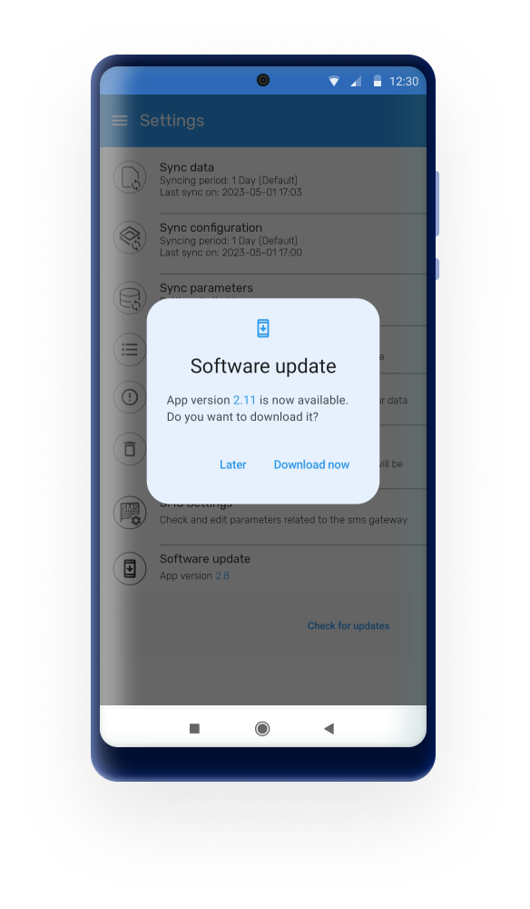

# Settings { #capture_app_settings }

>In version 3.3.0 the settings menu was redesigned to provide a cleaner structure and improved navigation experience. This update aligns the screen with the design changes introduced in previous versions and prepares the menu to host future configuration options, such as 2FA-related settings.

{width=25%}

## Sync data { #capture_app_settings_sync_data }

Any user is able to choose from a drop-down list if the data entered in the app is uploaded to the server manually or scheduled every 15 min, 1 hour or 1 Day. By default the app will sync every 24h. This kind of Syncing includes new and updated events and TEI’s.

## Sync configuration/metadata (Improved in 3.4) { #capture_app_settings_sync_metadata }

Any User is able to choose from a drop-down list  if the data entered in the app is uploaded to the server manually or scheduled every day or week. By default the app will sync every 24h.  This sync will update changes in programs or configurations in web.

From 3.4, in addition to existing intervals, automatic metadata sync can now run every 6 or 12 hours, allowing for more timely updates and better alignment with data sync behavior.

{width=25%}

## Sync parameters { #capture_app_settings_sync_parameters }

These parameters allow the user to specify the maximum number of TEI’s and events that can be stored in the local device. The user can also specify if limits apply per organisation unit or in total. Values can be set to default by clicking on “Reset to default”.

> **Note** 
>
> Sync data, Sync configuration and Sync parameters can be overwritten using the Android Settings Web App as described [in the specific section][#capture_app_andoid_settings_webapp_synchronization]
>
>

## Reserved values { #capture_app_settings_reserved_values }

This will specify the number of reserved Id's available in your device and will allow you to refill them.

## Open sync errors log { #capture_app_settings_errors_log }

The sync error log gives details about the error and is prepared to be shared with admins.

## Export database { #capture_app_settings_export_db }

Users are able to export the local database and share it with an admin, who will be able to import it for troubleshooting, being able to replicate the exact environment (database, device, configuration). The exported database is encrypted and the administrator will require the user credentials to be able to access the database

{ width=25%}

The import button can be found by tapping on the tree dots menu at the login screen.

{ width=25%}

## Delete local data { #capture_app_settings_delete_localdb }
:	This action will delete local data without having to log out.

> **Warning** 
>
> Using this functionality might lead to data loss if changes have not been previously synced to the server.
>
>

## Reset app data & configuration { #capture_app_settings_sync_metadata }
:	This action will log out the user and delete all data and metadata, this means user and server information is also deleted. It is similar to resetting the App.

> **Warning** 
>
> Using this functionality might lead to data loss if changes have not been previously synced to the server.
>
>

## SMS Settings { #capture_app_settings_sms }

This sections allows to check or edit the parameters related to the sms gateway. [More information here.](https://docs.dhis2.org/en/develop/developing-with-the-android-sdk/sms-module.html#android_sdk_sms_module)

## Software Update { #capture_app_settings_software_update }

This feature enables implementation administrators to manage and control the version of the Android app from the DHIS2 user web interface, making it easier to manage app updates and ensure compatibility with the DHIS2 system. Managers will be able to upload the desired version and users will get a prompt message to update when they are not in the last updated version. The management of versions is made through a new Web App.

{ width=25%}