## Version update document

This document provides an overview of the key features and enhancements introduced in different versions of the DHIS2 Android app, specifically Android 2.9, 3.0, and 3.1. It highlights compatibility with DHIS2 core versions and details improvements in usability, configuration, and functionality.

| Feature | Android 2.9 | Android 3.0 | Android 3.1 |
| :---- | :---- | :---- | :---- |
| Compatible DHIS2 web version | Compatible with DHIS2 versions 2.30 through 40| Compatible with DHIS2 core versions 2.39, 2.40, and 2.41| Compatible with DHIS2 core versions 2.39, 2.40, and 2.41|
| **Disable referral in tracker programs** | The referral option can be hidden using the Android Settings Web App. [Documentation](https://docs.dhis2.org/en/use/android-app/program-features.html#capture_app_programs_referrals)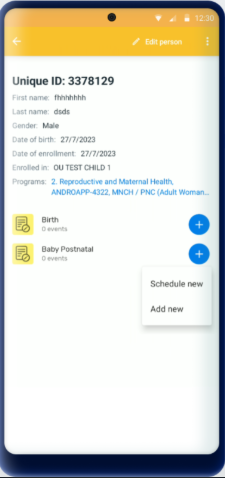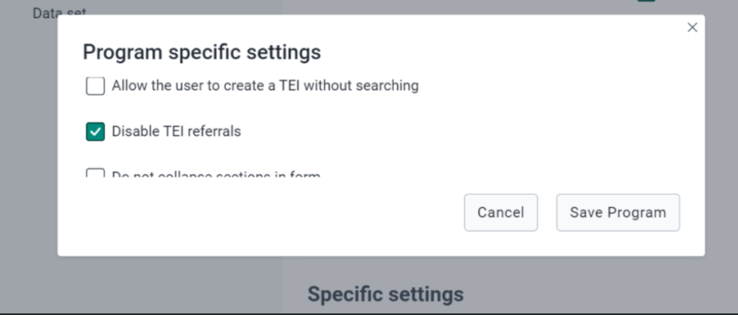| Updated settings in Web App. [Documentation](https://docs.dhis2.org/en/use/android-app/settings-configuration.html#capture_app_android_settings_webapp_appearance_program) |  |
| **Skip home screen if only one program is available** | The app skips the home screen if the user has access to only one program/dataset. [More info](https://docs.dhis2.org/en/use/android-app/android-specific-features.html#capture_app_home) 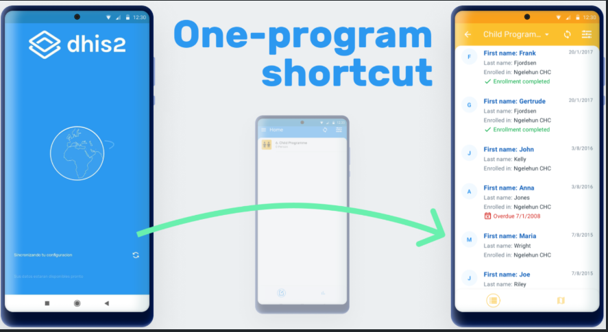 | \- |  |
| **Display program stage description** | To provide more context and information at the moment of data collection, the description has now been brought to the user interface and will be displayed below the section name [More info](https://docs.dhis2.org/en/use/android-app/program-features.html#capture_app_programs_common_features_data_entry_form_program_stage_description) 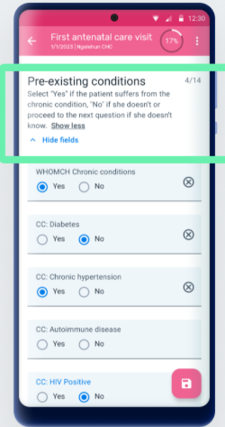| \- |  |
| **Disable collapsible sections in forms** | Stage sections are displayed with collapsible menus. [Documentation](https://docs.dhis2.org/en/use/android-app/program-features.html#capture_app_programs_common_features_data_entry_form_collapsible_sections) 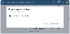 | \- |  |
| **Working lists under the search bar** | Working lists are now visible under the search bar for better filtering. [More info](https://docs.dhis2.org/en/use/android-app/program-features.html#capture_app_programs_common_features_working_lists) 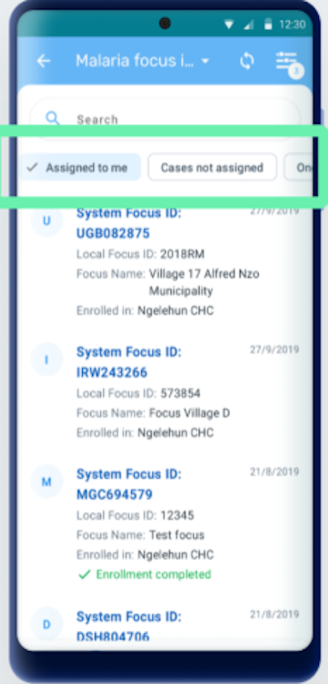| \- |  |
| **New design for Dataset, Event, and TEI cards** | Cards have a cleaner layout with descriptive text. [Documentation](https://docs.dhis2.org/en/use/android-app/datasets-features.html#capture_app_datsets_cards_design) 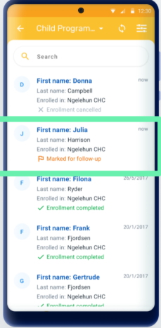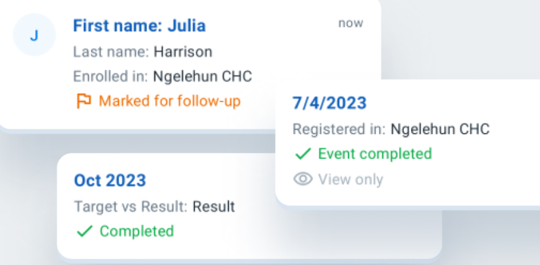 | \- |  |
| **Implement changes in TEI Dashboard details** | Improved layout with secondary actions moved to hidden menus. [More info](https://docs.dhis2.org/en/use/android-app/program-features.html#capture_app_programs_tei_design) 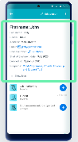 | \- |  |
| **Redesigned inputs for all value types** | Tappable areas and texts have been increased and selection modes are improved to offer a cleaner and more intuitive user experience. [Documentation](https://docs.dhis2.org/en/use/android-app/program-features.html#capture_app_programs_common_features_data_entry_form_new_inputs) 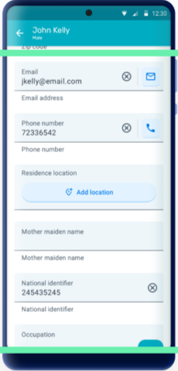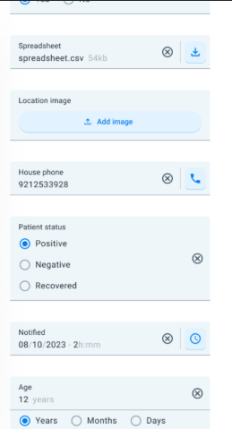 | \- |  |
| **\[EXPERIMENTAL\] TEI Header** | The TEI Header is a title that can be added to the TEI cards and dashboards in the app. This feature is experimental, and depending on feedback and adoption it will be refined and incorporated in the web Capture app. [Documentation](https://docs.dhis2.org/en/use/android-app/program-features.html#capture_app_programs_tei_header) 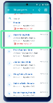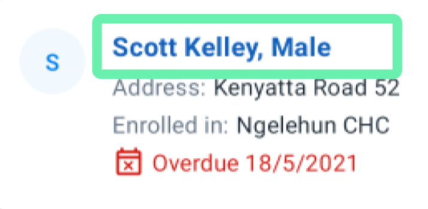| \- |  |
| **Schedule after completion** | \- | Redesigned schedule dialog for better event creation.  |  |
| **Maps** | \- |Custom map layers supported. [More info](https://docs.dhis2.org/en/use/android-app/program-features.html?h=android%2B3.0&capture_app_programs_common_features_maps) !| The Map introduces a precision display for location capture, allowing users to assess the accuracy of their captured coordinates in real-time. [Documentation](https://docs.dhis2.org/en/use/android-app/program-features.html#capture_app_programs_common_features_map_accuracy)  |
| **Customized Tracker Terminology** | \- | Terms like “event” and “enrollment” are now customizable. | The term "event" (program context) is now customizable.|
| **TEI Dashboard** | \- | The TEI Dashboard has been redesigned for both portrait and landscape view. The new design offers a cleaner and more intuitive layout replacing the use of coloured icons by explicit text when relevant and moving some secondar actions to the hidden menus  |  |
| **Search Flow** | \- | TEI search before enrollment is now optional.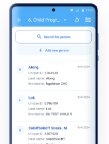 |  |
| **Delete TEIs and Enrollments** | \- | Delete options available in TEI dashboard.To delete a TEI or an enrollment, select the desired option in the three dots menu of TEI dashboard.There is a confirmation message to reduce errors when tapping on the delete button.   |  |
| **Data Entry Flow** | \- | Improved form structure for better data entry.  |  |
| **Relationships** | \- |  \-|  The relationship tab has been modified to display sections once the tab is open. Each section represents a different relationship type and the + icon will be available only if the user has capture access to the relationship type. |
| **Transfers** | \- |  \-|  Significant enhancements to the transfer flow.The transfer button has been moved to a more accessible location within the three dot menu in the TEI Dashboard, ensuring that users can easily find and initiate transfers without unnecessary navigation.|

