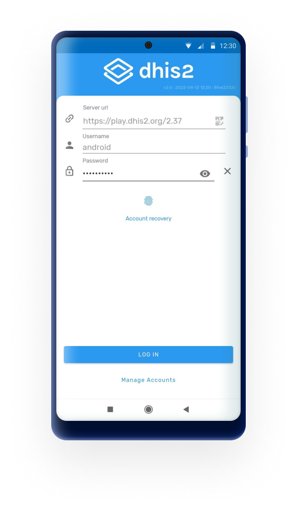
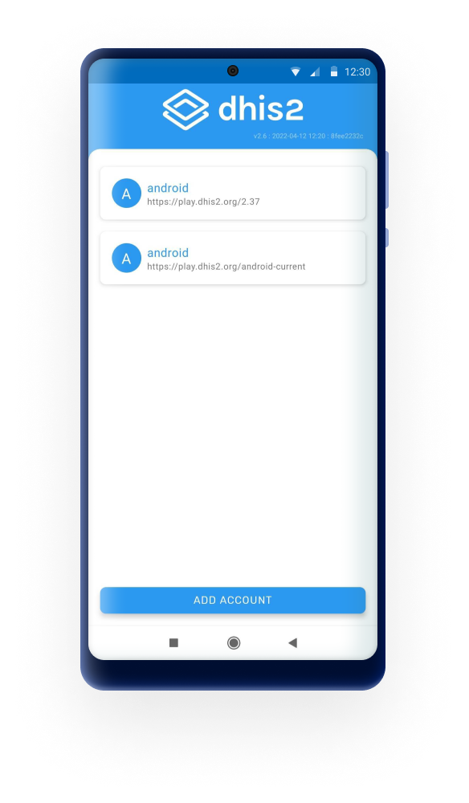
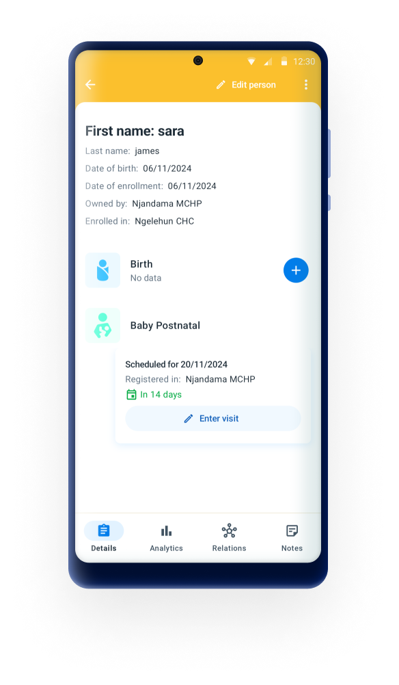
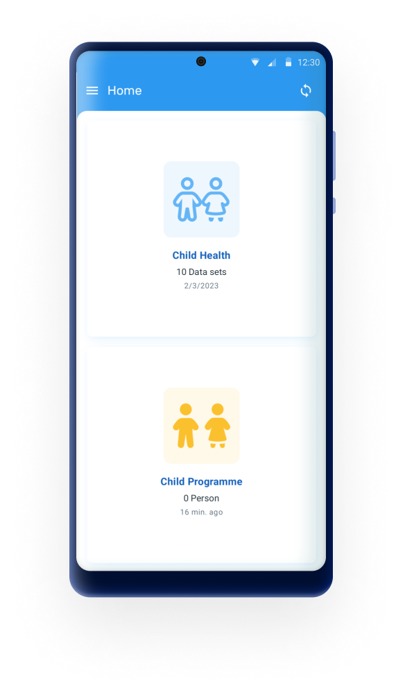
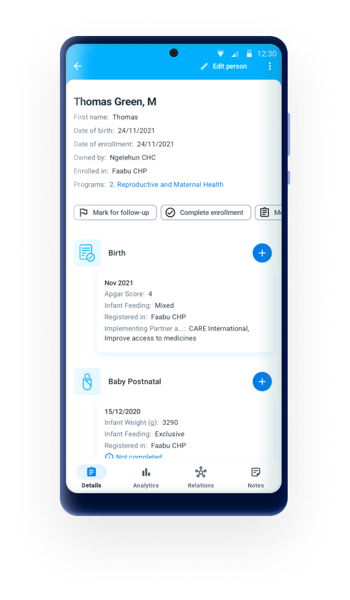
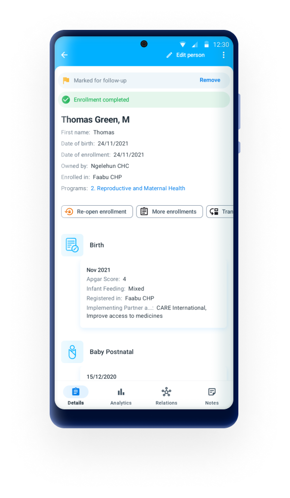

# DHIS 2 Capture Android overview { #implementation_guide_overview }

This document focuses on mobile implementation which use the new DHIS 2 Capture Android App. To get additional information about the different DHIS 2 Android apps please visit the [App Store](https://www.dhis2.org/app-store) and the [Documentation](https://www.dhis2.org/android-documentation) on the website. 

The DHIS2 Android Capture App is the official mobile application developed by the DHIS2 core team for collecting and managing data in field-based environments. It supports both Tracker and Aggregate programs and is fully aligned with the DHIS2 data model and Web API.

As of 2020, this app has fully replaced earlier DHIS2 Android applications such as Tracker Capture, Event Capture, Data Capture, and Dashboard, all of which have been officially deprecated. The Android Capture App consolidates their functionality into a single, unified experience, while also continuing to evolve with new capabilities.

The app plays a central role in DHIS2’s mobile strategy, supporting use cases where access to desktop computers or consistent internet connectivity is limited or unavailable. It has been used globally in a wide range of programs, including immunization, community outreach, HIV case management, routine facility reporting, and nutrition programs and now increasingly in education, stock management and logistics tracking.

## Core Principles { #implementation_core_principles }
The Android Capture App is designed with the following key principles:

* Offline-first architecture: All data entry, validation, program rules, and syncing are available offline. Users can work fully disconnected and synchronize data when a connection is available.
* Security and role-based access: User roles, data permissions, and secure local storage are fully respected.
* Scalable and modular: The app can be deployed at national scale, used across multiple programs, and adapted for specific implementation needs.
* Open source: The full source code is available under an open-source license and actively maintained on GitHub.

## Feature Summary
The DHIS2 Android Capture App includes a range of features designed to ensure usability, performance, and security in real-world mobile data collection settings. Below is an overview of its main capabilities.

### Easier Login & Secure Access { #implementation_guide_overview_easier }

* Quick login using QR codes: Users can scan a QR code to instantly populate the server URL. Previously used server URLs and usernames are also remembered for convenience.
* PIN-based app locking: Once logged in, users can secure the app with a 4-digit PIN, enabling soft logout and protecting sensitive data between sessions.
* Multi-account support: Users can manage and switch between multiple DHIS2 accounts on the same device.

{ .center width=25% }
{ .center width=25% }

### Customizations and Configurable UI { #implementation_guide_overview_configurable }

* Custom colors an icons: The programs appearance (icon, color) is defined by your server configuration.
* Visual data entry: Icons and colors can be configured for option sets, making data entry more intuitive, especially in field or low-literacy settings.
* Language support: The app supports full translation of the user interface and metadata.

{ .center width=25% }

### User-Friendly Navigation { #implementation_guide_overview_attractive }

* Unified home screen: All accessible programs and datasets are integrated into a single "Home" screen, displayed with their assigned icons and colors. Screen is responsive to the amount of programs/data sets assigned to the user.
* Pictorial forms: Option sets can use icons and colors to visually represent choices in both Tracker and Event programs.
* Context-sensitive actions: Visibility of buttons like “Refer,” “Schedule,” or “Add Event” adapts based on the program’s configuration and current stage.

{ .center width=25% }

### Offline-First with Smart Synchronization { #implementation_guide_overview_fully_functional }

* Reliable local storage: All assigned metadata and data (programs, TEIs, events, datasets) are stored on the device, allowing users to work fully offline.
* Configurable sync scope: Admins can define how much data to sync. By default:
    - Tracked Entities: up to 500 active enrolments, prioritizing the most recently updated on the user’s assigned data capture Org Unit(s).
    - Events & Datasets: by default, the most recent 1,000 events or 500 datasets.
    - Error and sync status feedback: Users can see when syncs are complete, failed, or pending, and retry when needed.

### Tracker and events { #implementation_guide_overview_tracker_dashboard }

* Full tracker dashboard: Includes relationships, indicators, feedback messages, and stage completion overview, even in offline mode.
* Enrollment logic: The app respects enrollment rules such as uniqueness, completion status, and program access.
* Event-based workflows: Users can view and complete repeatable or scheduled events based on assigned timelines and availability.
* Integrated tracker search: When adding new tracked entities, the app first checks for duplicates:
    - Offline: Search is performed on the locally cached dataset.
    - Online: Suggestions are pulled from the server based on the user’s org unit scope and search settings.

{ .center width=25% }
{ .center width=25% }

### Event Completeness { #implementation_guide_overview_event_completeness }

During data entry, the app provides real-time indicators for section or stage completeness — especially useful in complex program forms with multiple stages or sections.
