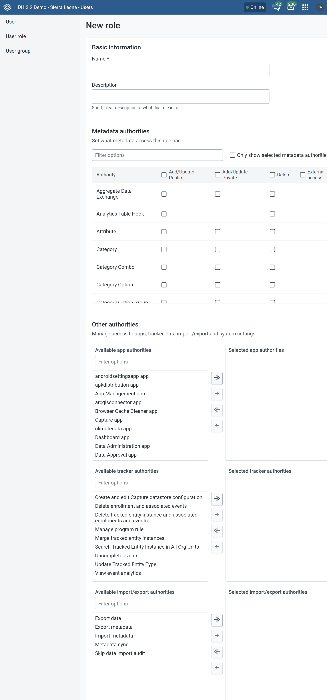
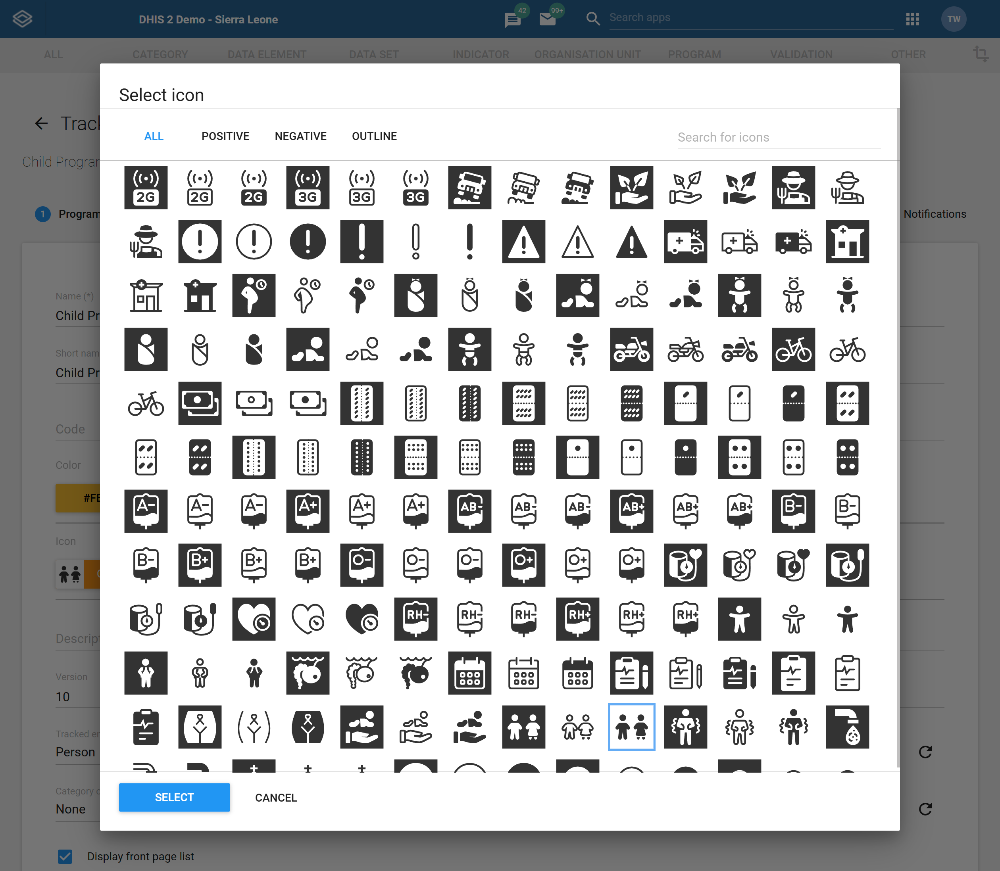
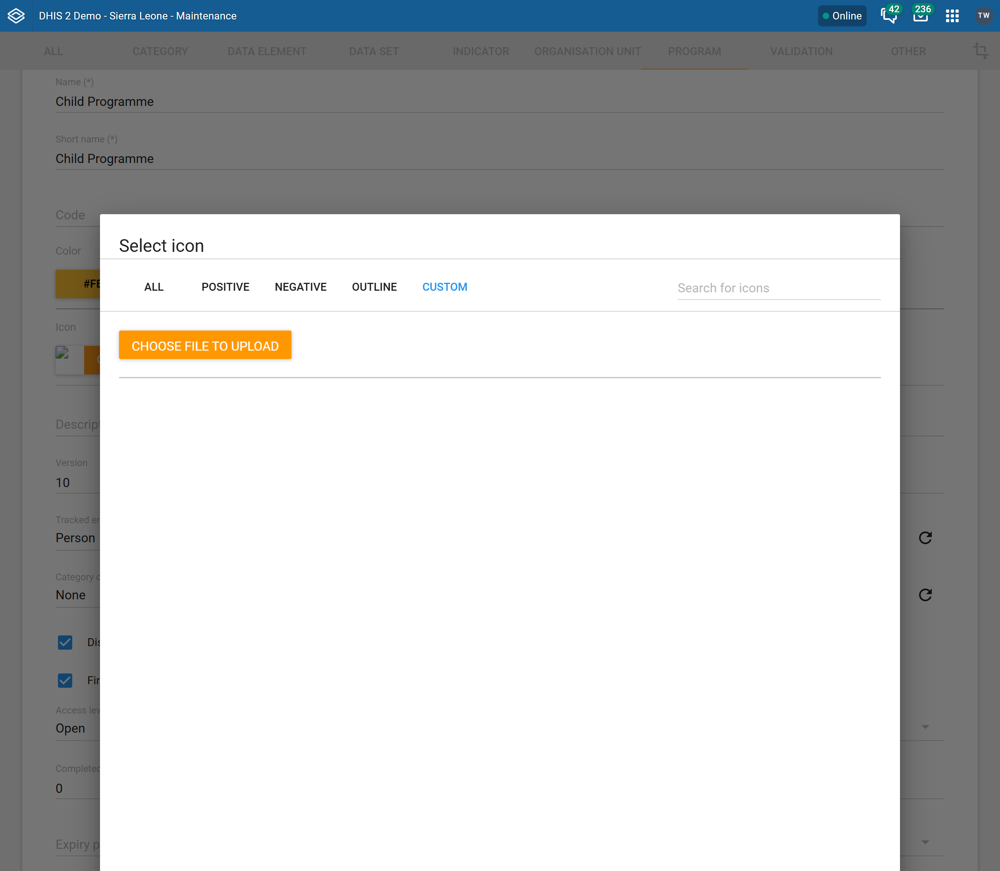
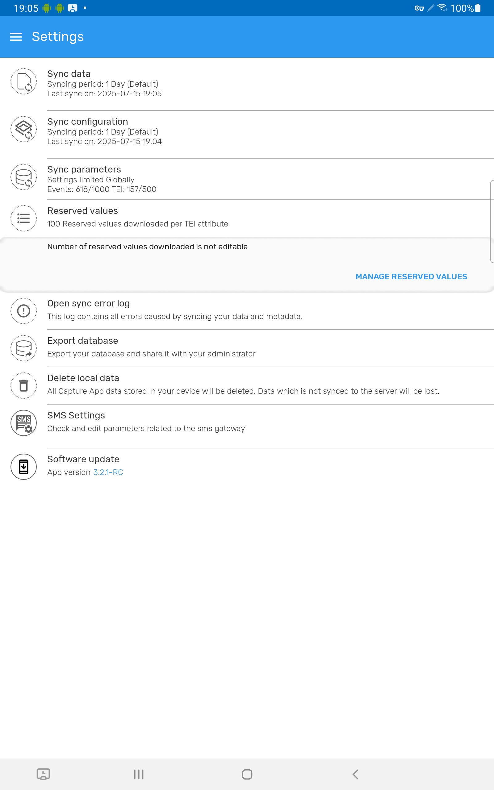
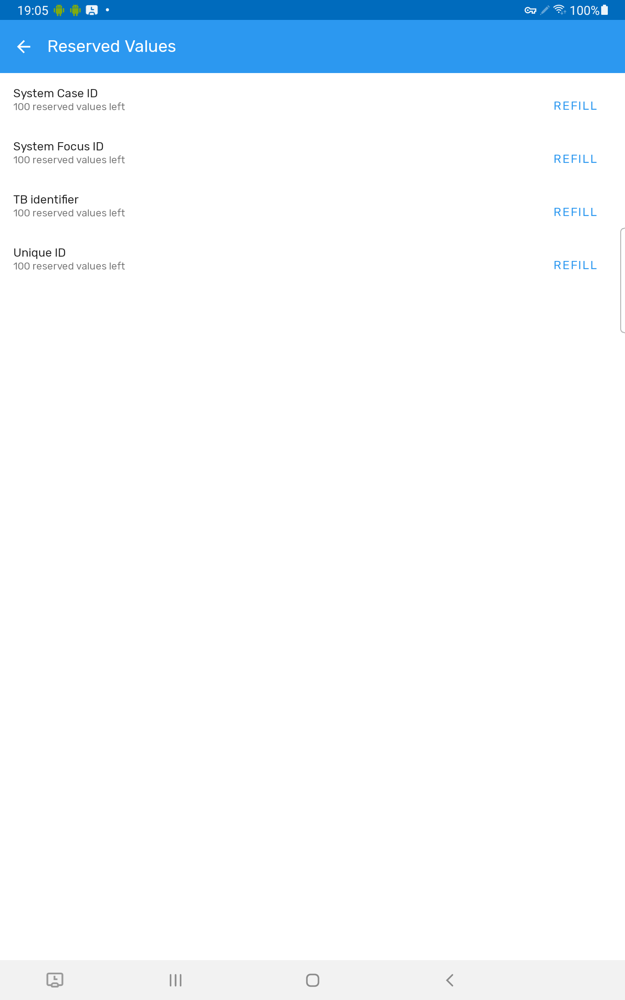

# DHIS2 configuration for using the Android App { #implementation_guide_dhis2_config }

The DHIS2 Android Capture App is fully metadata-driven. This means that the programs, datasets, forms, user access, and even many user interface elements in the app are determined by how the server is configured. Proper metadata and access configuration on the DHIS2 server will ensure that users see the appropriate functionality based on their assigned roles and organization units.

This section outlines how to prepare your DHIS2 instance for Android use and points to relevant configuration tools and documentation resources. For a complete and successful implementation, please read the detailed and updated [documentation](https://www.dhis2.org/android-documentation) to get all the information about configuring the DHIS 2 Server for using with the DHIS 2 Android Capture App.

## User Setup  { #implementation_guide_dhis2_config_user_setup }

To ensure the Android Capture App functions properly for field users, it’s important to prepare not only the metadata but also user roles, access scopes, and program configuration. This section walks through the essential steps to configure users and control what they see and do in the app.

Android users need access to the app through valid credentials and assigned roles. An Android-compatible user should have a dedicated user role, assigned organisation units, and access to at least one program or dataset.

DHIS2 does not require a special user type for Android access — standard users can authenticate, as long as they have been granted the correct authorities and metadata is shared with them appropriately.

> **Note**
>
> To simplify setup in large deployments, consider defining user groups for Android users, and assigning roles and sharing access via those groups.
>

### 1. Creating User Roles { #implementation_guide_dhis2_config_creating_user_role }

Before you can create a user, first you need to define a DHIS 2 user role. The DHIS 2 Android Capture App doesn’t require any of the authorities that are encapsulated in a user role. The security for a DHIS 2 program or dataset is set as program or dataset data access.

For the purposes of web debugging problems with your users it is recommended that you create and assign a user role with data capture functionality, which should include:

- Tracker Capture app, Event capture app and/or Data Entry app
- Dashboard (to be able to login)
- Cache Cleaner (you will need to clean the cache)

Keep roles simple and task-specific. Avoid assigning global admin rights unless necessary, and test the role on a staging server before rollout.

> **Note**
>
> When users enter a TEI and while it is not synced to the server they will be able to delete the TEI and the enrollment even if they have not been asigned the specific authorities. This is by design and to allow users rolling back in case of having entered wrong data (TEI and/or enrollment) and thus preventing it reaching the server and requiring another user with higher privileges to fix the issue.
>

### 2. Create user { #implementation_guide_dhis2_config_creating_user_user }

Second, you should create a user, for which you will need to add some basic details such as the user name and assign it the role.

- User Name: name.android
- Example: belen.android
- User Role assignment: assign to the role you created in step one.

### 3. Assign Organisation units { #implementation_guide_dhis2_config_creating_user_assign }

The third step is to assign the Org Units to the user you just created.

There are three types of organisation unit assignment:

- **Data capture:** Datasets and well as program creation of TEI, Enrollments and Events. Data pre-downloaded in the app at first login will be the one belonging to these org units.
	- Mobile users are not expected to access the org. unit hierarchy of a whole country. Maximum number of org units is difficult to set,as the App does not set the limit, but the resources on the device (memory, processor). We could say below 250 org units should be safe, but still believe that is a very big number for a mobile use case.
- **Data output:** for data analysis. Not applicable in Android.
- **Search Org. Units:** Expands TEI search (when online) across further Org Units. Individual records can be downloaded for offline use.
	- When configuring search org. units, make sure that your capture org. units are contained in your search org.units, to do that capture org. units have to be selected as well as search org. units.

{ .center width=80% }

## Visual configuration: Understanding what renders and why { #implementation_guide_dhis2_config_visual_config }

### Form layout

The DHIS2 Android Capture App renders data entry screens based on the structure of the assigned programs and datasets. Each program stage (event) or data set is displayed as a form, and the layout of that form can include sections if they are defined in the metadata. The app does not support custom HTML forms, but it fully supports section-based layouts and program rules (tracker and event programs) for dynamic behavior.

### Customizations - Colors and Icons 

The Android Capture App supports extensive visual customization through the use of icons and colors. These elements improve usability by allowing program and form elements to be visually distinguished and quickly recognized.

Administrators can assign icons and colors to a variety of metadata objects, including programs, program stages, tracked entity types, datasets, data elements, attributes, and option sets. These icons appear throughout the app — in the home screen, data entry forms, dashboards, and filters — to improve navigation and comprehension.

#### Built-in and Custom Icons

There is an icon library of over four hundred images in DHIS2 instances. As of recent versions, administrators can also upload their own custom icons (e.g., .png or .jpeg) directly via DHIS2. While this increases flexibility, it introduces tradeoffs such as larger metadata payloads and potential sync delays.

For performance reasons, it's recommended to keep custom icons small in size (under 50KB) and only use them where they add clear value (e.g., custom campaign branding or highly specific visual codes).

**Metadata Assignments**

The following metadata types support color and icon assignment in Android:
* Tracked Entity Types
* Programs and Program Stages
* Data Sets
* Data Elements and Attributes
* Indicators and Program Indicators
* Option Sets and Options

{ width=25%}

{ width=25%}

#### Rendering Modes for Sections
For program stages with sections, Android supports three rendering modes that determine how the fields or options within a section are visually arranged for the user:

* Listing: elements are shown as a flat list.

* Sequential: typically means that fields or options are displayed one after another in a vertical list, guiding the user through the form step by step.

* Matrix: arranges fields or options in a grid or table-like format, allowing for a more compact and comparative view, which can be useful for data that is best visualized in rows and columns.

These can be configured in the program stage settings using the mobile rendering type field. Implementers should choose the rendering mode that best matches the complexity and flow of their form, balancing clarity and data entry speed.

{ .center }

A System Administrator can decide the best way to render the information in each program stage section by setting up the mobile rendering type, as shown on the screenshot.

{ .center }

### Advanced Behavior Configuration via Android Settings

In addition to form layout and visuals, the Android Settings Web App (ASWA) allows you to control how the app behaves across different contexts and user roles. These settings can be tailored to align with field realities, user capacity, and program complexity. Implementers are encouraged to review these options and apply them based on the specific needs of their workflows.

Some of the most impactful configurable features include:

* **Sync limits and frequency:** Define how much data (TEIs, events, datasets) is synced and how often, ensuring performance in bandwidth-limited environments.

* **Map accuracy thresholds:** Control the GPS precision required before capturing coordinates — critical for use cases like mobile outreach, campaign site mapping, or logistics.

* **Enable/disable specific actions:** Restrict features like referrals, manual geo-location, or dashboard widgets, reducing clutter or enforcing SOPs.

* **Expand/collapse form sections:** Improves navigation, especially in long, sectioned forms. Users can focus on one section at a time, minimizing errors.

* **Quick actions in dashboards:** Enable shortcuts for common activities like event creation or TEI navigation directly from the dashboard.

* **Filters:** Predefine the filters to be displayed across the app.

* **Local analytics:** Allow users to view indicators, charts, or summaries based on the data available on their device, supporting feedback and decision-making in disconnected settings.

For more details, see the [Android Settings Configuration Guide](https://docs.dhis2.org/en/use/android-app/settings-configuration.html).

## Program Rules & Indicators { #implementation_guide_dhis2_config_setting_pr }

### Setting Up Program Rules

Program rules allow you to embed real-time logic into the Android app, even while offline. They automatically enforce data validation, default values, conditional display, and other dynamic behaviors, greatly improving data quality and user experience.

*Key considerations:*

* **Rule context and priority:** Each rule is defined for a specific program (and optionally a stage), and is executed in ascending order of assigned priority. This ensures deterministic behavior, especially when rules depend on the output of other rules.
* **Use of variables and expressions:** You can base rules on attribute or data element values, as well as built-in variables like eventDate, orgUnit, or relative date functions. Be sure to define any custom variables you reference.

>**Note**
>
>We recommend to test the Android App in parallel with the configuration of your program rules, this is to make sure that your changes in the server are properly reflected and working in the app.
>

*Steps to configure a program rule*

1. Define the context and priority for the execution of the rule. 

{ .center }

2. Write the program rule expression. Variables have to be defined by the administrator to be able to evaluate information entered for a TEI attribute or a program stage data element.

{ .center }

3. Define the action or actions to be executed when the program rule expression is true

{ .center }

When setting up your program rules you should be aware of what is supported by the DHIS 2 Android app. You can check the updated list in the [user guide](https://docs.dhis2.org/en/use/android-app/program-rules-supported.html).

### Defining Program Indicators and Legends { #implementation_guide_dhis2_config_defining_prog_ind }

Program indicators are used in the Android Capture App to display real-time calculations based on values in a program  event or data set. These indicators help users interpret the data they're collecting by surfacing meaningful summaries.

To display a program indicator (events or tracker) in the Android app, ensure the “Display in form” option is enabled in the indicator configuration.

To display indicators in data sets, ensure you assign them during the data set configuration in the maintenance app. 

* Using Legends for Visual Feedback *

Legend sets allow you to apply colors to numeric ranges, making it easy to visually flag critical values such as:

* Risk thresholds
* Stock levels
* Survey scores

Legends are supported in the following areas in Android:

* Program Indicators (in Tracker and Event programs)
* Data Elements (in Event programs and Datasets)

You can create legend sets in Maintenance > Other > Legends in the DHIS2 server and then assign them either to a program indicator or to a data element. In the app, legends appear as background color changes or status indicators inside the form, giving users immediate visual cues.

You can check the updated information of what is supported when using program indicators in the [user guide](https://docs.dhis2.org/en/use/android-app/program-indicators-supported.html). 

## Reserved IDs  { #implementation_guide_dhis2_config_reserved_id }

In many Tracker programs, a unique identifier — such as a case ID, patient number, or voucher code — must be generated when a new Tracked Entity Instance (TEI) is registered. DHIS2 supports this using Generated Values for Tracked Entity Attributes (TEAs), which follow predefined patterns (e.g. ANC-#####) managed by the server.

Because field users often work offline, the Android app handles this by preloading a pool of reserved IDs, downloaded from the server during sync. These are then assigned locally, even without connectivity.

The number of IDs reserved per tracked entity type is configurable through the Android Settings Web App (ASWA). This setting is crucial for ensuring smooth operation in low-connectivity environments. If ASWA is not configured, the default number of reserved IDs is 100.

Everytime the user uses a value (registers a tracked entity instance), the app will:

1. Check if there are enough remaining values and refill when needed (if less than 50 values are available).
2. Assign the first available value to the tracked entity instance and remove it from the list of available values.

Whenever the app is synced it will:

1. Delete expired reserved values.
2. Check if there are enough remaining values and refill when needed (if less than 50 values are available).

A value is considered as "expired" when one of the following conditions is true:

- "expiryDate" is overdue. By default, the server sets the expiry period to 2 months.
- If the attribute pattern is dependent on time, i.e., it contains the segment \`CURRENT\_DATE(format)\`, the app calculates an extra expiry date based on that pattern.

> **Caution**
>
> When using auto-generated unique values which contain dates as part of the pattern the expiryDate of those values will be linked to that date pattern which might result in unexpected behavior if the pattern is not defined well.
>
> *Example*: The value *UniqueID* has been configured with a pattern like CURRENT_DATE(MM)-SEQUENTIAL(###) and today is 31st of January, the application would download 100 values (from 01-001 to 01-101) to allow the application working offline and having enough values, but tomorrow, 1st of February, the applicataion would not have any available values as all would have been marked as expired and so it would display such message. 
>

On the App, the user can also check the available values and refill them in the settings menu.

{ .center width=50%}
{ .center width=50%}

When the app runs out of values and the server cannot provide more, the user will receive a message on the data entry form saying that there are no more available values. Your should fix that on the server side.
